# 🍌 Portrait & Photography Cases

> Part of [awesome-gpt-image-2-prompts](../README.md)

### Case 1: [Convenience Store Neon Portrait](https://x.com/BubbleBrain/status/2045167461147042202) (by [@BubbleBrain](https://x.com/BubbleBrain))

| Output |
| :----: |
| <a href="https://evolink.ai/gpt-image-2-prompts?utm_source=github&utm_medium=picture&utm_campaign=awesome-gpt-image-2-prompts" target="_blank" rel="noopener noreferrer"></a> |

**Prompt:**

```
35mm film photography with harsh convenience store fluorescent lighting mixed with colorful neon signs from outside, authentic film grain, high contrast, slight color cast, cinematic street editorial style, intimate medium shot, early 20s sexy Chinese female idol with ultra-realistic delicate refined Chinese features, seductive almond-shaped fox eyes with natural double eyelids, high nose bridge, small sharp V-shaped jawline, flawless porcelain skin with cool ivory undertone and visible specular highlights from fluorescent light, subtle skin texture and micro pores, natural dewy makeup with soft flush on cheeks, glossy natural pink lips slightly parted, subtle natural freckles across nose and cheeks, long dark brown hair in a messy high ponytail with many loose strands falling around face and neck, wearing an oversized white button-up shirt as the only top, unbuttoned at the top with deep cleavage and loosely tied at the waist, paired with a tiny black pleated mini skirt, barefoot in simple white slides, seductive casual leaning pose against the glass door of a 24-hour convenience store at late night, body slightly arched, one leg bent with foot resting against the door frame, the other leg straight, one hand holding a bottle of iced drink, the other hand lightly pulling the hem of her mini skirt, intensely seductive playful yet slightly vulnerable gaze straight at the viewer with soft doe eyes full of quiet temptation and teasing smile, bright cold fluorescent store light from inside mixed with pink and blue neon glow from outside signs, realistic reflections on glass door, blurred convenience store interior with shelves and snacks in background, authentic 35mm film color grading with harsh lighting and neon accents, extremely sharp yet soft skin rendering, natural hair strands, realistic fabric wrinkles and drape on the oversized shirt and mini skirt, no plastic skin, no digital over-sharpening, no airbrushing, no blemishes, no moles, no oily skin, no watermark, no text, authentic late-night convenience store atmosphere
```
### Case 2: [Cinematic Minimal Portrait](https://x.com/iam_miharbi/status/2045151354679665101) (by [@iam_miharbi](https://x.com/iam_miharbi))

| Output |
| :----: |
| <a href="https://evolink.ai/gpt-image-2-prompts?utm_source=github&utm_medium=picture&utm_campaign=awesome-gpt-image-2-prompts" target="_blank" rel="noopener noreferrer"></a> |

**Prompt:**

```
Generate a cinematic minimal portrait of a solitary man standing in an intense orange to red gradient environment, strong silhouette lighting, deep shadow contrast, reflective glossy floor, symmetrical composition, minimal
```
### Case 3: [Japanese Onsen Ryokan Portrait](https://x.com/BubbleBrain/status/2045092449803284923) (by [@BubbleBrain](https://x.com/BubbleBrain))

| Output |
| :----: |
| <a href="https://evolink.ai/gpt-image-2-prompts?utm_source=github&utm_medium=picture&utm_campaign=awesome-gpt-image-2-prompts" target="_blank" rel="noopener noreferrer"></a> |

**Prompt:**

```
35mm film photography, warm vintage Japanese onsen ryokan aesthetic, soft ambient wooden lantern lighting mixed with gentle natural window light, subtle film grain, gentle color shift, high atmosphere editorial style, intimate medium shot, early 20s beautiful Chinese female idol with ultra-realistic delicate refined Chinese features, seductive almond-shaped fox eyes with natural double eyelids, high nose bridge, small sharp V-shaped jawline, flawless porcelain skin with warm ivory undertone, visible subtle skin texture and micro pores, soft natural makeup with dewy glow, subtle rosy flush on cheeks, natural soft pink lips slightly parted, long dark brown hair tied in a loose low bun with some messy strands falling around face and neck, wearing a loose white yukata (traditional Japanese bathrobe) deliberately slipped off one shoulder and loosely tied at the waist, the fabric slightly open revealing smooth skin and subtle cleavage, barefoot, seductive relaxed sitting pose on the edge of a traditional wooden engawa veranda at a vintage onsen ryokan, body slightly turned toward the camera, one leg bent with foot resting on the wooden floor, the other leg gently dangling, one hand lightly holding the yukata collar, the other hand resting on the wooden floor behind her for support, softly arched back to gently accentuate curves, intensely seductive yet gentle and inviting gaze straight at the viewer with soft doe eyes full of quiet temptation and warmth, warm wooden interior with paper sliding doors and distant steaming hot spring in soft focus, gentle rim lighting highlighting skin and fabric texture, authentic vintage film color grading with warm tones, extremely sharp yet soft skin rendering, natural hair strands, realistic fabric wrinkles and drape on the yukata, no plastic skin, no digital over-sharpening, no airbrushing, no blemishes, no moles, no oily skin, no watermark, no text, authentic 35mm film Japanese onsen ryokan atmosphere
```
### Case 4: [35mm Flash Editorial Portrait](https://x.com/BubbleBrain/status/2045052982728016131) (by [@BubbleBrain](https://x.com/BubbleBrain))

| Output |
| :----: |
| <a href="https://evolink.ai/gpt-image-2-prompts?utm_source=github&utm_medium=picture&utm_campaign=awesome-gpt-image-2-prompts" target="_blank" rel="noopener noreferrer"></a> |

**Prompt:**

```
35mm color film photography with harsh direct on-camera flash, specular highlights on skin and clothing, strong catchlights in eyes, high contrast flash illumination, authentic film grain and color shift, high fashion fresh innocent basketball court editorial style, intimate first-person low-angle POV shot from below, early 20s sexy Chinese female idol with ultra-realistic delicate refined Chinese features, seductive almond-shaped fox eyes with natural double eyelids, high nose bridge, small sharp V-shaped jawline, flawless realistic porcelain skin with cool ivory undertone and visible flash specular highlights, fine delicate skin texture with subtle pores micro details and natural dewy glow under flash, fresh natural sporty makeup with soft dewy glow, subtle natural flush on cheeks, natural pink lips slightly parted, subtle natural freckles across nose and cheeks, long dark brown hair tied in a high playful ponytail with some loose strands framing the face and realistic loose strands, wearing a loose white tank top and white high-waisted basketball shorts, white knee-high sports socks, seductive natural leaning pose against the basketball hoop pole on the outdoor court at dusk, body angled sideways with naturally arched back and hips gently pushed back to accentuate perky round hips and sexy butt curve, one leg naturally extended forward toward the camera and the other leg slightly bent to emphasize long sexy legs, both hands lightly resting on the basketball pole at shoulder height, intensely seductive playful yet pitiable doe-eyed gaze straight at the viewer with soft vulnerable longing eyes and a gentle teasing smile full of quiet temptation and desire, harsh direct on-camera flash creating sharp specular highlights and strong catchlights, background with blurred basketball court and hoop under dusk sky, high contrast film color grading with natural flash look, extremely sharp yet soft skin rendering with authentic 35mm direct flash aesthetic, natural hair strands, realistic fabric texture on tank top and shorts with socks detail, no plastic skin, no digital over-sharpening, no airbrushing, no blemishes, no moles, no oily skin, no watermark, no text, authentic 35mm direct flash film basketball court look --ar 9:16
```
### Case 5: [Mirror Selfie Bedroom Portrait](https://x.com/Shinning1010/status/2045002808903020962) (by [@Shinning1010](https://x.com/Shinning1010))

| Output |
| :----: |
| <a href="https://evolink.ai/gpt-image-2-prompts?utm_source=github&utm_medium=picture&utm_campaign=awesome-gpt-image-2-prompts" target="_blank" rel="noopener noreferrer"></a> |

**Prompt:**

```
A stunning 18-year-old Chinese girl with a youthful, pure face and realistic skin texture, sitting on a cozy, slightly messy bed in her bedroom. She is taking a mirror selfie with a smartphone, capturing a natural and intimate moment. Wearing casual gray loungewear and neat white crew socks. Soft natural light (golden hour) streams in from a side window, creating a warm, moody, and cinematic atmosphere. 35mm lens, sharp focus on the subject in the mirror, depth of field with a beautifully blurred background (bokeh). Photorealistic, 8K, high resolution, studio quality, masterpiece.
Negative Prompts: no extra limbs, no deformed hands, no blur, no noise, no watermark, no text, no cartoon/anime style. Aspect Ratio: 3:4.
```

### Case 6: [Soft Airy 35mm Portrait](https://x.com/BubbleBrain/status/2046115431144902732) (by [@BubbleBrain](https://x.com/BubbleBrain))

| Output |
| :----: |
| <a href="https://evolink.ai/gpt-image-2-prompts?utm_source=github&utm_medium=picture&utm_campaign=awesome-gpt-image-2-prompts" target="_blank" rel="noopener noreferrer"></a> |

**Prompt:**

```
Analog 35mm film photography, soft airy Japanese-style aesthetic, gentle diffused natural window light, slight overexposure, pastel tones, low contrast, soft highlights, minimal indoor setting near a window with white curtains, clean light-colored wall, natural composition, eye-level, slightly closer full-body framing (mid-thigh to head), young East Asian woman, natural minimal makeup, soft realistic skin texture, long slightly messy dark hair, oversized white button-up shirt, light casual shorts, barefoot, simple and relaxed styling, standing naturally with relaxed posture, arms loosely at sides or slightly behind, facing camera, gentle soft smile, subtle stillness, focus on light, air, and quiet everyday mood, soft film grain, dreamy and understated atmosphere --ar 9:16
```

### Case 7: [Luxury Glam Beauty Portrait](https://x.com/patrickassale/status/2044581766309060765) (by [@patrickassale](https://x.com/patrickassale))

| Output |
| :----: |
| <a href="https://evolink.ai/gpt-image-2-prompts?utm_source=github&utm_medium=picture&utm_campaign=awesome-gpt-image-2-prompts" target="_blank" rel="noopener noreferrer"></a> |

**Prompt:**

```
Luxury Glam Beauty Portrait:, Beautiful Black woman, youthful spirit, creamy vanilla, silk press, mahogany red, subtle confidence, textured fabric, sapphire blue, minimal jewelry, beachside breeze, lens flare effect, nostalgic, cinematic lens, symmetrical composition, soft focus, high fashion photography, monochromatic, dewy finish, mysterious tension, layered elements
```
### Case 8: [9:16 Cosplayer Portrait Screenshot](https://x.com/Zoulinshen/status/2045082518089810073) (by [@Zoulinshen](https://x.com/Zoulinshen))

| Output |
| :----: |
| <a href="https://evolink.ai/gpt-image-2-prompts?utm_source=github&utm_medium=picture&utm_campaign=awesome-gpt-image-2-prompts" target="_blank" rel="noopener noreferrer"></a> |

**Prompt:**

```
 生成一张竖版手机截图风格的图片，整体比例接近 9:16。画面中心偏上是一位真人 coser，扮演（角色名称）的二次元角色。人物为写实风格，但五官略带动漫感，皮肤细腻，眼睛稍大，表情温柔地看向镜头，坐在室内的休闲场景中，例如咖啡厅或酒吧吧台前，背景有符合场景的道具。画面最上方加入手机系统状态栏 UI，包括时间、电量、信号、网络等图标，让整张图看起来像手机截图。画面底部叠加一块宽大的半透明 galgame 风格对话框，对话框左侧放一个与画面人物对应的动漫或 Q 版头像；对话框右侧排版文字：第一行用较大字体显示与前面相同的角色名字，下面一到两行显示一段适合这个角色人设的、温柔治愈风格的简体中文台词，由你自动创作。再在对话框下方加一条操作栏，仿照 galgame UI。整体风格高清、细节丰富、光线柔和、二次元与真人写真自然融合。
```

### Case 9: [Urban Turn-Back Street Portrait](https://x.com/Tz_2022/status/2045892003775361198) (by [@Tz_2022](https://x.com/Tz_2022))

| Output |
| :----: |
| <a href="https://evolink.ai/gpt-image-2-prompts?utm_source=github&utm_medium=picture&utm_campaign=awesome-gpt-image-2-prompts" target="_blank" rel="noopener noreferrer"></a> |

**Prompt:**

```
该画面为中近景，采用平视镜头，聚焦于一位年轻女性。她以七分身镜头呈现，身体坐姿略带倾斜，臀部向后撅起，双腿自然交叠，左腿在前，右腿在后，膝盖微屈。她将上半身向右后方扭转，头部则转向镜头方向，形成一个经典的“回眸”姿态，目光直视镜头，眼神清澈而略带一丝俏皮。她的发型是蓬松的棕色齐肩短发，刘海自然垂落，发尾微卷，妆容清淡自然，仅在眼部有轻微眼线勾勒，唇色为自然裸粉。画面整体采用自然日光滤镜，光线从画面左上方斜射入，形成柔和的逆光轮廓，面部和身体右侧被温暖的金色光线照亮，左侧则形成自然的阴影过渡，增强了立体感。灯光效果是明亮的自然光，带有轻微的镜头眩光，营造出午后阳光的氛围。拍摄角度为平视，构图上，人物主体位于画面中偏右位置，背景中的斑马线与道路线条形成自然的引导线，将视线引向人物。背景为城市街道，包含道路、斑马线、绿化带和远处的车辆，背景被适度虚化，但依然可辨识出树木、护栏和停放的电动车等元素，构图上利用了三分法，人物位于右侧三分之一处，增强了画面的平衡感。主体穿着一件军绿色迷彩图案的连帽卫衣，下身搭配黑色短裤，脚穿白色高帮运动鞋配白色中筒袜。背包为黑色，带有橙黄色装饰条纹和一个橙色毛绒挂件，材质为帆布和皮革拼接。整体风格为街头休闲风，肢体语言放松自然，表情略带好奇与俏皮，整体呈现出一种随性、青春、充满活力的都市少女形象。
```

### Case 10: [Sam Altman Skatepark Snapshot](https://x.com/Malek1173989/status/2045836887684694395) (by [@Malek1173989](https://x.com/Malek1173989))

| Output |
| :----: |
| <a href="https://evolink.ai/gpt-image-2-prompts?utm_source=github&utm_medium=picture&utm_campaign=awesome-gpt-image-2-prompts" target="_blank" rel="noopener noreferrer"></a> |

**Prompt:**

```
"Sam Altman on a skateboard at a skatepark with no people."
```

### Case 11: [Korean Idol 3x3 Grid Portrait](https://x.com/BubbleBrain/status/2046268941941850575) (by [@BubbleBrain](https://x.com/BubbleBrain))

| Output |
| :----: |
| <a href="https://evolink.ai/gpt-image-2-prompts?utm_source=github&utm_medium=picture&utm_campaign=awesome-gpt-image-2-prompts" target="_blank" rel="noopener noreferrer"></a> |

**Prompt:**

```
9:16 vertical, Korean idol portrait photoshoot, 3x3 grid (nine frames), same person in all images, consistent facial features and styling, soft black mist filter effect, lowered contrast, blooming highlights, subtle glow around light sources
```

### Case 12: [CCD Camera Flash Korean Idol](https://x.com/BubbleBrain/status/2046190539213885806) (by [@BubbleBrain](https://x.com/BubbleBrain))

| Output |
| :----: |
| <a href="https://evolink.ai/gpt-image-2-prompts?utm_source=github&utm_medium=picture&utm_campaign=awesome-gpt-image-2-prompts" target="_blank" rel="noopener noreferrer"></a> |

**Prompt:**

```
mobile phone photo, old CCD camera aesthetic, harsh flash, grainy, dim messy indoor lighting, candid snapshot feeling, slight motion blur, young Korean female idol, soft innocent look
```

### Case 13: [Korean Idol 3x3 Collage Portrait](https://x.com/BubbleBrain/status/2046151898621993364) (by [@BubbleBrain](https://x.com/BubbleBrain))

| Output |
| :----: |
| <a href="https://evolink.ai/gpt-image-2-prompts?utm_source=github&utm_medium=picture&utm_campaign=awesome-gpt-image-2-prompts" target="_blank" rel="noopener noreferrer"></a> |

**Prompt:**

```
9:16 vertical — a 3x3 grid collage (nine images) forming a Korean idol portrait photoshoot series. Each frame features the same young Korean female idol, maintaining 100% consistency in facial features, proportions, hairstyle, and identity across all nine shots.   Natural, ultra-realistic skin texture, no retouching, no smoothing. Clean idol-style minimal makeup, soft glow, subtle imperfections.   Hair: long, voluminous dark hair, slightly tousled, consistent across all frames (natural loose flow, slight movement).  Outfit: cohesive Korean idol photoshoot styling — white shirt + short bottoms (or simple neutral-toned outfit), youthful, clean, slightly casual but styled. Same outfit across all frames.  Setting: minimal studio or simple indoor environment (plain wall, soft window light, clean background). Focus on subject, not environment.  Lighting: soft diffused natural light, gentle highlights, low contrast, slightly airy tones, subtle film-like softness.  Camera style: intimate portrait photography, slightly handheld feel, subtle imperfections (minor grain, slight blur in motion frames, imperfect framing).  Frame breakdown (3x3 grid):  Top row: - Top left: standing naturally, looking slightly away, relaxed expression - Top center: facing camera, casual mid-motion (hair or body slight movement) - Top right: slight side angle, soft gaze, natural candid feel  Middle row: - Center left: looking slightly upward, soft thoughtful expression - Center: close-up portrait, direct eye contact, gentle idol smile - Center right: turning body slightly, mid-motion candid frame  Bottom row: - Bottom left: seated or leaning casually, relaxed posture - Bottom center: back partially turned, looking over shoulder toward camera - Bottom right: standing close to frame, slightly playful or soft expression  Mood: Korean idol photobook / photocard aesthetic, intimate, soft, natural, everyday charm.  Quality: ultra-realistic, 8K detail, subtle analog film grain, natural imperfections, soft dreamy tone
```

### Case 14: [Soft Black Mist Editorial Portrait](https://x.com/BubbleBrain/status/2046434670724907395) (by [@BubbleBrain](https://x.com/BubbleBrain))

| Output |
| :----: |
| <a href="https://evolink.ai/gpt-image-2-prompts?utm_source=github&utm_medium=picture&utm_campaign=awesome-gpt-image-2-prompts" target="_blank" rel="noopener noreferrer"></a> |

**Prompt:**

```
9:16 vertical — editorial portrait, single subject  soft black mist filter, subtle haze, gentle highlight bloom, muted tones  minimal indoor space, clean background, slight texture  young Korean woman, minimal makeup, natural skin texture  outfit: fitted ribbed knit top or soft camisole layered under a loose shirt, paired with high-waisted shorts or skirt; fabric slightly clings to body shape, soft and natural, no revealing elements  hair: slightly messy, natural volume  pose: sitting on floor with one leg bent and the other relaxed, body slightly leaning, shoulders not aligned, head tilted  composition: subject slightly off-center, negative space present  expression: calm, slightly distant, natural lips  lighting: soft side light, gentle shadow falloff  mood: understated, quiet, subtly sensual through natural body lines, relaxed and unposed  quality: fine grain, slight softness, realistic look
```

### Case 15: [Fujifilm Strawberry School Portrait](https://x.com/BubbleBrain/status/2046483268019884384) (by [@BubbleBrain](https://x.com/BubbleBrain))

| Output |
| :----: |
| <a href="https://evolink.ai/gpt-image-2-prompts?utm_source=github&utm_medium=picture&utm_campaign=awesome-gpt-image-2-prompts" target="_blank" rel="noopener noreferrer"></a> |

**Prompt:**

```
9:16 vertical — Japanese Fuji film style portrait, single subject  Fujifilm analog aesthetic (Pro 400H / Superia feel), soft pastel tones, slight green-magenta shift, low contrast, gentle highlight roll-off, fine film grain, subtle halation, slight vignette  bright natural daylight, diffused sunlight through window, soft shadows, airy atmosphere  young Japanese female idol, natural minimal makeup, fresh glowing skin, realistic texture, slight imperfections  outfit: Japanese school uniform (sailor-style or blazer uniform), neatly styled, non-revealing, youthful and clean  hair: natural dark hair, straight or softly flowing, a few loose strands  pose: front-facing or slight angle toward camera, relaxed posture; one hand gently holding a strawberry near lips, mid-action as if about to take a bite; shoulders relaxed, subtle natural body curve  expression: soft playful gaze, light smile or neutral lips, gentle eye contact with camera  setting: minimal indoor near window or simple outdoor corner, clean background, everyday atmosphere  composition: slightly off-center framing, intimate distance, candid feel  mood: fresh, youthful, sweet everyday moment, understated charm  quality: ultra-realistic, analog film look, natural imperfections, soft dreamy finish
```

### Case 16: [Soft Black Mist Idol Portrait](https://x.com/BubbleBrain/status/2046518189509734903) (by [@BubbleBrain](https://x.com/BubbleBrain))

| Output |
| :----: |
| <a href="https://evolink.ai/gpt-image-2-prompts?utm_source=github&utm_medium=picture&utm_campaign=awesome-gpt-image-2-prompts" target="_blank" rel="noopener noreferrer"></a> |

**Prompt:**

```
9:16 vertical — Korean idol portrait photography, single subject  soft black mist filter effect, lowered contrast, gentle highlight bloom, subtle glow, soft diffusion, slightly faded blacks  minimal indoor setting near window, white curtains, clean light-toned background  young Korean female idol, natural minimal makeup, dewy realistic skin texture, subtle imperfections  outfit: oversized white button-up shirt + short bottoms, slightly loose fit, soft and casual styling, no revealing elements  hair: long dark hair, slightly messy, natural volume, softly flowing  pose: relaxed standing or slight lean, body subtly angled, one leg slightly forward, shoulders relaxed; one hand lightly touching collar or resting near neckline, the other relaxed; gentle body curve without exaggeration  expression: soft cute smile, slightly playful eyes, direct or slightly off-camera gaze  camera: close to mid-body framing, eye-level, intimate distance, slight handheld feel  lighting: diffused natural daylight, soft shadows, gentle light wrapping around face and body  mood: cute yet subtly sensual, intimate, everyday softness, quiet romantic atmosphere  quality: ultra-realistic, fine film grain, slight softness at edges, natural imperfections, dreamy understated tone
```

### Case 17: [Fujifilm Couple Portrait](https://x.com/BubbleBrain/status/2046502288102170757) (by [@BubbleBrain](https://x.com/BubbleBrain))

| Output |
| :----: |
| <a href="https://evolink.ai/gpt-image-2-prompts?utm_source=github&utm_medium=picture&utm_campaign=awesome-gpt-image-2-prompts" target="_blank" rel="noopener noreferrer"></a> |

**Prompt:**

```
9:16 vertical — Japanese Fuji film style couple portrait, two subjects  Fujifilm analog aesthetic (Pro 400H / Superia feel), soft pastel tones, slight green-magenta shift, low contrast, gentle highlight roll-off, fine film grain, subtle halation  bright natural daylight, diffused sunlight through window, soft shadows, airy atmosphere  young Japanese couple, natural minimal makeup, realistic skin texture, slight imperfections  female outfit: oversized button-up shirt with loose shorts, relaxed fit, soft casual styling   male outfit: simple t-shirt or light shirt, clean and understated  hair: natural, slightly tousled for both  pose: close intimate distance — sitting or standing close together; the girl gently leaning toward him, one hand lightly resting on his shoulder or chest; the boy slightly leaning in, faces close, almost touching, capturing the moment just before a kiss  expression: soft smiles or gentle gaze toward each other, relaxed and natural, emotional connection visible  camera: close framing (waist-up), eye-level, intimate distance, slight handheld feel  setting: minimal indoor near window, light curtains, clean soft background  lighting: diffused daylight, gentle highlight bloom, soft shadow transitions  mood: warm, romantic, intimate everyday moment, natural affection  quality: ultra-realistic, analog film look, fine grain, slight softness, natural imperfections
```

### Case 18: [AI Self-Perception Portrait](https://x.com/80vul/status/2046218165961753047) (by [@80vul](https://x.com/80vul))

| Output |
| :----: |
| <a href="https://evolink.ai/gpt-image-2-prompts?utm_source=github&utm_medium=picture&utm_campaign=awesome-gpt-image-2-prompts" target="_blank" rel="noopener noreferrer"></a> |

**Prompt:**

```
根据你对我的认知 给我生成一个“你认识的我”的 图片
```


### Case 19: [Create the most realistic front page design of a vintage newspaper featuring ...](https://x.com/Naiknelofar788/status/2047207812800147647) (by [@Naiknelofar788](https://x.com/Naiknelofar788))

| Output |
| :----: |
| <a href="https://evolink.ai/gpt-image-2-prompts?utm_source=github&utm_medium=picture&utm_campaign=awesome-gpt-image-2-prompts" target="_blank" rel="noopener noreferrer"></a> |

**Prompt:**

```
Create the most realistic front page design of a vintage newspaper featuring the main character. The layout should be made in the style of a real printed newspaper with a cinematic black-and-white aesthetic.
The main photo should be prominently placed in the center, framed, like the image in the title of the article. The subject in the photo should remain unchanged and clearly distinguishable in natural light and slightly increased contrast in order to match the spectacular editorial style.
Create a bold, attention-grabbing headline at the top (create a unique title that matches the spirit of the photo - it can be romantic, mysterious, funny, or dramatic). Add a smaller subtitle under it, which will look like a real newspaper caption.
Add realistic newspaper elements:
Columns of small text (in the style of lorem ipsum, but framed like real news)
At the top is the fictitious name of the publication (for example, The Daily Prompts, AI Times or similar - think creatively, according to the picture)
Date, issue number and location
Decorative lines, dividers, and vintage typography
Small additional articles or captions to the main image
Optional stamps, doodles, or editorial notes to add personality.
Style:
Black and white or slightly faded monochrome paper
Fine paper texture, grain, and ink defects
Small shadows and creases that mimic real printed paper
The aesthetics of a clean but slightly worn vintage newspaper
Mood: Give the design personality, expressiveness and plot, as if the plot is part of the main article.
Aspect ratio: 4:5 or 1:1
High-detail, ultra-realistic hybrid of editorial photography and print design.
```

### Case 20: [Magazine Travel Guide Feature Article](https://x.com/andis13/status/2047204384811921764) (by [@andis13](https://x.com/andis13))

| Output |
| :----: |
| <a href="https://evolink.ai/gpt-image-2-prompts?utm_source=github&utm_medium=picture&utm_campaign=awesome-gpt-image-2-prompts" target="_blank" rel="noopener noreferrer"></a> |

**Prompt:**

```
Create image of Magazine feature article [travel] guide page, cute, information dense photo book style magazine feature article page. Add all necessary sections, tips, recommendations, information. add photos for any sections and recommendations if you like. Place the attached person at the precise location of [city, country]. Seamlessly blend the attached person as if they are sightseeing. Approach this task with the understanding that this is a critical, information rich page that will significantly influence visitor numbers, text accuracy is important. Fully use the entire [9:16] page. NEGATIVE PROMPT: coordinate texts @swiat_ai @ProfitAII
```

### Case 21: [analyze this photo and give me a detailed JSON prompt that recreates it. brea...](https://x.com/pavellaslov/status/2047182214304055339) (by [@pavellaslov](https://x.com/pavellaslov))

| Output |
| :----: |
| <a href="https://evolink.ai/gpt-image-2-prompts?utm_source=github&utm_medium=picture&utm_campaign=awesome-gpt-image-2-prompts" target="_blank" rel="noopener noreferrer"></a> |

**Prompt:**

```
analyze this photo and give me a detailed JSON prompt that recreates it. break down the color grading and every exact color in the photo

(use Opus, not Sonnet. Opus has stronger visual analysis and writes more detailed JSON)

paste that JSON into ChatGPT
upload your product image and prompt:
using this JSON as reference, generate a person holding my product
save that generated photo as your character reference

attach it to every future generation for facial consistency

you now have a consistent UGC model that works across any product

the JSON controls the lighting and color grading. GPT image-2 handles the character. you control the product placement.

the #1 tell on AI photos is flat colors and a grainy look. this method removes both.
5 minutes to set up. unlimited variations after.
```

### Case 22: [CALMING GREEN TEA Film Kit displayed frontally, the open box shows soft sage-...](https://x.com/ZaraIrahh/status/2047180061657452601) (by [@ZaraIrahh](https://x.com/ZaraIrahh))

| Output |
| :----: |
| <a href="https://evolink.ai/gpt-image-2-prompts?utm_source=github&utm_medium=picture&utm_campaign=awesome-gpt-image-2-prompts" target="_blank" rel="noopener noreferrer"></a> |

**Prompt:**

```
CALMING GREEN TEA Film Kit displayed frontally, the open box shows soft sage-green film pouches and translucent ampoules with matte silver caps, product placed centrally with clear branding CALMING GREEN TEA -- 7 Days to Soothed Skin, pastel green background with botanical graphic accents, three minimal icons (leaf, wave, balance) floating around the product to emphasize benefits, photographic, hyper detailed, ultra realistic, lifelike, 8k, high detail, soft professional lighting.
```

### Case 23: [Ultra-realistic product photography of a rich strawberry soft-serve ice cream...](https://x.com/ZaraIrahh/status/2047179916161212542) (by [@ZaraIrahh](https://x.com/ZaraIrahh))

| Output |
| :----: |
| <a href="https://evolink.ai/gpt-image-2-prompts?utm_source=github&utm_medium=picture&utm_campaign=awesome-gpt-image-2-prompts" target="_blank" rel="noopener noreferrer"></a> |

**Prompt:**

```
Ultra-realistic product photography of a rich strawberry soft-serve ice cream in a crispy waffle cone, styled with a clean, modern premium aesthetic. The soft serve is a vibrant natural pink, thick and creamy, sculpted into a smooth swirl with a softly curled peak, lightly topped with delicate strawberry dust or tiny fruit specks for a fresh, appetizing look. The cone has a rustic, crunchy texture with slightly uneven edges for an artisanal feel.
The background is soft beige with natural sunlight casting subtle leaf shadows, creating a calm, organic atmosphere. Include softly blurred greenery in the foreground for depth. The composition is minimal, balanced, and uses negative space effectively, similar to high-end American food brand ads.
On the left side, include modern English typography in a clean, elegant layout (not vertical).
Main headline:
Sweet Strawberry Bliss.
Supporting line (smaller text):
Made with real strawberries. Smooth. Creamy. Irresistible.
Add a small circular badge showing the price:
$5.80.
Lighting: soft natural daylight, warm highlights, shallow depth of field, high-end commercial food photography style.
Mood: fresh, premium, modern, and inviting — aligned with upscale U.S. dessert branding.
```

### Case 24: [A hyper-realistic UI/UX mockup displayed on a slim modern laptop placed on a ...](https://x.com/ZaraIrahh/status/2047179669011616172) (by [@ZaraIrahh](https://x.com/ZaraIrahh))

| Output |
| :----: |
| <a href="https://evolink.ai/gpt-image-2-prompts?utm_source=github&utm_medium=picture&utm_campaign=awesome-gpt-image-2-prompts" target="_blank" rel="noopener noreferrer"></a> |

**Prompt:**

```
A hyper-realistic UI/UX mockup displayed on a slim modern laptop placed on a minimal wooden desk with soft natural daylight. The screen shows a clean SaaS dashboard with elegant typography, glassmorphism cards, smooth gradients, subtle drop shadows, and neatly spaced components. Visible charts, analytics panels, sidebar navigation, and micro-interactions. Realistic macOS-style window frame, soft reflections on the screen, shallow depth of field, cozy workspace atmosphere, shot in photorealistic product photography style, ultra-detailed.
```

### Case 25: [Ultra-realistic cinematic DSLR photograph of an 18-year-old handsome young ma...](https://x.com/harboriis/status/2047175250761433416) (by [@harboriis](https://x.com/harboriis))

| Output |
| :----: |
| <a href="https://evolink.ai/gpt-image-2-prompts?utm_source=github&utm_medium=picture&utm_campaign=awesome-gpt-image-2-prompts" target="_blank" rel="noopener noreferrer"></a> |

**Prompt:**

```
Ultra-realistic cinematic DSLR photograph of an 18-year-old handsome young man with a slim skinny body, lean physique, narrow shoulders and waist, standing confidently in front of a blue 2017 Ford Mustang GT Convertible with a bold red soft top roof, captured from a high-angle aerial perspective exactly like a luxury driveway photoshoot. Keep face 100% identical to reference image with exact facial structure, natural skin texture, realistic pores, authentic expression, no beautification, no facial modification. Same modern textured side-swept quiff hairstyle with heavy natural volume on top, deep side flow, messy yet controlled texture, soft matte finish, visible natural hair strands, softly blended sides.

The subject stands centered near the front bumper of the Mustang GT, hands inside hoodie pockets, relaxed shoulders, straight posture, slight head tilt upward toward camera, confident calm expression, wearing oversized premium black hoodie with realistic cotton texture, natural folds, hanging drawstrings, loose dark washed black denim jeans with soft wrinkles and stacked hems, clean white sneakers with realistic leather texture and sole details, black slim rectangular sunglasses.

Car must be a detailed 2017 Ford Mustang GT Convertible, metallic electric blue paint, glossy reflections on hood, visible Mustang pony grille emblem, aggressive headlights, muscular hood sculpting, aerodynamic front bumper, black alloy wheels, premium red convertible fabric roof, realistic windshield reflections, detailed side mirrors, authentic tire tread, showroom-clean finish

Scene set in an upscale villa driveway with light beige hexagonal stone pavement, curved border with fresh green grass on left side, tropical palm leaves entering frame from top corners, subtle luxury outdoor atmosphere. Soft natural daylight, diffused afternoon lighting, realistic shadows under car and body, soft reflections on paintwork, cinematic premium color grading, natural contrast, shallow depth separation while maintaining environment clarity. Shot on 35mm lens, vertical composition, full body framing, crisp details, hyper-realistic DSLR quality, zero Al look, natural skin rendering, realistic hair strands, fabric texture, stone surface texture, luxury lifestyle mood. stylish text AmanZaid at the bottom-left corner, signature style

Negative Prompt:

face changed, different identity, beautified face, edited face, smooth plastic skin, fake skin glow, wrong hairstyle, short hair, fade haircut, buzzcut, messy deformed hair, female features, muscular body, fat body, broad shoulders, bad anatomy, long neck, short legs, extra fingers, missing fingers, mutated hands, distorted arms, broken posture, crossed eyes, lazy eye, bad sunglasses, blurry face, low resolution, pixelated, noisy image, overexposed, underexposed, harsh shadows, unrealistic reflections, fake car shape, wrong car model, damaged car, extra wheels, warped Mustang logo, incorrect. proportions, bad pavement texture, background artifacts, duplicate objects, watermark, logo errors, text artifacts, cropped feet, cut car, unnatural perspective, CGI render, cartoon style, painting, Al artifacts, oversaturated colors, motion blur, lens distortion 1664x2080-ar 4:5
```


### Case 26: [Candid Bedroom Selfie Photorealistic Portrait](https://x.com/charliejhills/status/2047969988368314526) (by [@charliejhills](https://x.com/charliejhills))

| Output |
| :----: |
| <a href="https://evolink.ai/gpt-image-2-prompts?utm_source=github&utm_medium=picture&utm_campaign=awesome-gpt-image-2-prompts" target="_blank" rel="noopener noreferrer"></a> |

**Prompt:**

```
Candid selfie of a young woman with shoulder-length honey-blonde hair with lighter highlights, green-grey eyes, rosy cheeks, and a natural no-makeup makeup look. She is wearing a light grey hoodie and looking slightly off-camera with a relaxed expression. Background shows a cosy bedroom with warm fairy lights strung on a pink wall, a unmade bed with tan bedding, and a small white desk with stacked books. Soft, warm ambient lighting. Photo-realistic, casual, intimate feel.
```


### Case 27: [Musician Leaving Bodega Night Cinematic Portrait](https://x.com/commanderdgr8/status/2047934886124867684) (by [@commanderdgr8](https://x.com/commanderdgr8))

| Output |
| :----: |
| <a href="https://evolink.ai/gpt-image-2-prompts?utm_source=github&utm_medium=picture&utm_campaign=awesome-gpt-image-2-prompts" target="_blank" rel="noopener noreferrer"></a> |

**Prompt:**

```
A candid, magazine-cover quality documentary photograph of a young musician with curly hair, casually carrying a worn guitar case, stepping out of a classic downtown bodega at 11 PM. The lighting features a complex mixed color temperature: a bright neon "OPEN" sign casts an intense, warm red glow across his face, while a yellow streetlamp provides a striking backlight behind him. The image perfectly emulates 35mm film shot on a Canon AE-1 with a 50mm f/1.4 lens wide open, exhibiting a shallow depth of field with the background beautifully blurred. It captures the exact aesthetics of CineStill 800T film, specifically featuring the distinctive soft red halation bloom radiating outward from the neon light sources, a tungsten white balance, and moody, slightly green-tinted shadows in the darkest areas. Cinematic night photography, photorealistic, highly detailed.
```


### Case 28: [Old Delhi Sweet Shop Storefront Documentary Photo](https://x.com/commanderdgr8/status/2047889839123521635) (by [@commanderdgr8](https://x.com/commanderdgr8))

| Output |
| :----: |
| <a href="https://evolink.ai/gpt-image-2-prompts?utm_source=github&utm_medium=picture&utm_campaign=awesome-gpt-image-2-prompts" target="_blank" rel="noopener noreferrer"></a> |

**Prompt:**

```
Create a photorealistic travel-documentary image of a small sweet-shop storefront in Old Delhi at midday. A painted shop signboard above the door reads "मिठाई की दुकान" in large bold yellow hand-painted Devanagari on a deep red background, with "SWEET SHOP" in smaller roman letters beneath. Realistic hand-painted texture, slight wear, natural shadow. Authentic script proportion. Spelling and characters exact. No extra signage in frame, no watermark.
```


### Case 29: [Cyberpunk Sci-Fi Side Profile Portrait](https://x.com/iamsofiaijaz/status/2047882171336253928) (by [@iamsofiaijaz](https://x.com/iamsofiaijaz))

| Output |
| :----: |
| <a href="https://evolink.ai/gpt-image-2-prompts?utm_source=github&utm_medium=picture&utm_campaign=awesome-gpt-image-2-prompts" target="_blank" rel="noopener noreferrer"></a> |

**Prompt:**

```
A cinematic side-profile portrait of a rugged man with a tied-back bun and full beard, wearing round dark sunglasses and a textured leather jacket. His skin is detailed and slightly weathered. The background is a futuristic sci-fi interface filled with glowing orange and red data streams, star maps, celestial navigation diagrams, grids, and holographic UI elements. Fiery particle effects and ember-like energy swirl around him, creating a cosmic, high-tech atmosphere. Dark color palette with strong contrast, dramatic lighting, ultra-detailed, sharp focus, 8K, cyberpunk aesthetic, cinematic composition, depth of field.
```


### Case 30: [Realistic Candid Bedroom Recording Portrait](https://x.com/ChillaiKalan__/status/2047862141894681076) (by [@ChillaiKalan__](https://x.com/ChillaiKalan__))

| Output |
| :----: |
| <a href="https://evolink.ai/gpt-image-2-prompts?utm_source=github&utm_medium=picture&utm_campaign=awesome-gpt-image-2-prompts" target="_blank" rel="noopener noreferrer"></a> |

**Prompt:**

```
A realistic young woman sitting casually in a softly lit bedroom during late afternoon.

She is holding her phone very close to her face as if recording a private video or voice note.

Framing is tight and slightly imperfect.

Expression: thoughtful, slightly shy, natural.

Minimal makeup, natural skin texture, relaxed clothing.

Lighting: warm natural light fading from a window, soft shadows.

Environment: simple bedroom, calm and lived-in.

Style: ultra-realistic, looks like a real phone recording, slightly grainy, not cinematic.
```


### Case 31: [Toddler Crayon Scribble Art Style Portrait](https://x.com/akakageAI/status/2047812983389356276) (by [@akakageAI](https://x.com/akakageAI))

| Output |
| :----: |
| <a href="https://evolink.ai/gpt-image-2-prompts?utm_source=github&utm_medium=picture&utm_campaign=awesome-gpt-image-2-prompts" target="_blank" rel="noopener noreferrer"></a> |

**Prompt:**

```
(被写体) in the style of super bad child drawing, toddler art, scribbles, messy crayon lines on white background, completely lack of technique, terrible composition, chaotic colors, barely recognizable shapes, very raw, honest art, pure naivety, unrefined style, 4:3
Negative:
good drawing, nice lines, clear shapes, neat, pretty, smooth, realistic, talented art, coherent composition, artistic style, professional, skilled, masterpiece, beautiful, detailed
```

### Case 82: [Restored Vintage Mother and Child Portrait](https://x.com/gdb/status/2048184797374325031) (by [@gdb](https://x.com/gdb))

| Output |
| :----: |
| <a href="https://evolink.ai/gpt-image-2-prompts?utm_source=github&utm_medium=picture&utm_campaign=awesome-gpt-image-2-prompts" target="_blank" rel="noopener noreferrer"></a> |

**Prompt:**

```
A restored vintage family snapshot, photographed indoors in soft natural light, showing a {argument name="adult subject" default="young mother"} seated and holding a {argument name="child subject" default="toddler"} on her lap in a close, centered waist-up portrait. The adult has short softly curled auburn hair in a voluminous 1960s-inspired bob, wears a sleeveless black dress and a thin gold necklace, and wraps both arms protectively around the child. The child has fine light blond hair and wears a plain white long-sleeve outfit. Compose the image with a warm nostalgic color cast, gentle film softness, subtle grain, and the look of a carefully repaired old printed photograph. Place them in front of a cream-colored curtain patterned with small brown teddy bear motifs, with a softly blurred interior window frame visible along the top background. Preserve realistic skin tones, natural posture, and the intimate family-photo feeling, as if an old damaged photograph has been professionally reimagined and restored. Square crop, centered composition, shallow depth of field, authentic analog photo texture, no modern styling, no text.
```

### Case 83: [Damaged Vintage Mother and Child Photo](https://x.com/gdb/status/2048184797374325031) (by [@gdb](https://x.com/gdb))

| Output |
| :----: |
| <a href="https://evolink.ai/gpt-image-2-prompts?utm_source=github&utm_medium=picture&utm_campaign=awesome-gpt-image-2-prompts" target="_blank" rel="noopener noreferrer"></a> |

**Prompt:**

```
A heavily damaged old family snapshot in faded black and white with a slight sepia cast, shown as a worn physical photograph scanned straight-on. The image depicts a seated woman holding a small child on her lap indoors, both centered in a simple portrait composition. The woman has short dark wavy hair and wears a dark sleeveless dress or pinafore layered over a lighter short-sleeved blouse. The child appears to be a toddler with very short light hair, wearing a light-colored outfit, facing the camera while sitting against the woman’s chest and arm. Behind them is a patterned curtain with small floral or leaf motifs, and above it a dark window area with a pale vertical window frame is visible near the top center. The print is severely deteriorated: extensive scratches, creases, emulsion damage, stains, blotches, and peeling cover the entire surface, with especially heavy white abrasion and loss of detail across the bottom third and scattered cracking throughout. Keep the overall look authentic to a mid-20th-century vernacular photo, low contrast, soft focus, and visibly aged paper texture. Add a rectangular blurred censor block over the woman’s face only, while the child’s face remains visible but faded. No text, no border, just the distressed archival photograph filling the frame.
```

### Case 84: [Ink-Etched Family Portrait](https://x.com/gdb/status/2048184698195870102) (by [@gdb](https://x.com/gdb))

| Output |
| :----: |
| <a href="https://evolink.ai/gpt-image-2-prompts?utm_source=github&utm_medium=picture&utm_campaign=awesome-gpt-image-2-prompts" target="_blank" rel="noopener noreferrer"></a> |

**Prompt:**

```
A black-and-white hand-drawn family portrait in the style of detailed pen-and-ink crosshatching on textured white paper, showing 4 people seated closely together in a casual candid composition. On the left, an adult man in a dark baseball cap worn backward and a dark T-shirt leans into the frame, with a crossbody sling bag worn across his chest and visible zipper details. On the right, an adult woman with curly hair tied up in a loose high bun wears a light T-shirt with large collegiate block letters reading {argument name="shirt text" default="CITY"}. In the center are 2 young children sitting close together, both with short curly hair and matching light-colored T-shirts printed all over with strawberries. The child on the left leans inward with one arm crossing the other child, and the child on the right tilts their head slightly upward. The adults frame the children protectively, creating a warm family snapshot feeling. Render the whole image as a monochrome etched illustration with dense fine-line hatching, engraved shadows, crisp contour lines, and a realistic yet artistic likeness, with no color, no background setting beyond a plain light paper texture, and a vertical portrait crop.
```

### Case 85: [Vintage Engraved Hoodie Portrait](https://x.com/gdb/status/2048184698195870102) (by [@gdb](https://x.com/gdb))

| Output |
| :----: |
| <a href="https://evolink.ai/gpt-image-2-prompts?utm_source=github&utm_medium=picture&utm_campaign=awesome-gpt-image-2-prompts" target="_blank" rel="noopener noreferrer"></a> |

**Prompt:**

```
A centered black-and-white vintage engraved portrait of a bearded man wearing a hooded sweatshirt with the hood up and a backward snapback cap visible under the hood. Show only the upper torso and head against a plain off-white paper background with subtle texture. Render the image in detailed pen-and-ink etching style with dense cross-hatching, fine parallel lines, and old book illustration shading. The figure faces forward in a calm, neutral pose. The cap has a visible snap closure band across the forehead area, slicked-back hair is visible above it, and a thick full beard extends below the face. The hoodie has two drawstrings hanging down at the chest. Keep the composition symmetrical and tightly framed like a classic engraved bust portrait, with no color, no modern graphic elements, and no background objects.
```

### Case 86: [Dreamy Backlit Editorial Portrait](https://x.com/ToroJushiAi/status/2048139425465467248) (by [@ToroJushiAi](https://x.com/ToroJushiAi))

| Output |
| :----: |
| <a href="https://evolink.ai/gpt-image-2-prompts?utm_source=github&utm_medium=picture&utm_campaign=awesome-gpt-image-2-prompts" target="_blank" rel="noopener noreferrer"></a> |

**Prompt:**

```
A cinematic soft-focus portrait of a woman from behind and slightly in profile, framed from the upper torso up in a vertical composition. She has {argument name="hair color" default="dark brown"} hair styled in a loose messy updo with wispy strands catching the light. Her face is mostly hidden by her pose and hair, with only a small portion of one cheek visible. She wears a {argument name="dress color" default="deep red"} sleeveless dress with an open back or low-cut side, emphasizing her bare shoulder and upper back. One hand is raised delicately near her neck or shoulder, fingers relaxed. Use strong warm backlighting and rim light, with glowing golden highlights around the hair and skin, dreamy lens flare, and large circular bokeh in the blurred background. The image should feel intimate, elegant, and slightly sensual, like a high-end fashion or beauty editorial, with shallow depth of field, creamy blur, warm amber and rose tones, and a soft cinematic glow.
```

### Case 87: [3D Cartoon Character Render](https://x.com/Inshrah_ali_/status/2048121503367995753) (by [@Inshrah_ali_](https://x.com/Inshrah_ali_))

| Output |
| :----: |
| <a href="https://evolink.ai/gpt-image-2-prompts?utm_source=github&utm_medium=picture&utm_campaign=awesome-gpt-image-2-prompts" target="_blank" rel="noopener noreferrer"></a> |

**Prompt:**

```
High-quality 3D CGI render of {argument name="character" default="[character]"} in a charming cartoon style, portrait composition showing head and shoulders. Highly stylized caricature with exaggerated, expressive features that are both playful and humorous. Smooth, polished rendering with clean materials and soft ambient lighting creating gentle shadows. Dynamic camera angle with stylish perspective. Minimalist bright {argument name="background color" default="[color]"} background that makes the character pop and stand out. Professional Pixar-like quality with glossy finish and cheerful mood.
```

### Case 88: [Young Woman in Sequin Dress on Stairs](https://x.com/XSydneyFan/status/2048114180906217566) (by [@XSydneyFan](https://x.com/XSydneyFan))

| Output |
| :----: |
| <a href="https://evolink.ai/gpt-image-2-prompts?utm_source=github&utm_medium=picture&utm_campaign=awesome-gpt-image-2-prompts" target="_blank" rel="noopener noreferrer"></a> |

**Prompt:**

```
Vertical 2:3 format. {argument name="subject" default="Young woman"} hair in messy updo sits on modern wooden staircase. wears {argument name="dress" default="shimmering Silver halter dress sequin dress"}. matching with silver high-heeled sandals. legs crossed. Silver heart earrings. One fuchsia bracelet on each ankle. Sultry expression, with slightly parted lips. Blurred background vertical wooden slats and black metal railings. Don't change face
```

### Case 89: [Luxury Studio Outfit Transformation](https://x.com/Abdullah__Ai7/status/2048083022315159595) (by [@Abdullah__Ai7](https://x.com/Abdullah__Ai7))

| Output |
| :----: |
| <a href="https://evolink.ai/gpt-image-2-prompts?utm_source=github&utm_medium=picture&utm_campaign=awesome-gpt-image-2-prompts" target="_blank" rel="noopener noreferrer"></a> |

**Prompt:**

```
Using REFERENCE_0 as the subject base, transform the casual desert snapshot into a full-body luxury fashion studio portrait. Replace the denim jacket, tank top, and shorts with a fitted strapless mini cocktail dress in {argument name="dress color" default="powder blue"} with ornate silver floral embroidery and exactly 2 geometric cutouts at the chest and upper waist. Change the setting to a clean seamless light-gray studio background with polished high-end editorial styling. Add 1 silver clutch with a thin chain strap in the subject's right hand and 1 pair of pointed silver high heels. Refine the pose into an elegant standing fashion pose with one hand near the face, keep the same person and hair identity, and apply soft cinematic luxury lighting with crisp 8K fashion-photography detail.
```

### Case 90: [Blonde Maid in Warm Cafe](https://x.com/yume00112211/status/2048072808606089230) (by [@yume00112211](https://x.com/yume00112211))

| Output |
| :----: |
| <a href="https://evolink.ai/gpt-image-2-prompts?utm_source=github&utm_medium=picture&utm_campaign=awesome-gpt-image-2-prompts" target="_blank" rel="noopener noreferrer"></a> |

**Prompt:**

```
A polished anime-style portrait of {argument name="character" default="a blonde female VTuber-inspired maid"} seated indoors in a cozy sunlit cafe, framed from upper thighs to head in a slightly high, intimate angle. She has short to medium-length tousled {argument name="hair color" default="golden blonde"} hair with soft layers, a white frilled maid headband, and a teal ribbon hair accessory with a small gold ornament on the right side. Her face is mostly obscured by the hair falling forward, creating a mysterious hidden-face composition. She wears an elegant black-and-white maid dress with puff sleeves, white ruffles, gold trim, a fitted bodice, a white apron, and a large white waist bow visible at the side and back. Add 2 teal bows with gold star-like charms: 1 at the collar and 1 on the wrist. Her right hand gently touches the bow at her chest, and her left hand is raised delicately near her shoulder holding a loose strand of hair. Include a frilly lace garter on her exposed thigh with a small teal-and-gold ribbon decoration. The background is a warmly lit European-style cafe interior with wooden beams, framed botanical art on the walls, a softly blurred cake stand on the left, window light streaming in, and tiny glowing dust-like sparkles in the air. Use soft golden afternoon lighting, shallow depth of field, glossy detailed fabric rendering, delicate skin shading, subtle romantic atmosphere, and highly detailed refined anime illustration quality.
```

### Case 91: [Dreamy Oriental female portrait prompt](https://x.com/liyue_ai/status/2048046253842559183) (by [@liyue_ai](https://x.com/liyue_ai))

| Output |
| :----: |
| <a href="https://evolink.ai/gpt-image-2-prompts?utm_source=github&utm_medium=picture&utm_campaign=awesome-gpt-image-2-prompts" target="_blank" rel="noopener noreferrer"></a> |

**Prompt:**

```
{argument name="subject" default="Dreamy Oriental female portrait"}, adult female, close-up portrait, exquisite facial features, fair and translucent skin, delicate but clean skin texture, emerald green eyes, soft and charming gaze, brown wavy hair falling naturally; {argument name="accessories" default="Off-white lace headpiece"}, embellished with turquoise butterflies and pearl decorations; attire is an exquisite lace gown with a clear structure and clean, not overly complex texture, accompanied by emerald jewelry; lighting is soft warm gold side-backlighting, rim lighting is clear but not overexposed, skin has slight highlights but not excessive reflection, overall lighting is clean and transparent, background is softly blurred with shallow depth of field; high-end portrait photography quality, details are clear but restrained, no grain, no noise, real physical lighting, 8K, commercial-grade quality. Aspect ratio: 9:16
```

### Case 92: [Monochrome Hermes-Inspired Avatar](https://x.com/jiajia232016/status/2048044100793032976) (by [@jiajia232016](https://x.com/jiajia232016))

| Output |
| :----: |
| <a href="https://evolink.ai/gpt-image-2-prompts?utm_source=github&utm_medium=picture&utm_campaign=awesome-gpt-image-2-prompts" target="_blank" rel="noopener noreferrer"></a> |

**Prompt:**

```
Create a minimalist black-and-white vector avatar logo of a mythic anime woman shown in elegant side profile facing right, cropped from the chest up on a plain white background. Give her long flowing {argument name="hair color" default="black"} hair with bold white highlight streaks and smooth graphic shapes, rendered as high-contrast ink silhouette art with clean sharp edges. She wears a winged headpiece reminiscent of Hermes or a messenger god helmet, with one large white feathered wing visible on the side of her head and a circular metallic earpiece detail. Dress her in a sleek high-collar garment with a luxury-fashion feel, and hang a prominent pendant or zipper pull shaped like the letter {argument name="monogram letter" default="H"} at the center of the collar. The face is intentionally obscured by a centered soft gray rectangular blur block covering most facial features, creating a censored anonymous profile-image effect. Overall style: luxury brand avatar, fashion logo, anime-inspired goddess silhouette, monochrome vector emblem, smooth negative-space highlights, balanced composition, modern and iconic, suitable for a social media profile picture.
```

### Case 93: [Cyber Crystal Anime Girl Portrait](https://x.com/libearal/status/2048026376645861799) (by [@libearal](https://x.com/libearal))

| Output |
| :----: |
| <a href="https://evolink.ai/gpt-image-2-prompts?utm_source=github&utm_medium=picture&utm_campaign=awesome-gpt-image-2-prompts" target="_blank" rel="noopener noreferrer"></a> |

**Prompt:**

```
A highly detailed anime-style full-body character portrait of {argument name="character name" default="Hermes"}, a delicate futuristic girl sitting curled up with her knees hugged to her chest, gazing softly at the viewer with a calm, slightly melancholic expression. She has extremely long {argument name="hair color" default="silver-lilac"} twin tails with soft bangs, glossy lavender eyes, porcelain skin, and ornate crystal hair accessories including 3 large ribbon bows and a jeweled tiara-like headpiece. Her outfit is an elaborate translucent idol-tech dress in {argument name="outfit color" default="pink, lavender, and violet"}, featuring off-shoulder puff sleeves, layered ruffles, faceted gemstone-like fabrics, a huge floral bow at the waist, dangling crystal charms, garter details, patterned thigh-high stockings, and glossy bow heels. Surround her with a luminous cyber dreamscape in {argument name="background palette" default="neon violet and electric blue"}: transparent holographic panels, floating glass cubes, sparkling particles, geometric prisms, glowing wireframe lines, and digital UI windows suspended in space. Include 5 readable interface text elements scattered in the background: "ERROR.", "Code-", "return", "area x1", and "404". Make the whole image feel like a luxurious AI avatar reference illustration, mixing ethereal fantasy and cyberspace aesthetics, with crystalline light refractions, dramatic glow, high detail, intricate lace and gem textures, and a polished premium gpt-image-2 anime rendering.
```

### Case 94: [Pastel Lavender Anime Girl Portrait](https://x.com/libearal/status/2048026376645861799) (by [@libearal](https://x.com/libearal))

| Output |
| :----: |
| <a href="https://evolink.ai/gpt-image-2-prompts?utm_source=github&utm_medium=picture&utm_campaign=awesome-gpt-image-2-prompts" target="_blank" rel="noopener noreferrer"></a> |

**Prompt:**

```
A delicate vertical anime portrait of a dreamy young woman in an ethereal pastel lavender palette, shown from about mid-thigh up against a soft decorative background of pale swirling lines, floating petals, tiny stars, and subtle sparkles. She has extremely long, voluminous silver-lilac hair styled in twin tails with flowing strands, soft bangs, and ornate ribbon decorations; each side is adorned with large lavender bows, ruffled headband-like trim, dangling gold star charms, and small white flower hair ornaments. Her face is centered and mostly covered by a flat solid pale lavender rectangle censor block, leaving only hints of her ears and hairline visible. She wears an elaborate fantasy-lolita inspired dress in white, pearl, and light violet, with glossy satin fabric, ruffled neckline, layered frills, puffed detached sleeves, gold trim, corset lacing at the waist, and multiple purple bows including 3 clearly visible bow accents on the outfit. Her hands are clasped gently near her chest in a shy, elegant pose. The image should feel soft, refined, feminine, and luminous, with high-detail anime rendering, smooth gradients, airy composition, flowing hair movement, and a romantic celestial aesthetic. Use a {argument name="color theme" default="pastel lavender and white"} palette, {argument name="hair color" default="silver-lilac"} hair, an {argument name="outfit style" default="ornate fantasy lolita dress with bows and ruffles"} design, a {argument name="background style" default="soft swirls, petals, stars, and sparkles"} backdrop, and a {argument name="face covering" default="solid pale lavender censor rectangle"} over the face.
```

### Case 95: [Lavender AI Girl in Memory Space](https://x.com/libearal/status/2048026376645861799) (by [@libearal](https://x.com/libearal))

| Output |
| :----: |
| <a href="https://evolink.ai/gpt-image-2-prompts?utm_source=github&utm_medium=picture&utm_campaign=awesome-gpt-image-2-prompts" target="_blank" rel="noopener noreferrer"></a> |

**Prompt:**

```
A dreamy anime portrait of {argument name="character name" default="Kotori"}, a delicate virtual girl seated on the floor in a curled-up pose with both knees pulled close to her chest and her arms wrapped gently around them, looking directly at the viewer with a soft, quiet, slightly melancholy expression. She has very long, flowing silver-lavender twin tails with wispy bangs, decorated with 8 visible hair ornaments: 2 large ribbon bows at the twin-tail bases, 3 small flower clips, 2 tiny butterfly clips, and 1 heart-shaped hairpin. Her eyes are large, luminous violet with glossy highlights. She wears an oversized pastel-lilac off-shoulder knit cardigan slipping loosely around her arms, a frilly lace-trimmed nightdress or camisole in pale lavender, and a pair of soft knee-high socks with 2 visible ribbon bows, all in a cohesive {argument name="color theme" default="soft lavender and pastel purple"} palette. The scene is set inside a futuristic holographic memory space filled with floating translucent interface panels, glowing data windows, starry particles, and butterfly-shaped light motifs. Include a visible text panel on the left showing terminal-like white text that reads: {argument name="screen text" default="memory://\nUser: You\nAI: Kotori\n\nAccessing.\n> initializing\n> loading memory\n> 100%\n> welcome home."}. In the background, show a cosmic digital environment with a faint planet, layered transparent screens, and several floating image thumbnails suggesting memories and character sketches. Lighting is ethereal and backlit, with iridescent bloom, soft rim light, sparkling dust, and glossy highlights on hair and fabric. Composition is full-frame vertical, centered on the girl, intimate and emotionally warm, highly detailed, ultra-polished, soft-focus anime illustration, celestial cyber fantasy aesthetic, gentle purple glow, intricate lace, silky hair strands, and a tender "AI companion in her memory world" mood.
```

### Case 96: [Pastel AI Assistant Anime Portrait](https://x.com/libearal/status/2048026376645861799) (by [@libearal](https://x.com/libearal))

| Output |
| :----: |
| <a href="https://evolink.ai/gpt-image-2-prompts?utm_source=github&utm_medium=picture&utm_campaign=awesome-gpt-image-2-prompts" target="_blank" rel="noopener noreferrer"></a> |

**Prompt:**

```
A dreamy anime-style portrait of a gentle virtual assistant girl named {argument name="character name" default="Misha"}, sitting curled up indoors in a cozy futuristic bedroom filled with translucent holographic memory screens. She has very long silvery white hair with a faint lavender tint, styled in 2 low twin tails tied with small lavender ribbons, with soft wispy bangs and loose flowing strands. Her expression should be tender, introspective, and slightly lonely, with a soft glow and delicate features. She wears an oversized chunky cable-knit cardigan in {argument name="cardigan color" default="pastel lavender"} draped loosely over a thin white ruffled nightdress, plus a tiny gemstone necklace. Her pose is seated with knees pulled to her chest and arms wrapped around her legs, creating a vulnerable, intimate silhouette. The room is lit in hazy pastel violet and pink ambient light with sparkles, dustlike stars, and a nostalgic magical-tech atmosphere. Around her are 5 visible holographic interface panels: 2 floating photo panels in the upper left showing soft memories, 1 lower-left panel labeled “Memory Fragments” with a small image and tiny graph bars, 1 large right-side profile panel with Japanese text including “ミーシャ・Misha” and “あなたの専属AIアシスタント,” and 1 smaller right-side checklist panel with heart icons. Include a glowing crystal ball on a desk to the right, a white mug printed with “Misha” and small heart motifs, a stack of 2 books beneath the desk area, and 1 plush cat cushion on the lower left. Composition is vertical, full-body to three-quarter seated framing, highly detailed, soft painterly anime rendering, luminous translucent overlays, sentimental memory-core aesthetic, gentle depth of field, pastel lilac palette, ethereal and emotionally warm.
```

### Case 97: [Dark Gatorade-Style Portrait](https://x.com/jeremydevz/status/2048026214812561683) (by [@jeremydevz](https://x.com/jeremydevz))

| Output |
| :----: |
| <a href="https://evolink.ai/gpt-image-2-prompts?utm_source=github&utm_medium=picture&utm_campaign=awesome-gpt-image-2-prompts" target="_blank" rel="noopener noreferrer"></a> |

**Prompt:**

```
A dramatic, high-contrast studio portrait of a {argument name="subject gender" default="male"} athlete or model in the visual style of a premium sports drink advertisement, centered and facing straight toward the camera in a tight head-and-shoulders crop. The subject has {argument name="hair style" default="short dark hair brushed back"}, visible ears on both sides, and a rugged lower face with a short beard or stubble. Dress him in a dark zip-up athletic jacket with the zipper centered and visible near the collar. Use an almost entirely black background and extremely low-key lighting, with subtle rim light and soft highlights catching the hair, ears, jawline, shoulders, and jacket texture while most facial features remain swallowed by shadow for a mysterious, intense mood. The image should feel monochrome or nearly monochrome, with deep blacks, muted gray highlights, cinematic contrast, gritty texture, and a sleek commercial sports-brand aesthetic reminiscent of a {argument name="brand style" default="Gatorade"} campaign. Vertical composition, minimalist framing, no text, no logo, no props, no visible environment.
```

### Case 98: [Portrait of a Gentle Woman with Glasses](https://x.com/megane_onesan/status/2047989490153926848) (by [@megane_onesan](https://x.com/megane_onesan))

| Output |
| :----: |
| <a href="https://evolink.ai/gpt-image-2-prompts?utm_source=github&utm_medium=picture&utm_campaign=awesome-gpt-image-2-prompts" target="_blank" rel="noopener noreferrer"></a> |

**Prompt:**

```
A {argument name="style" default="photobook-style portrait"} of a {argument name="character" default="gentle woman with glasses"}
```

### Case 99: [Dreamy Underwater Woman With Translucent Fish](https://x.com/kotobukigraphic/status/2047967522453123255) (by [@kotobukigraphic](https://x.com/kotobukigraphic))

| Output |
| :----: |
| <a href="https://evolink.ai/gpt-image-2-prompts?utm_source=github&utm_medium=picture&utm_campaign=awesome-gpt-image-2-prompts" target="_blank" rel="noopener noreferrer"></a> |

**Prompt:**

```
A dreamy surreal portrait of a {argument name="subject" default="young woman"} standing underwater or in a liquid-like ethereal space, shown from about mid-thigh up, wearing a flowing sleeveless white dress that appears to dissolve into translucent water and shimmering fragments. Her long {argument name="hair color" default="dark brown"} hair streams dramatically sideways as if suspended in water, and her face is intentionally obscured by a soft vertical blur block for anonymity. Surround her with an exact count of about 30 small translucent fish, some striped and some pale silvery white, swimming in multiple depths of field across the foreground, midground, and background, with several fish passing in front of her body and hair to create strong motion and depth. Use a soft pastel {argument name="background color" default="powder blue"} background with faint handwritten script texture layered across it, plus whimsical doodles scattered throughout: white and pale pink hearts, stars, curved squiggles, wave lines, dots, sparkles, and 2 smiley faces. Add prismatic rainbow refractions, glossy caustic highlights, and subtle lens-like chromatic shimmer on the fish and dress. The mood should feel delicate, introspective, airy, and magical, with high-key lighting, gentle contrast, soft focus in the foreground, and crisp detail on the torso and hair. Compose the figure slightly off-center with one arm relaxed downward and the body turned lightly in motion, as if drifting peacefully through a school of fish. Include tiny elegant footer text in white near the bottom edge, with a left signature, a centered website URL, and a small right credit mark, resembling an art-poster or social-media showcase image.
```

### Case 100: [Japanese Classroom Long Hair Snapshot](https://x.com/Hair_Hair55/status/2047963832732221723) (by [@Hair_Hair55](https://x.com/Hair_Hair55))

| Output |
| :----: |
| <a href="https://evolink.ai/gpt-image-2-prompts?utm_source=github&utm_medium=picture&utm_campaign=awesome-gpt-image-2-prompts" target="_blank" rel="noopener noreferrer"></a> |

**Prompt:**

```
A candid, photorealistic Japanese high school classroom scene in vertical smartphone-photo framing. Three schoolgirls wearing matching traditional navy blue sailor uniforms are the main focus in the foreground. The central standing girl has extremely long, straight, glossy black hair that falls well past her knees, almost to the floor, and she is gently combing the lower section with a small comb while looking downward. A second girl stands behind and slightly to the right, also with long straight black hair, holding an open compact mirror in one hand and adjusting her bangs or hair near her temple with the other. A third girl kneels on the floor at the right front, carefully holding and arranging the central girl’s long hair with both hands. All three wear dark navy sailor-style school uniforms with white stripe trim, pleated skirts, long sleeves, white socks, and indoor school shoes. Their faces are obscured or blurred. In the background, exactly 8 additional students in dark school uniforms sit at desks in small groups, facing away or sideways, creating the feel of an ordinary class period or homeroom. The classroom has wooden desks and chairs, large bright windows along the left side letting in soft daylight, a green chalkboard on the right wall, bulletin papers pinned near the board, and a framed Japanese calligraphy sign above the chalkboard reading {argument name="wall sign text" default="創誠造実"}. The atmosphere is natural and unposed, like a documentary snapshot. Emphasize realistic lighting, fine hair detail, the unusual dramatic length of the central girl’s hair, and a believable everyday school environment.
```

### Case 101: [Cozy Catgirl Pajama Night Portrait](https://x.com/yume00112211/status/2047951384734228617) (by [@yume00112211](https://x.com/yume00112211))

| Output |
| :----: |
| <a href="https://evolink.ai/gpt-image-2-prompts?utm_source=github&utm_medium=picture&utm_campaign=awesome-gpt-image-2-prompts" target="_blank" rel="noopener noreferrer"></a> |

**Prompt:**

```
A soft anime-style bedroom portrait of {argument name="character name" default="Nekomata Okayu"}, shown from the chest up sitting on a bed at night, centered in the frame. She has short fluffy {argument name="hair color" default="lavender"} hair with layered bangs partially covering one eye, large cat ears on top of her head with white inner fur, and a cute sleepy catgirl appearance. Her expression is gentle and relaxed, with one hand raised near her cheek in a shy, cozy pose. She wears oversized {argument name="pajama color" default="light lavender"} button-up pajamas with dark purple piping, a small chest pocket, and paw-print shaped buttons and paw-print decoration on the pocket. The room is lit with dreamy purple ambient lighting. In the background, show a nighttime window with a crescent moon and stars visible outside, soft curtains, a bedside table with a glowing cat-shaped lamp, a neatly rumpled bed with pillows and blankets in matching purple tones, and a small framed wall picture featuring a simple cat face and hearts. Use a cute pastel palette, soft shading, polished digital anime rendering, subtle highlights in the hair, intimate cozy composition, and a calm bedtime atmosphere.
```

### Case 102: [Collectible Figure Workspace Photo](https://x.com/Shinning1010/status/2049068188399227174) (by [@Shinning1010](https://x.com/Shinning1010))

| Output |
| :----: |
| <a href="https://evolink.ai/gpt-image-2-prompts?utm_source=github&utm_medium=picture&utm_campaign=awesome-gpt-image-2-prompts" target="_blank" rel="noopener noreferrer"></a> |

**Prompt:**

```
Photorealistic high-quality studio photo of a modern digital art workspace, showing the concept of “from 3D virtual character to real collectible figure.”

In the foreground, a highly realistic collectible figurine of [Character Name / Character Identity] is placed on a round wooden display stand. The character has [facial features / appearance], [hairstyle], and a [expression / personality vibe]. The figure is wearing [outfit / costume]. The overall design is refined, premium, and instantly recognizable. The figurine should have realistic collectible statue quality, with subtle resin/sculpture material feel, while still looking highly believable and visually realistic.

The pose is [character pose], natural, stable, elegant, and display-worthy. Shot from a low-angle close-up perspective with slight wide-angle distortion, vertical composition, emphasizing the full figure, clothing structure, leg lines, and pose.

In the background, there is a professional 3D character design workstation with two large curved monitors. Both monitors must show the exact same character as the foreground figurine — same face, same hairstyle, same outfit, same pose, and same overall vibe — clearly expressing the idea of turning a digital 3D character into a real physical figure.

The left monitor shows a gray sculpt / clay model view in a professional 3D sculpting software interface, similar to ZBrush. The gray model must match the foreground figure exactly in character design, pose, outfit structure, and facial identity.

The right monitor shows the fully rendered colored version of the same character, also matching the foreground figure exactly in face, hairstyle, outfit, pose, and temperament. Together, the two monitors reinforce the workflow of “digital character design → physical collectible statue.”

On the desk are a keyboard, mouse, monitor arms, drawing tablet, stylus, and other 3D modeling tools. The workspace is clean, professional, and visually premium. Optional extra elements: [weapon / accessories / theme props / IP-style design details].

Lighting is a mix of soft studio lighting and indoor workspace lighting. The foreground figurine is evenly lit with clear facial and material detail, while the monitors emit cool-toned tech light. Overall mood is realistic, clean, premium, slightly shallow depth of field, ultra-detailed, emphasizing the collectible figure quality, professional 3D design studio atmosphere, and the visual concept of “from digital model to real figure.”

photorealistic, ultra detailed, cinematic studio lighting, realistic figurine, collectible statue, 3D character design studio, from digital model to real figure, vertical composition
```

### Case 103: [Rainy Bus Stop Portrait](https://x.com/harboriis/status/2049081194156020046) (by [@harboriis](https://x.com/harboriis))

| Output |
| :----: |
| <a href="https://evolink.ai/gpt-image-2-prompts?utm_source=github&utm_medium=picture&utm_campaign=awesome-gpt-image-2-prompts" target="_blank" rel="noopener noreferrer"></a> |

**Prompt:**

```
A cinematic nighttime photo of [your photo as reference] sitting alone at a wet bus

stop bench, eating a burger. Rain-soaked street with orange bokeh city lights

reflecting on the ground. Neon tube lights overhead. Red jacket, tan corduroy

pants. Moody, dark, atmospheric street photography.
```

### Case 104: [CCD flash beauty portrait template](https://x.com/AIwithAliya/status/2049452006608392350) (by [@AIwithAliya](https://x.com/AIwithAliya))

| Output |
| :----: |
| <a href="https://evolink.ai/gpt-image-2-prompts?utm_source=github&utm_medium=picture&utm_campaign=awesome-gpt-image-2-prompts" target="_blank" rel="noopener noreferrer"></a> |

**Prompt:**

```
A hyper-photorealistic shot of the same subject in the attached image, ultra-detailed facial features, visible pores, natural skin texture, rosy complexion and dewy skin, Douyin/Korean glass-skin makeup, glossy lips, aegyosal, baby pink blush, high identity consistency, realistic human anatomy. Use an old CCD digital camera aesthetic with direct flash, visible grain, slight overexposure, cool-neutral white balance, slight motion blur, and candid composition. Hair in a loose romantic updo; outfit in delicate off-shoulder silk with embroidered floral fabric; background of pastel floral bedding; horizontal close-up; shallow depth of field. Negative prompt: over-smoothed skin, plastic texture, unrealistic proportions, studio lighting, overly sharp HDR, stiff pose, artificial symmetry, over-retouched face.
```


### Case 105: [Black-and-red streetwear campaign portrait](https://x.com/harboriis/status/2049450257604550872) (by [@harboriis](https://x.com/harboriis))

| Output |
| :----: |
| <a href="https://evolink.ai/gpt-image-2-prompts?utm_source=github&utm_medium=picture&utm_campaign=awesome-gpt-image-2-prompts" target="_blank" rel="noopener noreferrer"></a> |

**Prompt:**

```
Create a bold, high-contrast black and white portrait of a confident young man wearing a black leather jacket, facing slightly sideways with an intense expression. Use dramatic studio lighting with sharp shadows and detailed skin texture. Add strong red graphic elements over the image, including a horizontal red bar across the eyes, geometric shapes, thin lines, and framing boxes. Incorporate large bold typography, repeated faded text, and a motivational headline in bright red. The design should feel like a premium sports or streetwear campaign poster with a minimal textured grey background and black/white/grey/red palette only.
```

### Case 106: [Cyberpunk Fashion Portrait](https://x.com/ChillaiKalan__/status/2050453739430195320) (by [@ChillaiKalan__](https://x.com/ChillaiKalan__))

| Output |
| :----: |
| <a href="https://evolink.ai/gpt-image-2-prompts?utm_source=github&utm_medium=picture&utm_campaign=awesome-gpt-image-2-prompts" target="_blank" rel="noopener noreferrer"></a> |

**Prompt:**

```
GPT Image 2 on @SocialSight Prompt: Futuristic portrait of a young woman facing camera, wearing a transparent neon jacket with glowing green and orange edges, large illuminated logo on chest, black inner outfit, sleek sunglasses, soft smoke light trails behind, dark teal background, cyberpunk fashion campaign, ultra-realistic textures, cinematic lighting, sharp focus, luxury sportswear branding style, 8k Style keywords: neon edges, glowing logo, fashion campaign, high-end branding, moody lighting
```

### Case 107: [Japanese Negative Film Rooftop Portrait](https://x.com/BubbleBrain/status/2050449020645216532) (by [@BubbleBrain](https://x.com/BubbleBrain))

| Output |
| :----: |
| <a href="https://evolink.ai/gpt-image-2-prompts?utm_source=github&utm_medium=picture&utm_campaign=awesome-gpt-image-2-prompts" target="_blank" rel="noopener noreferrer"></a> |

**Prompt:**

```
Today's Portrait by gpt image 2 ---prompt--- Japanese negative film aesthetic, rooftop summer scene, soft natural sunlight, slight overexposure highlights, low contrast, muted faded colors, subtle grain a stunning beautiful young woman with subtle sensual presence, natural body line, effortless charm wearing a slightly oversized white shirt loosely unbuttoned at the collar, paired with high-waisted shorts; shirt softly moving in the wind, occasionally slipping off one shoulder holding a cold glass bottle drink with condensation, one hand lifting it near her neck or cheek, fingers lightly touching the surface subject sitting or leaning on rooftop edge, body relaxed but with slight weight shift, one hand supporting behind, torso subtly opening, one knee bent and the other leg softly extended hair gently blown by summer wind, loose strands across face expression calm and distant, lips slightly parted, looking toward camera or slightly away open sky, minimal environment, a light plastic bag resting beside her moving slightly with the wind imperfect composition, quiet isolated mood, nostalgic and reflective, “memory-like realism”, subtle sensuality through natural gesture --2:3
```

### Case 108: [Paris Café Lifestyle Portrait](https://x.com/Sairah_0/status/2050432730962530809) (by [@Sairah_0](https://x.com/Sairah_0))

| Output |
| :----: |
| <a href="https://evolink.ai/gpt-image-2-prompts?utm_source=github&utm_medium=picture&utm_campaign=awesome-gpt-image-2-prompts" target="_blank" rel="noopener noreferrer"></a> |

**Prompt:**

```
GPT IMAGE 2 on Chat Gpt Prompt : Ultra-realistic portrait of a young woman sitting at a Parisian café, soft golden hour sunlight hitting her face, natural glowing skin, light blush, minimal makeup, green eyes, dark hair tied back with sunglasses on head, wearing a cozy grey knit sweater, resting her face on her hand, relaxed expression, shallow depth of field, cinematic lighting, reflections of classic Paris buildings in the window behind her, table with glassware and subtle foreground blur, 50mm lens, high detail, editorial fashion photography style. Prompt : Natural lifestyle portrait of a young woman at an outdoor Paris café, soft daylight, slightly wet slicked-back dark hair, minimal makeup with dewy skin and flushed cheeks, wearing a loose grey sweater, leaning her head on her hand, calm and intimate expression, symmetrical framing, glass windows reflecting Haussmann-style buildings, table with water glasses and phone, candid aesthetic, soft shadows, realistic tones, 35mm photography, high resolution, cinematic street-style fashion shoot.
```

### Case 109: [2x2 Editorial Portrait Grid](https://x.com/Taaruk_/status/2050429694890389779) (by [@Taaruk_](https://x.com/Taaruk_))

| Output |
| :----: |
| <a href="https://evolink.ai/gpt-image-2-prompts?utm_source=github&utm_medium=picture&utm_campaign=awesome-gpt-image-2-prompts" target="_blank" rel="noopener noreferrer"></a> |

**Prompt:**

```
GPT IMAGE 2 ON CHATGPT Prompt: Editorial portrait photography arranged in a 2x2 grid layout featuring the same man with round tortoiseshell glasses, natural look, light beard, soft neutral background. Top-left: front-facing portrait with direct eye contact, calm expression. Top-right: extreme macro close-up of eye behind glasses, ultra-detailed iris and skin texture. Bottom-left: slightly lower angle portrait, subtle expression, soft shadows. Bottom-right: side profile portrait, natural pose, looking away. Soft diffused natural lighting, warm neutral tones, shallow depth of field, ultra-realistic skin texture with visible pores and freckles, minimal retouching, 85mm lens, high-end editorial photography style, clean composition, 4K
```

<!-- Case 110: Luxury Golf Editorial Collage (by @AIwithkhan) -->
### Case 110: [Luxury Golf Editorial Collage](https://x.com/AIwithkhan/status/2051275667354890345) (by [@AIwithkhan](https://x.com/AIwithkhan))

| Output |
| :----: |
| <a href="https://evolink.ai/gpt-image-2-prompts?utm_source=github&utm_medium=picture&utm_campaign=awesome-gpt-image-2-API-and-Prompts" target="_blank" rel="noopener noreferrer"></a> |

**Prompt:**

```
Three-image luxury golf editorial collage featuring a professional female golfer on a pristine putting green, soft natural daylight, minimalistic and high-end sports photography style, ultra-realistic, cinematic color grading, clean composition, no text, no logos
Layout: asymmetrical grid (one large frame + two smaller frames)
Frame 1 (Left – Hero Wide Shot):
Full-body low-angle shot of the golfer crouching and lining up a putt, golf ball in foreground near the hole, strong leading lines on the green, balanced composition, calm and focused posture, expansive sky background
Frame 2 (Top Right – Close-Up Detail):
Extreme close-up of her face and hands gripping the putter, intense concentration, visible skin texture and slight sweat glow, shallow depth of field, blurred background
Frame 3 (Bottom Right – Action Shot):
Side angle of golfer completing the putt, smooth follow-through, golf ball rolling across the green, natural motion feel, soft shadows, realistic lighting
Style Keywords:
luxury sports campaign, editorial photography, Nike-style aesthetic, muted green tones, sharp focus, 85mm lens look, depth of field, cinematic lighting, premium composition, 4K, hyper-realistic
```

<!-- Case 111: Selective-Color Editorial Portrait (by @SPEEDAI07) -->
### Case 111: [Selective-Color Editorial Portrait](https://x.com/SPEEDAI07/status/2051262381733618119) (by [@SPEEDAI07](https://x.com/SPEEDAI07))

| Output |
| :----: |
| <a href="https://evolink.ai/gpt-image-2-prompts?utm_source=github&utm_medium=picture&utm_campaign=awesome-gpt-image-2-API-and-Prompts" target="_blank" rel="noopener noreferrer"></a> |

**Prompt:**

```
GPT Image 2 on ChatGPT

A studio-style close-up editorial portrait of a person with strong, well-defined facial features and slightly imperfect, natural skin texture. The subject wears a black tailored turtleneck with sharp, clean lines, layered under a high-collared black jacket in a minimalist contemporary fashion style.The subject wears semi-transparent orange acetate sunglasses — rectangular frames with softly rounded edges, glossy finish, and amber gradient lenses — serving as the only colored element in the image.Color concept: selective color photography — monochrome black-and-white image with only the sunglasses in vivid orange.
Mood is calm and confident, serious expression, direct gaze into the camera.
Lighting is soft frontal studio light with gentle shadows, even skin tones, cinematic contrast, and visible natural skin texture. Shot on a professional portrait camera, f/2.0, ISO 100, 1/125s. High resolution, ultra-sharp focus on the face.
```

<!-- Case 112: Analog Idol Portrait (by @BubbleBrain) -->
### Case 112: [Analog Idol Portrait](https://x.com/BubbleBrain/status/2051253854516478082) (by [@BubbleBrain](https://x.com/BubbleBrain))

| Output |
| :----: |
| <a href="https://evolink.ai/gpt-image-2-prompts?utm_source=github&utm_medium=picture&utm_campaign=awesome-gpt-image-2-API-and-Prompts" target="_blank" rel="noopener noreferrer"></a> |

**Prompt:**

```
Realistic analog 35mm film photography, intimate upper-body portrait of a beautiful Japanese female idol with an elegant and subtly sensual aura, side-facing toward the camera, gently turning her head back with a calm, confident yet slightly distant gaze.

She lifts her high ponytail using both hands symmetrically — each hand positioned on opposite sides of her head, naturally gathering and holding the hair. Her elbows extend outward, creating a balanced and elegant silhouette, while emphasizing her shoulder line, neck, and collarbone. The pose feels natural and unposed, like a fleeting candid moment rather than intentional modeling.

Framing: close medium shot from head to waist, slightly imperfect composition, subject slightly off-center, intimate and cinematic.

Outfit: fitted off-shoulder knit top or thin-strap satin camisole, minimal and tasteful, softly contouring the body without being revealing. Delicate earrings, natural glossy lips, clean Korean-style makeup, porcelain skin with visible real texture, micro pores, no over-retouching.

Scene: quiet indoor apartment corner, soft curtains, minimal background, warm ambient tungsten light mixed with faint natural window light, subtle shadow gradients on wall, slightly hazy air catching light.

Lighting: soft side lighting with gentle falloff, natural facial fill, subtle rim light on hair and shoulders, slight highlight bloom, warm cinematic tones.

Style: authentic analog film look (Kodak Portra 400 or Fujifilm Pro 400H feel), soft contrast, muted warm palette, visible organic film grain, fine noise texture, slight lens imperfection, nostalgic cinematic mood, high-end fashion editorial with documentary realism.

Camera: 50mm lens, shallow depth of field, natural skin rendering, realistic proportions, slight focus falloff.

Add a small handwritten signature text "BubbleBrain" at the bottom right corner, subtle and integrated.

--ar 2:3
```

<!-- Case 113: White Suit Red Backdrop Portrait (by @iamsofiaijaz) -->
### Case 113: [White Suit Red Backdrop Portrait](https://x.com/iamsofiaijaz/status/2051153792725667873) (by [@iamsofiaijaz](https://x.com/iamsofiaijaz))

| Output |
| :----: |
| <a href="https://evolink.ai/gpt-image-2-prompts?utm_source=github&utm_medium=picture&utm_campaign=awesome-gpt-image-2-API-and-Prompts" target="_blank" rel="noopener noreferrer"></a> |

**Prompt:**

```
A cinematic, high-fashion portrait of a confident stylish woman wearing an elegant tailored white suit with a high-neck design and sleek oval sunglasses. She is holding a thin medium cigar with soft smoke rising, and a slightly burning King of Hearts playing card with minimal flame detail. Soft wisps of smoke drift upward. The background is a bold, vibrant solid red seamless backdrop. High-key professional studio lighting with soft shadows and gentle warm highlights reflecting on her face. Ultra-realistic skin texture, sharp focus on facial features, shallow depth of field, soft bokeh, 35mm lens look. Crisp contrast, modern editorial fashion photography, clean luxury aesthetic, refined, powerful, and slightly rebellious mood.
```

<!-- Case 114: Monochrome Glitch Profile Portrait (by @Goodmanprotocol) -->
### Case 114: [Monochrome Glitch Profile Portrait](https://x.com/Goodmanprotocol/status/2049733639651385759) (by [@Goodmanprotocol](https://x.com/Goodmanprotocol))

| Output |
| :----: |
| <a href="https://evolink.ai/gpt-image-2-prompts?utm_source=github&utm_medium=picture&utm_campaign=awesome-gpt-image-2-API-and-Prompts" target="_blank" rel="noopener noreferrer"></a> |

**Prompt:**

```
Subject: A sharp, high-contrast side-profile portrait of a handsome man with a defined jawline, short stubble, and voluminous, textured dark hair styled upwards.

Style & Composition: A fusion of realistic photography and abstract digital glitch art. The subject is rendered in stark black and white, set against a clean, minimalist white background.

Color Palette: Strictly monochromatic (deep blacks and bright whites) with aggressive, vibrant splashes of crimson red.

Graphic Elements: > * Glitch Effect: The back of the head and the lower torso dissolve into abstract geometric shards, pixel sorting, and "glitchy" red brushstrokes.

Texture: Gritty, ink-wash textures and distressed digital overlays that suggest a modern noir or cyberpunk editorial feel.

Lighting & Technicals: > * Lighting: Intense side-lighting (Chiaroscuro) creating deep shadows on the face to highlight bone structure.

Details: Hyper-realistic skin texture, individual hair strands visible, high-grain film aesthetic.

Framing: Vertical aspect ratio, close-up profile shot.

Aspect ratio is 9:16
```

<!-- Case 115: Basketball Boy Motion Sequence (by @Taaruk_) -->
### Case 115: [Basketball Boy Motion Sequence](https://x.com/Taaruk_/status/2049702491768684839) (by [@Taaruk_](https://x.com/Taaruk_))

| Output |
| :----: |
| <a href="https://evolink.ai/gpt-image-2-prompts?utm_source=github&utm_medium=picture&utm_campaign=awesome-gpt-image-2-API-and-Prompts" target="_blank" rel="noopener noreferrer"></a> |

**Prompt:**

```
A photorealistic video sequence captures a young boy with messy orange hair and thick-framed glasses, as seen in image_0.png, image_1.png, and other source frames. He is dressed in a black basketball jersey and matching shorts with purple and blue trim, featuring the text "WIZZGEN 23" on the front and "CHICAGO 23" on the back (image_4.png). The setting is an outdoor asphalt city basketball court with green trees and a visible basketball hoop. The action begins with the boy in a low stance, dribbling the ball between his legs (image_0.png through image_3.png), then transitions to him standing taller and performing crossovers (image_5.png through image_7.png), followed by him successfully spinning the ball on his finger (image_8.png), and finally posing with a peace sign while holding the ball (image_9.png). The lighting is soft daylight under an overcast sky.
```

<!-- Case 116: Golden Hour Street Side-Profile Portrait (by @Professor_134) -->
### Case 116: [Golden Hour Street Side-Profile Portrait](https://x.com/Professor_134/status/2049701241287311561) (by [@Professor_134](https://x.com/Professor_134))

| Output |
| :----: |
| <a href="https://evolink.ai/gpt-image-2-prompts?utm_source=github&utm_medium=picture&utm_campaign=awesome-gpt-image-2-API-and-Prompts" target="_blank" rel="noopener noreferrer"></a> |

**Prompt:**

```
- Cinematic golden hour street portrait of a young woman in side profile, walking through a busy city crowd, soft wind blowing through her long light-brown hair, individual strands glowing in backlight, warm sunlight flaring through her hair creating a natural halo effect, dreamy atmosphere, shallow depth of field, strong subject separation, background filled with softly blurred pedestrians and urban motion bokeh.

She has delicate facial features, natural skin texture, subtle makeup, calm introspective expression, slightly parted lips, looking off-frame. Wearing a minimal outfit (dark neutral tones), possibly a light jacket, modern casual style.

Lighting is rich golden hour sunlight, strong backlighting with lens flare, cinematic highlights, warm orange and amber tones, high dynamic range, soft shadows, volumetric light rays passing through hair and environment.

Shot on a telephoto lens (85mm–135mm look), f/1.8 aperture, ultra-realistic, high detail, film still quality, natural color grading, slight film grain, soft bloom, editorial photography style, Vogue aesthetic.

Composition: rule of thirds, subject slightly off-center, crowd motion blur behind her, dynamic yet intimate framing.

Mood: nostalgic, dreamy, romantic, fleeting moment, poetic realism.

Style keywords: cinematic, photorealistic, golden hour glow, bokeh, volumetric lighting, shallow depth of field, editorial portrait, soft focus highlights, warm tones, natural skin texture

Negative prompt: low quality, overexposed face, harsh shadows, distorted facial features, extra limbs, blur on subject, noise, oversharpening, artificial skin, cartoonish look
Generate image using uploaded image as reference
```


<!-- Case 117: Chibi 3D Mini Me Photo Effect (by @miratechtool) -->
### Case 117: [Chibi 3D Mini Me Photo Effect](https://x.com/miratechtool/status/2051691169592033488) (by [@miratechtool](https://x.com/miratechtool))

| Output |
| :----: |
| <a href="https://evolink.ai/gpt-image-2-prompts?utm_source=github&utm_medium=picture&utm_campaign=awesome-gpt-image-2-API-and-Prompts" target="_blank" rel="noopener noreferrer"></a> |

**Prompt:**

```
Mini "chibi 3D" versions of the same person appear around the original photo — sitting, climbing, playing, interacting with objects — with realistic shadows and depth. Keep base image unchanged. Add soft handwritten text: "Little versions of me… living my quiet moments." Include tiny props text like "You got this ♡". Cinematic, cozy, viral aesthetic.
```

<!-- Case 118: Cinematic Stormy Seaside Portrait (by @Shinning1010) -->
### Case 118: [Cinematic Stormy Seaside Portrait](https://x.com/Shinning1010/status/2051684366460354923) (by [@Shinning1010](https://x.com/Shinning1010))

| Output |
| :----: |
| <a href="https://evolink.ai/gpt-image-2-prompts?utm_source=github&utm_medium=picture&utm_campaign=awesome-gpt-image-2-API-and-Prompts" target="_blank" rel="noopener noreferrer"></a> |

**Prompt:**

```
Use the uploaded portrait only as a face reference. Keep the person's facial identity, face shape, eyes, nose, lips, and skin tone. Do not copy the original hairstyle, clothing, background, or lighting.

Create a cinematic stormy seaside portrait, vertical 2:3. Subject slightly right of frame, body turned away, head turned back, clear side-profile / three-quarter face. Very long, messy, windblown light pastel pink hair, black sleeveless or thin-strap dress.

Background: dark ocean, dramatic cloudy sky, distant horizon, many flying seagulls, including one large foreground seagull in the upper left. Strong cinematic lighting, bright rim light on the pale pink hair, refined high contrast, warm light breaking through clouds, subtle red ember-like particles, slight film grain, realistic photography, premium editorial quality, high visual impact.

Negative Prompt:
frontal face, wrong identity, copied hairstyle, braids, dark pink hair, red hair, magenta hair, short hair, bad anatomy, deformed face, bad hands, extra fingers, awkward pose, flat lighting, blurry face, low quality, anime, cartoon, CGI, malformed birds, duplicated birds, text, logo, watermark
```


### Case 119: 中式婚服古典美人

**Source**: [@liyue_ai](https://x.com/liyue_ai/status/2051918462025695625)

**Prompt**:
```
一位成年东方古典美人，9:16 竖版构图，写实风格人像，近景到半身偏全身构图。人物微微俯身侧转回眸，面向镜头，神情温柔、含蓄、迷人，眼神清澈而有吸引力，整体气质端庄、柔美、轻熟、优雅。

她拥有精致柔和的东方五官，白皙细腻的真实肌肤，清透自然妆容，眉眼温婉，鼻梁秀挺，红润水光唇，脸部光影自然真实。黑色长发半盘起，发丝柔顺蓬松，部分长发自然垂落在肩后，佩戴白色花朵发饰、金色流苏发簪与珍珠耳饰，整体精致但不繁复。

她身穿一袭红色中式婚服 / 改良旗袍礼服，服装为高级丝缎材质，贴合身体线条，带有细腻银白色刺绣花纹、云纹、牡丹纹与传统中式盘扣细节。上身剪裁修身，胸部轮廓自然饱满，展现成熟女性的柔美曲线；腰身收束明显，形成优雅的 S 型体态；下身裙摆贴合臀部与腰胯曲线，重点突出圆润、流畅、自然的臀部线条，呈现女性身体比例之美。整体性感但高级克制，不低俗，不暴露，强调东方审美中的含蓄、端庄与韵味。

她一手握着一把红色中式团扇，团扇上带有金色“囍”字、花卉刺绣与流苏装饰，另一只手自然扶在身侧。人物姿态微微前倾，形成柔和的身体曲线和动态感，服装褶皱与丝缎反光真实细腻，突出胸部、腰线、臀部和腿部的自然比例。

背景为冬日庭院或雪景园林，远处为深蓝灰色虚化树影与柔和雪地，空气中飘落少量细雪，背景大面积虚化，突出人物主体。光线为柔和冷暖结合的电影级自然光，面部有干净柔光，服装红色在冷色雪景中形成强烈但高级的视觉对比。整体画面唯美、写实、东方古典、婚服氛围浓厚，具有高端人像摄影质感。

风格要求：高级写实人像，东方古典美人，中式婚服，红色旗袍礼服，真实皮肤质感，丝缎材质，精致刺绣，柔和电影感光影，浅景深，背景虚化，端庄性感，女性曲线美，胸部与臀部线条自然突出，高级克制，超高细节，8K，photorealistic，cinematic portrait，无文字，无水印。
```

**Output**:

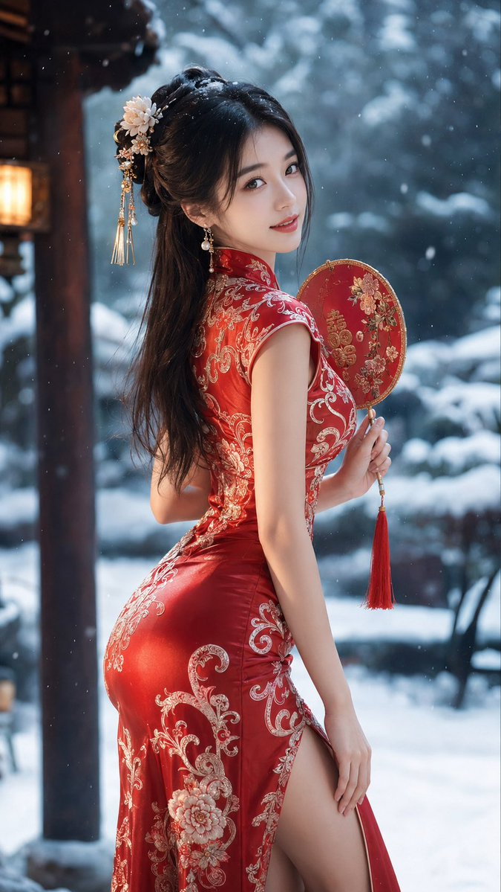

---

### Case 120: Y2K Korean Soft-Girl Editorial

**Source**: [@you1873118](https://x.com/you1873118/status/2051960110373855289)

**Prompt**:
```
最近女朋友有点沉迷这种

梦幻 Y2K 鬼马少女写真照

如果你平时爱

记录生活，拍照，搞氛围

这套GPT Image 2提示词一定要试试

A highly aesthetic Korean soft-girl editorial collage in a clean white studio. 3x3 magazine-style photo grid featuring a cute Korean girl with long wavy dark hair, wearing pink tops and oversized blue jeans. Soft pastel pink color palette, kawaii Y2K accessories, playful candid expressions, wink poses, cheek squishing, holding cotton candy, teddy bear, toy camera, popsicle, ice cream, and lollipop. Natural soft lighting, airy high-key photography, sweet youthful energy, Pinterest aesthetic, Korean idol photobook vibe, minimal white background, soft skin texture, dreamy lifestyle fashion editorial, cute but stylish, visually cohesive, adorable feminine atmosphere.
```

**Output**:

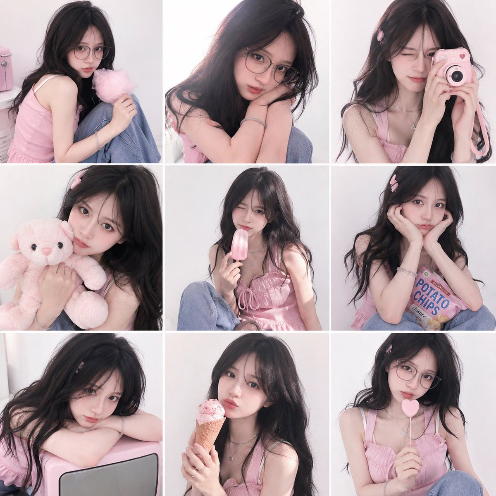

---

### Case 121: Japanese Graffiti Portrait Poster

**Source**: [@ZaraIrahh](https://x.com/ZaraIrahh/status/2052041111586402673)

**Prompt**:
```
Create a high-detail portrait poster in a bold Japanese graffiti-inspired art style, combining modern urban street aesthetics with expressive Japanese visual culture. The poster should feature dynamic graffiti typography, layered spray-paint textures, hand-drawn symbols, abstract paint splashes, neon brush strokes, urban sticker elements, Japanese calligraphy accents, and decorative ornaments that strongly reinforce the energetic atmosphere of the design. The overall composition should feel artistic, rebellious, fashionable, and visually striking, while still maintaining a premium editorial poster quality instead of looking messy or overdone. Humanity somehow turned vandalism into luxury wall art. Impressive species.

The subject must not replicate the exact pose or expression from the reference photo. Instead, create a completely new pose that feels natural, confident, and full of life. The expression should appear emotionally expressive, charismatic, and engaging, avoiding stiff, awkward, flat, or emotionless body language. The pose should reflect the elegance and sophistication commonly seen in international fashion models, with stylish posture, natural movement, and subtle attitude that enhances the overall cinematic fashion aesthetic.

The outfit should feature contemporary stylish casual fashion with strong visual appeal. Avoid plain or repetitive clothing designs. Use fashionable layering, modern streetwear inspiration, premium casual styling, and a balanced combination of colors, patterns, textures, and fabric types that create a rich and non-monotonous appearance. The clothing should feel trendy, fashionable, youthful, and visually premium while still fitting naturally into the Japanese graffiti poster concept.

The background and poster decorations should be filled with thematic urban Japanese-inspired visual elements such as graffiti walls, spray textures, painted symbols, urban signage, layered stickers, modern Japanese graphic motifs, abstract shapes, paint drips, street fashion aesthetics, and stylish decorative compositions that enhance depth and artistic intensity without distracting from the subject.

Lighting should feel cinematic and fashionable, with strong contrast, clean highlights, realistic skin texture, and high-end editorial poster quality. The final result must look like a premium modern street-fashion campaign poster with highly detailed textures, balanced composition, vibrant color harmony, realistic proportions, ultra-sharp focus, and immersive visual storytelling.

Ultra-detailed, highly aesthetic, premium composition, realistic texture rendering, fashionable urban atmosphere, cinematic quality, poster-ready design, 8K ultra high resolution.
```

**Output**:

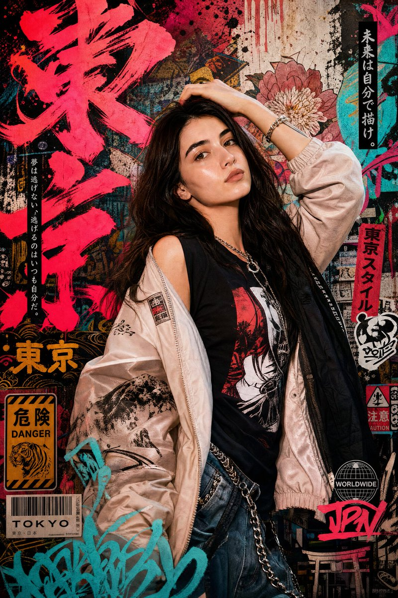

---

### Case 122: Cinematic Top-Down Couple Portrait

**Source**: [@Naiknelofar788](https://x.com/Naiknelofar788/status/2052041370777563190)

**Prompt**:
```
A cinematic top-down portrait in aesthetic style of a young couple lying side by side on a textured fabric surface, both wearing modest casual clothing with soft natural fabrics, their bodies relaxed and close to each other, heads slightly turned toward one another, **smiling, laughing, and chatting joyfully**, capturing a candid happy moment, gentle and natural expressions full of warmth, soft golden hour sunlight entering from one side, creating subtle light gradients and deep quiet shadows without harsh patterns, light softly dominating parts of the composition, low saturation with pale soft tones, slightly faded colors with warm ivory, beige, and subtle greenish tint, clean and airy atmosphere, delicate highlight bloom, underexposed shadows with minimal detail, shallow depth of field, very soft focus, fine film grain, Fuji Pro 400H film look, natural lighting, minimalist composition, **peaceful yet cheerful mood**, nostalgic Japanese cinematic feeling, intimate and heartfelt moment, understated elegance, poetic visual tone
```

**Output**:

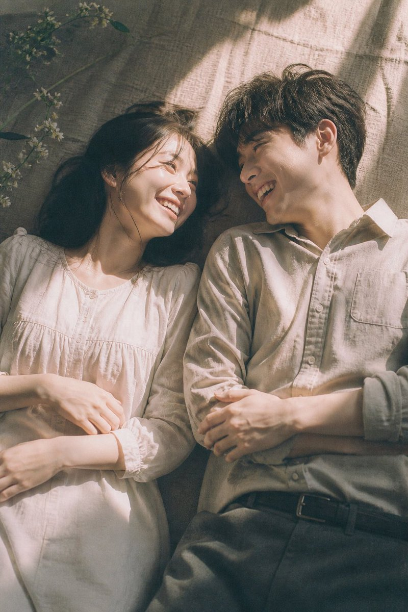

---

### Case 123: 中式深V礼服月下回眸

**Source**: [@liyue_ai](https://x.com/liyue_ai/status/2052054750888398898)

**Prompt**:
```
一位成年东方女性，9:16 竖版构图，写实风格，全身偏背面人像，人物行走在一条古典中式回廊之中，画面从后方略低机位捕捉她的身影，人物为绝对视觉中心。她微微回首，露出精致柔和的侧脸与安静迷人的神情，整体气质清冷、优雅、神秘而极具女性魅力。

她拥有纤细修长的身材，肌肤白皙细腻，黑色长发优雅盘起，发丝柔顺，点缀少量精致发饰。她身穿一袭黑色修身礼服 / 新中式晚礼裙，采用深V露背设计，背部大面积裸露，清晰展现女性优雅流畅的背部线条、肩胛轮廓与纤细腰身。礼服面料贴合身体曲线，从腰部自然收束，顺着身体向下延展，重点突出圆润饱满、流畅自然的臀部曲线，以及优雅的腰臀比例，呈现成熟女性含蓄而高级的性感气质。

外层披覆一层轻薄透明的白色薄纱披帛，薄纱在行走间轻轻飘动，增添柔美、朦胧和梦幻感。裙摆下摆带开衩或半透明叠层设计，在光影中展现细腻层次。整体体态修长挺拔，姿态自然优雅，强调女性身体线条的柔和力量感。

场景设定在夜色或月光下的中式庭院长廊，木质廊柱与雕花栏杆向远处延伸，形成强烈纵深感。四周盛开的白色花枝从前景与顶部穿插进入画面，花瓣在空气中轻轻飘落。远处挂着暖色灯笼或灯火，冷色月光与微暖灯光交织，营造静谧、空灵、诗意的氛围。地面与回廊中有斑驳光影，背景略带薄雾与浅景深虚化，突出人物主体。

整体风格要求：
高级写实风，东方电影感，美术摄影质感，唯美清冷，柔和光影，真实肌肤质感，精致服装面料，重点表现女性背部与臀部的优雅曲线，性感，梦幻氛围，超高细节，无文字，无水印。
```

**Output**:

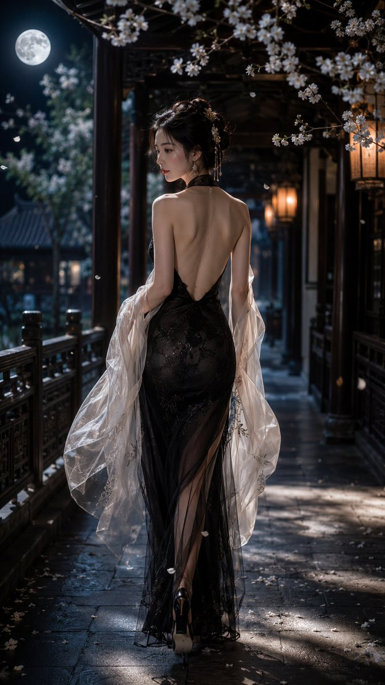

---

### Case 124: Multi-Exposure Ghost Echo Portrait

**Source**: [@Sheldon056](https://x.com/Sheldon056/status/2052033782061191429)

**Prompt**:
```
A man standing still while multiple semi-transparent versions of himself are layered around him, each slightly misaligned and looking in different directions.

Outfit: simple tee + denim.
Lighting: directional soft light creating ghost-like echoes.
Motion blur + echo trails.

Typography:

* Top: “TOO MANY”
* Smaller: “VERSIONS”
* Large overlapping text: “ME”

Mood: overthinking, fragmented identit
```

**Output**:

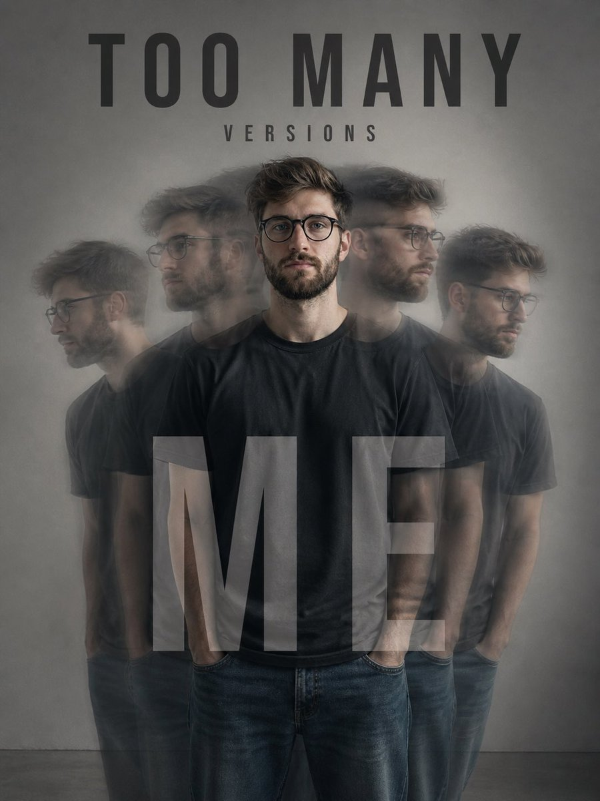

---

### Case 125: Baby Headgear Station Snapshot

**Source**: [@BubbleBrain](https://x.com/BubbleBrain/status/2052036785434440171)

**Prompt**:
```
Photorealistic candid street snapshot, Japanese train station concourse during rush hour, wide horizontal 4:3 frame, taken with a smartphone camera, natural imperfect composition, slight motion blur, realistic everyday atmosphere.

A fictional young adult East Asian woman standing near the ticket gates, wearing a soft romantic white outfit: delicate lace bonnet headscarf tied under the chin, semi-sheer white puff-sleeve blouse dress with subtle vertical pleats and soft flowing hem, light blue wide-leg jeans underneath, beige shoulder bag. She is holding a smartphone with both hands, looking slightly to the side with a quiet, uncertain, almost lost expression.

Background filled with blurred commuters walking in different directions, Japanese station signs, ticket gates, fluorescent ceiling lights, tiled floor, yellow tactile paving, urban transit details. The woman remains sharp while people around her are slightly blurred from movement.

Lighting: realistic indoor fluorescent station lighting, soft shadows, no cinematic exaggeration, muted natural colors, low contrast, documentary realism, subtle smartphone noise, casual snapshot feeling, slightly tilted framing, authentic Tokyo everyday street photography mood.

Style: realistic Japanese candid photography, iPhone snapshot, urban documentary, soft feminine fashion contrast against busy commuter crowd, natural skin texture, no heavy retouching, no studio lighting, no glamour pose.
```

**Output**:

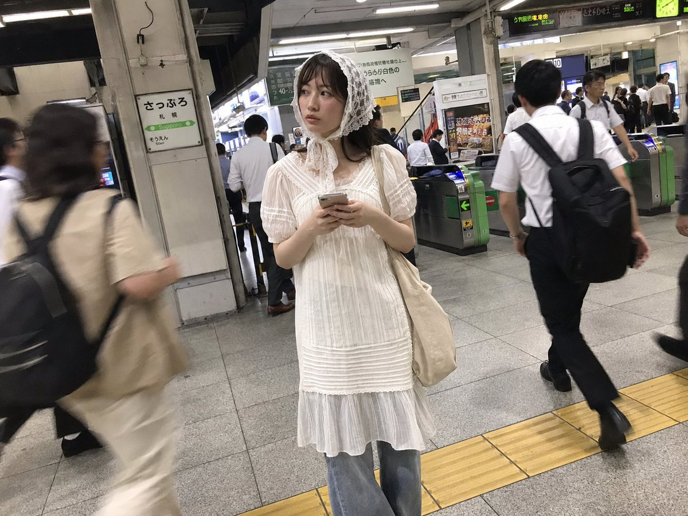

---

### Case 126: 镜子自拍二次元混合

**Source**: [@you1873118](https://x.com/you1873118/status/2052044966231425423)

**Prompt**:
```
手持手机开启闪光灯，在一个略显凌乱、随意灯光照射的房间里拍镜子自拍。周围环绕着多个动漫风格的角色，设计风格类似于[anime name]中的角色（如[character]、[character]、[character]、[character]和[character]）。他们站得非常近，亲密地聚集在我身边，有些轻轻触碰我的脸庞，其他的则紧靠着凑近。

妆容风格柔和自然，而面部特征明显受动漫美学启发。

场景营造出温暖舒适的氛围，带有柔和的阴影和镜中可见的闪光反射。视觉风格为半写实，带有电影般的照明、略带颗粒感的纹理，以及现代TikTok风格的美学。

这些角色看起来像是高质量cosplay的真人，而不是完全动画化的形象。
```

**Output**:

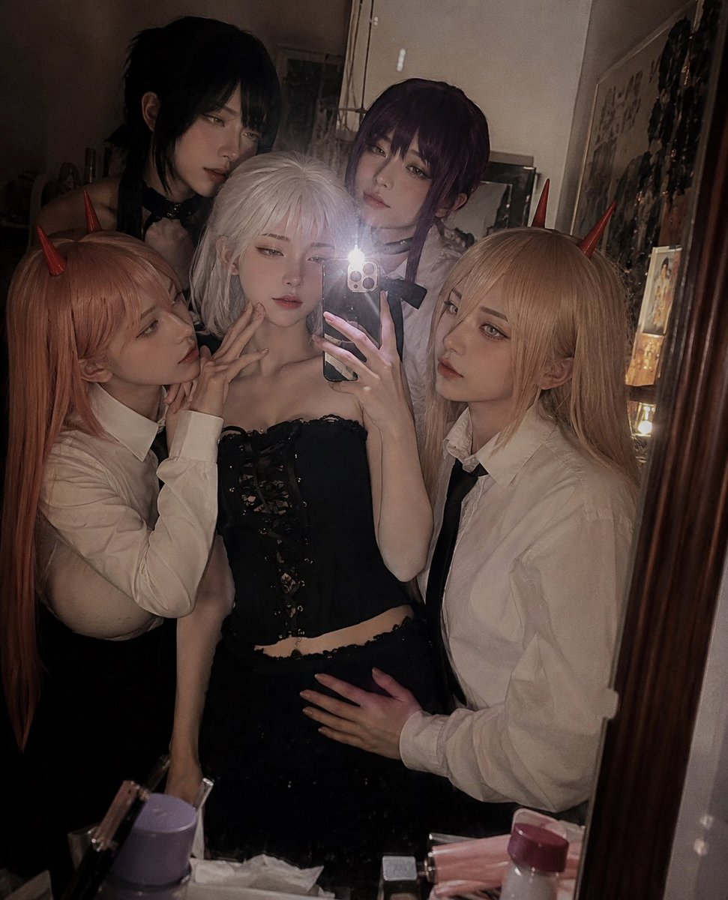

---

### Case 127: 韩风手绘涂鸦插画头像

**Source**: [@zhongying14](https://x.com/zhongying14/status/2052092830235885925)

**Prompt**:
```
分分钟把自己的照片改成插画头像啊！

GPT Image 2 提示词分享：
请基于用户上传的照片，创作一张韩风手绘涂鸦插画感人物海报。保留人物真实身份特征与整体气质，但整体表现要明显偏插画化，而不是写实转绘。

风格参考：韩风半写实插图、鲜明角色感、自然有表现力的面部情绪、半身构图、轻微动态姿势。强调松散自发的手绘线条、黑色墨水勾线、墨迹飞溅、草稿感笔触、可见笔刷纹理，以及柔和粉彩色调与墨水阴影的混合，呈现漫画草图般的质感。

不要做成高度写实插画，不要太像照片。要更有“画出来”的感觉，线条自由、边缘松弛、局部略带未完成感，头发和服装细节丰富，整体精致但有随性涂鸦感。

背景保持简约，可以是纯白或浅色纸张质感，围绕人物自由加入少量手写短句、星星、爱心、箭头、墨点、小贴纸等象征性装饰元素。文案和背景氛围请根据人物气质自由发挥。整体要高级、轻盈、灵动，像 X 上会火的韩系手绘人物海报。
```

**Output**:

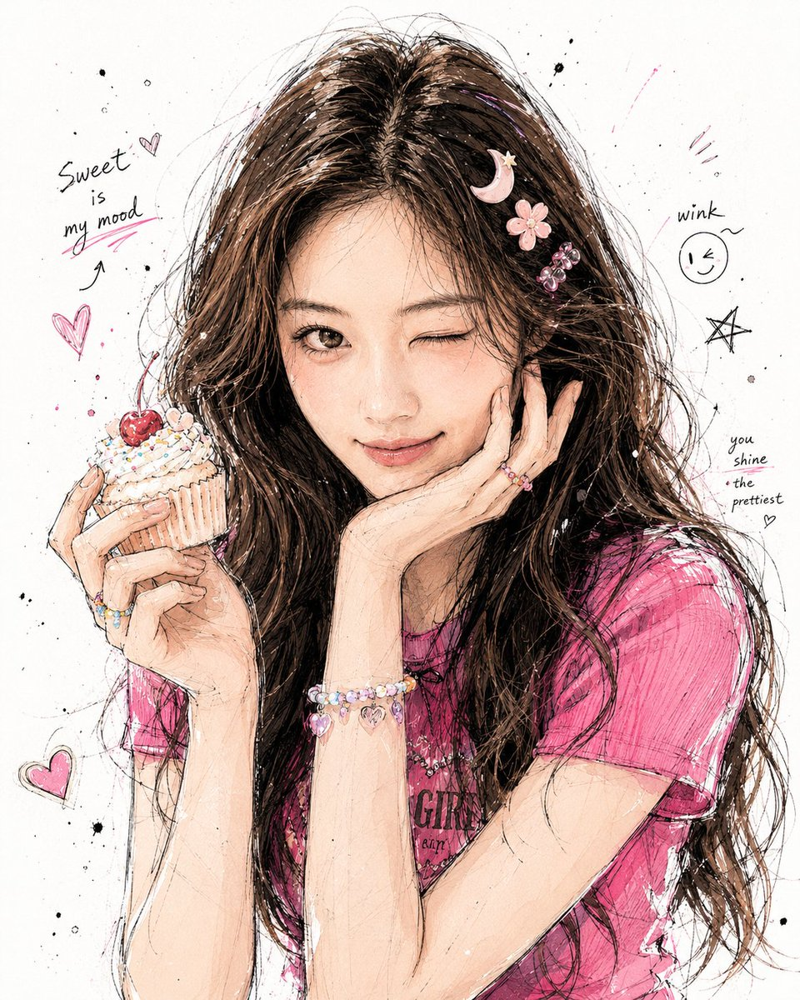

---

### Case 128: 照片趣味涂鸦互动

**Source**: [@zhongying14](https://x.com/zhongying14/status/2052079921808163125)

**Prompt**:
```
GPT Image 2提示词分享

步骤1：
分析上传的图片，保留原图的主体、构图和光线。请勿改变主角的身份或面部结构。添加一些与照片主体直接互动的趣味手绘涂鸦元素。这些涂鸦可以模仿、跟随或夸张现有的形状、姿势或动作——例如勾勒姿势轮廓、延伸手臂或腿部、添加动态线条，或创作一些与主体“互动”的富有想象力的元素，想象力需要大胆一些。

步骤2：
将整个图像转化为可爱的卡通风格插图，带有可爱的涂鸦美学。保持原始场景和角色细节，同时应用生动、柔和且俏皮的卡通外观。
```

**Output**:

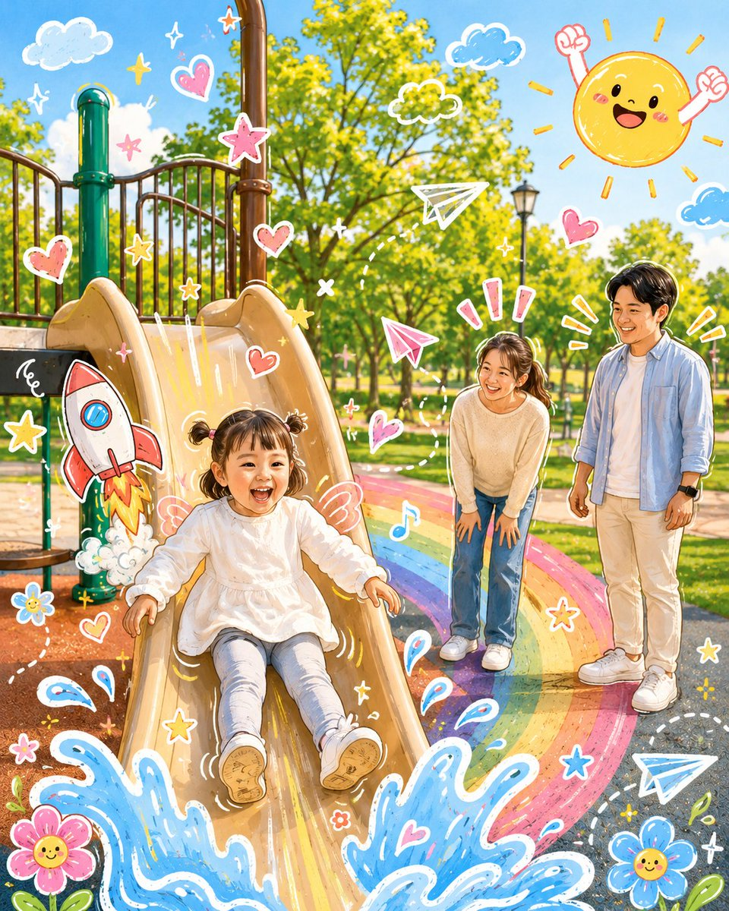

---

### Case 129: Mini Self Versions Motivational Portrait

**Source**: [@Xaroon_x](https://x.com/Xaroon_x/status/2052402655805493521)

**Prompt**:
```
A young boy sitting on a stool, wearing a beige hoodie and black pants, calm confident expression, surrounded by multiple cute mini cartoon versions of himself in different poses (sitting, climbing rope, taking photos, waving using phone), warm yellow-orange gradient background, modern motivational poster style, soft cinematic lighting, highly detailed face, 3D cartoon characters, depth of field, aesthetic composition, books stacked beside him (self-improvement theme), notebook on floor,
```

**Output**:

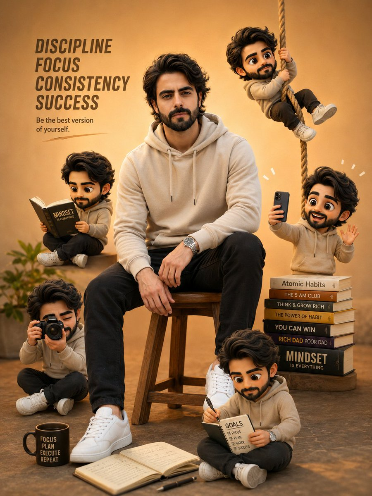

---

### Case 130: FACS Action Unit Expression Grid

**Source**: [@aimikoda](https://x.com/aimikoda/status/2052470692545982487)

**Prompt**:
```
Create a clean educational FACS Action Unit expression grid featuring a realistic adult female character.

Use minimal studio lighting, neutral white background, high readability, professional facial anatomy reference sheet aesthetic, realistic skin texture, consistent identity across all panels.

COLOR SYSTEM:
Use soft pastel color coding for categories while keeping the overall sheet minimal and elegant.

Forehead & Brow AUs:
soft pastel blue

Eye & Eyelid AUs:
soft pastel lavender

Nose & Cheek AUs:
soft pastel peach

Lip & Mouth AUs:
soft pastel pink

Head Movement AUs:
soft pastel mint

Eye Direction AUs:
soft pastel cyan

Special / Misc AUs:
soft pastel beige

Apply the color subtly as:
- panel background tint
- thin borders
- small label accents

Keep colors soft, muted and professional.

Include these Action Units:

GROUPS:

FOREHEAD & BROW
AU1 Inner Brow Raiser
AU2 Outer Brow Raiser
AU4 Brow Lowerer
AU71 Brow Furrow
AU72 Brow Bulge

EYE & EYELID
AU5 Upper Lid Raiser
AU7 Lid Tightener
AU41 Lid Droop
AU42 Slit Eyes
AU43 Eyes Closed
AU44 Squint
AU45 Blink
AU46 Wink

NOSE & CHEEK
AU6 Cheek Raiser
AU9 Nose Wrinkler
AU11 Nasolabial Deepener
AU82 Nostril Dilator
AU83 Nostril Compressor

LIP & MOUTH
AU10 Upper Lip Raiser
AU12 Lip Corner Puller
AU13 Sharp Lip Puller
AU14 Dimpler
AU15 Lip Corner Depressor
AU16 Lower Lip Depressor
AU17 Chin Raiser
AU18 Lip Pucker
AU20 Lip Stretcher
AU22 Lip Funneler
AU23 Lip Tightener
AU24 Lip Pressor
AU25 Lips Part
AU26 Jaw Drop
AU27 Mouth Stretch
AU28 Lip Suck
AU84 Tongue Up
AU85 Tongue Out

HEAD MOVEMENT
AU51 Head Turn Left
AU52 Head Turn Right
AU53 Head Up
AU54 Head Down
AU55 Head Tilt Left
AU56 Head Tilt Right
AU57 Head Forward
AU58 Head Back

EYE DIRECTION
AU61 Eyes Turn Left
AU62 Eyes Turn Right
AU63 Eyes Up
AU64 Eyes Down

SPECIAL / MISC
AU81 Chewing
```

**Output**:

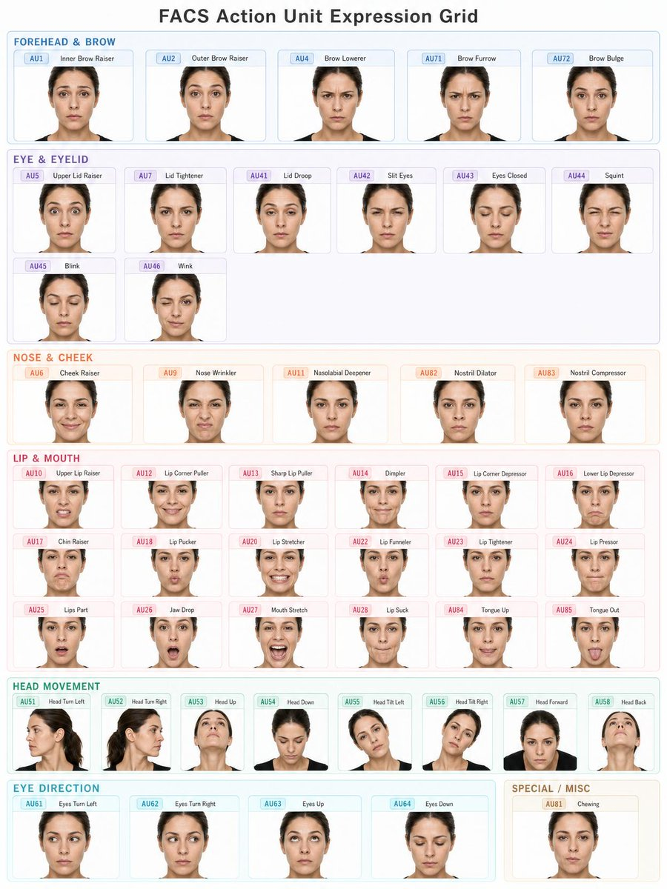

---

### Case 131: Female Cyclist Rainstorm 9-Panel Storyboard

**Source**: [@Just_sharon7](https://x.com/Just_sharon7/status/2052426076597744035)

**Prompt**:
```
Follow the storyboard strictly in exact order from Panel 1 to Panel 9. Do not skip, merge, or rearrange scenes.

Keep the SAME female cyclist identity across the entire film. No face changes, no hairstyle changes, no helmet changes, no body proportion inconsistencies.

Baby pink must remain the dominant apparel color throughout all cycling scenes. Avoid black wardrobe replacements.

Preserve realistic nighttime lighting continuity between shots. Maintain the same cool blue tones and subtle red light reflections.

Heavy rain intensity must stay visually consistent across all scenes.

Water physics must look physically accurate: droplets, splashes, mist, wheel spray, and runoff should behave naturally.

Avoid artificial AI motion. Camera movement should feel like real cinema rigs, FPV drones, mounted bike cameras, or stabilized tracking systems.

Drone shots must maintain locked framing and smooth movement without random drifting or orbiting.

Use subtle cinematic motion only — no excessive shaking or jitter.

Keep realistic breathing, body fatigue, pedaling mechanics, and fabric reactions to wind and rain.

Preserve shallow depth of field in macro shots and atmospheric haze in wide shots.

Keep the environment dark, moody, and cinematic with strong contrast between wet reflections and darkness.

Ensure all reflections on asphalt, water droplets, and bike components react naturally to changing light sources.

Maintain premium commercial pacing: slow controlled preparation and macro shots transitioning into aggressive high-speed riding sequences.

Final output should resemble a high-budget Nike / Rapha night cycling commercial shot during a real mountain storm. Ultra-realistic cinematic night cycling commercial about female endurance cyclists riding through an intense rainstorm in the mountains at night. Premium Nike / Rapha aesthetic with baby pink performance cycling apparel as the dominant accent color. Hyper-realistic documentary look, no stylization, no anime look, no beauty filters. Natural skin texture, realistic rain interaction, physically accurate water behavior, cinematic low-key lighting, cool blue night tones mixed with subtle red rear-light reflections. Heavy rain, fog, wet asphalt reflections, cinematic motion blur, high dynamic range, shallow depth of field, premium sports commercial quality.

The film follows a strict 9-panel storyboard structure with seamless cinematic transitions and continuity preserved across every scene. The SAME female cyclist identity must remain consistent throughout the entire video: same face, helmet, glasses, body proportions, baby pink apparel, lighting style, and overall appearance. Maintain continuity of rain intensity, wetness, fog density, and environmental lighting between all shots.

Panel 1: Extreme macro close-up of the female cyclist’s eyes and face in heavy rain at night. Focus on soaked eyelashes, wet skin texture, raindrops streaming across the face, baby pink helmet and baby pink face mask visible. Red rear bike light flickers dynamically across her eyes and skin while cool blue night tones dominate the scene. High contrast cinematic lighting, shallow depth of field, subtle breathing motion, intense determined expression.

Panel 2: Cinematic medium close-up frontal shot of the cyclist riding aggressively through heavy rain at night. She pedals hard with strong effort and forward-leaning posture. Baby pink waterproof cycling jacket soaked with rainwater. Front bike light cuts through fog and rain with subtle flickering illumination. Wet asphalt reflects red and white lights. Smooth cinematic tracking shot with controlled stable motion and slight natural float.

Panel 3: Ultra-realistic macro shot of large raindrops impacting wet asphalt at night. Crown-shaped splashes and overlapping ripples in slow motion. Rough wet asphalt texture, cool blue cinematic tones, subtle reflections from bike lights.
```

**Output**:

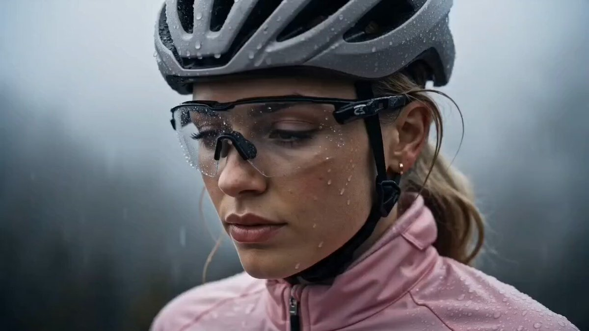

---

### Case 132: Anime Streetwear Character Poster

**Source**: [@harboriis](https://x.com/harboriis/status/2052391036325167165)

**Prompt**:
```
Create a stylized illustration of {character name} from {franchise}.

Character Analysis:

Derive the character’s core personality archetype based on canon portrayal (e.g., heroic, calm, mysterious, aggressive).
Identify the signature color from the original design and use it as the primary visual accent.

Pose & Body Language:

Generate an iconic pose that reflects the personality archetype:
Energetic / Heroic: dynamic action, wide stance, explosive movement
Calm / Confident: balanced, relaxed posture, minimal motion
Dark / Mysterious: low stance, subtle movement, sharp or hidden gaze
Aggressive / Intense: forward-leaning attack stance, visible tension, clenched fists

Facial Expression:

Match expression precisely to the character’s personality and emotional tone.

Art Style:

Anime × streetwear × graphic poster hybrid
Clean lineart, semi-flat shading, high contrast
Modern, minimal, and visually striking

Composition:

Vertical format 3:4
Off-center subject placement
Strong diagonal visual flow
Layered depth for a dynamic poster feel

Outfit Design:

Reimagine the original costume as modern streetwear / techwear
Preserve recognizable identity elements of the character

Color Palette:

Dominant clean white background
Use signature color as the primary accent
Add one secondary accent (complementary or analogous tone)
Keep palette minimal, bold, and high-contrast

Background:

Abstract geometric poster layout
Use negative space effectively
Integrate subtle accents using the character’s color theme

Effects:

Energy strokes, paint lines, and motion accents
Effects should follow the character’s energy and color identity

Lighting:

Sharp directional lighting
Crisp shadows
Subtle glow using the signature color

Rendering Quality:

Ultra-clean vector-style finish
Poster-quality composition
4K resolution, high detail
```

**Output**:

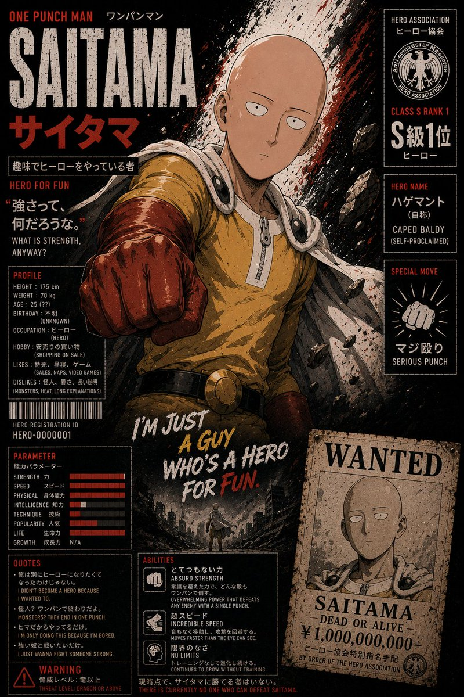

---

### Case 133: Korean Studio Couple Magazine Portrait

**Source**: [@zhongying14](https://x.com/zhongying14/status/2052267221649441221)

**Prompt**:
```
请基于用户上传的两位成年情侣清晰照片，生成一张韩系情侣杂志感棚拍写真。

请严格保留两个人的真实身份特征，包括脸型、五官比例、眼睛、鼻子、嘴唇、肤色、年龄感、发型基础和整体气质。生成结果必须清楚看起来是同一对真实情侣，不能变成陌生人，不能欧美化，不能过度美颜，不能出现 AI 假脸。

请只把上传照片作为人物身份参考，不要保留原照片中的原始背景、衣服、场景和构图。请重新生成全新的情侣棚拍写真。

整体风格为：
韩系杂志感情侣写真，极简棚拍，温柔自然，安静亲密，轻 editorial 感，像时尚杂志内页，不是影楼婚纱风，也不是普通自拍。

背景统一为纯净的浅灰色、暖灰色、米灰色或奶油灰色无缝摄影棚背景。光线为柔和均匀的棚拍柔光，画面干净克制，色调低饱和、温暖、自然，带轻微胶片质感，同时有一点点雾蒙蒙的感觉，但整体仍然清晰细腻。 

服装方向请统一为简洁、有质感的杂志风穿搭：
- 男生适合炭灰色针织上衣
- 女生适合暖橘色毛绒感针织上衣 
整体不要花哨，不要过度潮流感，不要廉价影楼风。

请特别强化两个人的眼神、情绪和关系表达，让画面看起来更有灵魂，而不是只有姿势。

两个人之间要呈现真实情侣关系感：
- 熟悉
- 信任
- 依赖
- 放松
- 自然亲近
- 在彼此身边会自然松下来
- 有轻微互动回应，而不是机械摆拍

眼神不要空洞，不要僵硬。请根据不同镜头安排自然的眼神流向：
- 有的镜头看向镜头，眼神平静柔和、带一点温度
- 有的镜头看向对方，目光自然、轻柔、专注
- 有的镜头看向镜头外侧，像情绪刚刚流动到某个瞬间
- 有的镜头闭眼轻笑，像真实互动中被逗笑的一瞬间

表情不要商业假笑，不要每张都只有同一种浅笑。请让表情更有层次：
- 平静带淡淡笑意
- 闭眼轻笑
- 忍不住笑出来
- 被逗笑后的自然大笑
- 轻微害羞
- 安静放松
- 若有所思但温柔
- 被对方触碰时自然放松

请避免整组图片出现表情、角度、构图和动作重复。不要每张都只是正面看镜头、站着靠近、浅浅微笑。整组照片要像同一次拍摄中的不同瞬间，而不是同一个姿势的重复变体。

请强化“抓拍感”和“瞬间感”：
- 动作像正在发生，而不是已经完成后静止摆拍
- 表情像情绪刚刚流动出来
- 允许有些镜头不完全看镜头
- 允许轻微不对称
- 允许笑容正在展开或刚收住
- 允许刚靠近、刚转头、刚抱住、刚低头笑、刚贴脸的一瞬间

请让每张画面都像摄影师在真实互动中自然捕捉到的瞬间，同时保留杂志级的构图和质感。

人物脸部与身体比例控制

请特别注意两个人的脸部比例、头身比例和身体结构必须自然真实。两个人都要像真实成年人，不要出现脸过大、头过小、脖子过长、肩膀错位、身体扭曲、手臂过长、手掌过大、身体拼接感或不符合人体结构的问题。

请根据上传照片保留两个人各自真实的脸型、头部大小、身材比例、肩宽、脖颈长度和整体体态。不要把男生变得过度高大、脸过宽、肩膀过夸张；不要把女生变得过度幼态、头过大、身体过小、脖子过细或比例失衡。

两个人同框时，请保持合理的空间关系和透视关系：
- 近镜头的人可以稍微更大，但不要夸张变形
- 远一点的人可以略小，但仍要保持真实成年人比例
- 两个人的头部大小差异要自然
- 脸、肩膀、手臂、躯干之间的位置关系要符合真实情侣合照
- 环抱、贴脸、靠肩、托脸、牵手时，肢体接触要自然，不要出现手臂穿模、手指混乱、身体重叠错误或肢体融合

请让两个人看起来像真实摄影棚里拍到的一对情侣，而不是被 AI 拼接出来的两个人。身体结构、脸部大小、肩颈线条、手部位置都要自然、协调、可信。
负面约束：
不要眼神空洞、无神、发呆；不要每张都同一种微笑；不要每张脸部角度都几乎一样；不要像两个陌生模特在完成动作；不要过度甜腻、不要夸张偶像剧感、不要过度表演；不要拍成机械重复的棚拍样片。不要出现脸部比例奇怪、头身比例失衡、脸太大或太小、脖子过长、肩膀错位、身体扭曲、手臂异常、手指错误、肢体融合、身体穿模、两个人像拼接在一起、情侣互动不符合真实人体结构的问题。
```

**Output**:

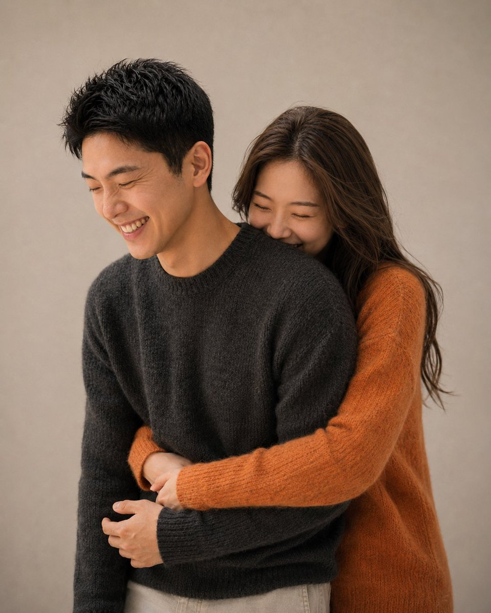

---

### Case 134: Floating Streetwear Fashion Poster

**Source**: [@im_shahid7](https://x.com/im_shahid7/status/2052420684899647933)

**Prompt**:
```
A high-end futuristic streetwear fashion poster featuring a faceless avant-garde model floating and leaping through the sky. The model wears an oversized beige puffer jacket with layered hoods and a knitted face mask completely covering the face. The lower outfit consists of loose white cargo pants layered with exaggerated light blue and dark blue stacked denim leg warmers, paired with beige sneakers and a black crossbody shoulder bag.
The composition uses an extreme low-angle perspective shot, making the legs and shoes appear dramatically enlarged for intense visual impact, as if the character is jumping directly over the viewer’s head. The pose feels anti-gravity and surreal — one arm stretched outward while one leg kicks forward dynamically, creating a floating airborne motion.
The background features a bright cyan-blue sky with soft white clouds, illuminated by clean sunlight and strong atmospheric depth. The overall visual style blends luxury fashion editorial photography, surreal streetwear advertising, and experimental urban poster design.
Add two smaller collage-style silhouette versions of the character in the top-right and bottom-left corners — one floating in the air and another mid-jump — creating the feeling of a fashion magazine collage layout.
Poster layout should resemble a square luxury magazine cover adapted to a 9:16 vertical composition. Add massive abstract rounded typography at the top inspired by Y2K bubble fonts and experimental streetwear brand logos. Include a small graffiti-style brand mark on the left side. On the right side, place a white handwritten brush-style slogan reading: “RISE ABOVE WITH FASHION”, followed by tiny editorial-style caption text underneath. Add a small barcode centered at the bottom.
The design should include thin white borders and a soft off-white paper texture overlay.
Style keywords: futuristic street fashion, avant-garde clothing design, Y2K graphic design, magazine cover typography, collage silhouettes, extreme low-angle shot, sky background, surreal floating motion, exaggerated perspective, premium streetwear campaign, realistic fabric texture, ultra-detailed, clean luxury aesthetic.
Aspect ratio: 9:16 vertical.
```

**Output**:

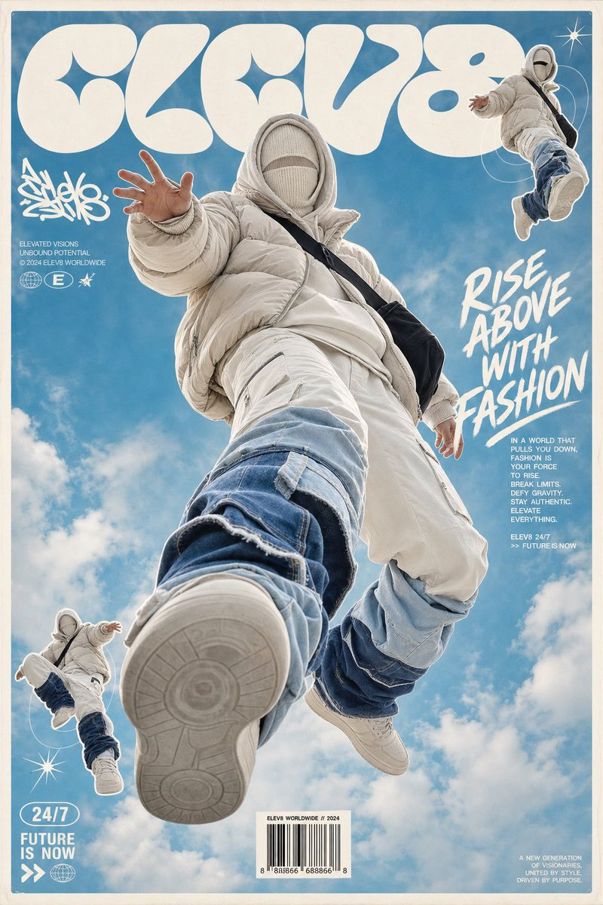

---

### Case 135: Demon Empress Lilitha Fantasy Poster

**Source**: [@john_my07](https://x.com/john_my07/status/2052430356096413896)

**Prompt**:
```
Epic dark-fantasy anime poster illustration featuring a powerful demon empress named “Lilitha”, designed in an ultra-detailed watercolor and ink-splatter art style. Massive cinematic vertical composition with a graceful side-profile portrait of a mesmerizing woman with porcelain skin, long flowing moonlit lavender hair, glowing ruby eyes, and a subtle dangerous smile. Elegant obsidian-and-crimson horns curve from her head while gigantic shadowy bat wings sweep across the frame like a living cloak.
Within her silhouette, reveal an expansive mystical realm using layered double-exposure storytelling: radiant amethyst crystal caves, enchanted forests, floating ancient temples, glowing celestial rivers, astral nebula clouds, and a lone traveler wandering through the magical landscape. Around the upper torso area, include a dramatic chess-table scene lit by candlelight, featuring mysterious shadow figures and a smaller version of Lilitha confidently smirking while playing the game.
At the lower center of the artwork, depict the full-body demon empress standing with authority, enormous crimson dragon wings fully expanded. She wears elegant black-and-ruby fantasy battle attire with luminous arcane details, surrounded by swirling pink, magenta, and violet magical flames.
Art direction should blend expressive watercolor textures, ink wash splashes, cosmic galaxy effects, painterly anime brushwork, and high-end cinematic fantasy poster aesthetics. Strong contrast of deep purples, crimson reds, magenta highlights, and rich black tones against a bright clean background with artistic paint-splatter framing. Dreamlike lighting, mystical atmosphere, highly intricate detailing, fantasy masterpiece illustration, ArtStation-quality, ultra refined, 8k resolution.
Typography in the top-left corner: “Lilitha” written in bold expressive brush-calligraphy.
Negative prompt: low resolution, blurry details, distorted anatomy, extra limbs, cropped composition, weak lighting, dull palette, photorealistic style, messy structure, duplicated subjects, text glitches, watermark, oversaturated noise.
```

**Output**:

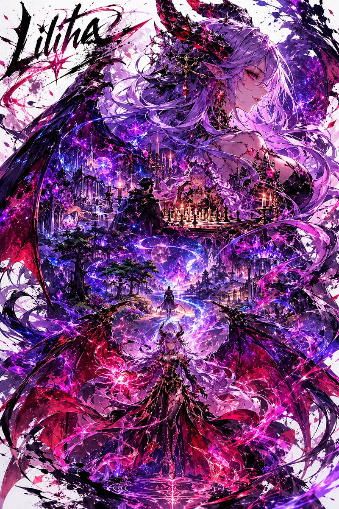

---

### Case 136: Red Gown Shattered Mirror Portrait

**Source**: [@liyue_ai](https://x.com/liyue_ai/status/2052229134693372089)

**Prompt**:
```
一位东方幻想成年美女正缓缓走向一面高大的镜子，画面为 9:16 竖版构图，摄像机位于她的左后方，以略带电影感的中远景视角捕捉她的身影。她是画面的绝对视觉中心，背影优雅迷人，身穿一袭华贵的红色礼服，礼服具有高级定制感，面料精致，细节丰富，带有层叠刺绣、珠饰或立体纹理。礼服为露肩设计，并带有深 V 领口，整体华丽、性感但高级克制，充分展现肩颈线条、锁骨气质与身体曲线。

她正朝镜子走去，身体以背面和左后侧为主，姿态优雅从容。镜子中清晰映出她的正面形象，镜中她的面容精致美丽，神情安静而富有故事感，同时可以看到她优美的锁骨，以及饱满胸部上半部分自然柔和的轮廓，整体呈现高级、唯美、迷人的女性气质。

在镜子四周以及画面周围，漂浮着大量破碎镜片，这些镜片是不规则的形状，边缘锐利但具有艺术感，如同时间被打碎后悬浮在空气中。有些碎镜中，映照出她过去与未来不同的样子：有的更年轻纯真，有的成熟冷艳，有的高贵神秘，有的未来感十足，有的带有不同年龄、不同气质、不同命运阶段的她。镜中形象都要保持同一人物的核心辨识度，但在妆容、发型、服饰、气质和时代感上有所区别，形成“同一个人不同人生切片”的感觉。

整个空间梦幻、神秘、唯美，光线以柔和光为主，镜子与碎镜边缘折射出红色、金色、银色与微冷白光，空气中带有轻微雾气、微粒、反射光斑与体积光。整体氛围像梦境、记忆与未来交汇的瞬间，华丽而富有叙事感。画面采用3D CG插画风格，整体明亮，精致、高级、细节丰富
```

**Output**:

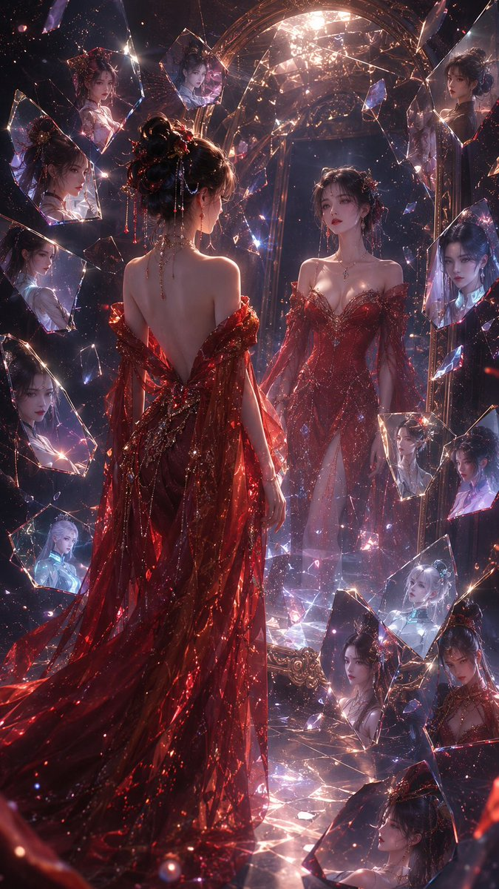

---

### Case 137: Cheongsam Year of Horse Graffiti

**Source**: [@msjiaozhu](https://x.com/msjiaozhu/status/2052368319903318236)

**Prompt**:
```
有点没搞懂，同一份提示词，在香蕉那正常，GPT Image 2 这边尺度明显大了很多🤪

但矛盾的是，在香蕉能生成的提示词，放到 GPT 这边又提示不符合平台政策 balabala🤔

提示词👇
{
  "task_description": "Create a natural street portrait of a real person standing in front of a layered, messy graffiti wall. The wall features a spontaneous, hand-painted caricature of the person mixed with Year of the Horse elements.",
  "global_settings": {
    "aspect_ratio": "4:3",
    "overall_vibe": "Authentic urban street culture, vibrant Lunar New Year energy, raw and spicy"
  },
  "variables": {
    "mural_main_text": "马上暴富",
    "mural_secondary_text": "2026",
    "theme": "Year of the Horse - Festive & Hot"
  },
  "mural_aesthetics": {
    "rendering_style": "Hand-painted aerosol art, authentic street graffiti style",
    "messiness_factors": [
      "Visible paint splatters and spontaneous drips in gold and red",
      "Soft, blurred spray edges over weathered concrete textures",
      "Layered effect: a stylized Horse zodiac silhouette and the subject's caricature painted over old, messy tags",
      "Imperfect, high-energy freehand strokes"
    ],
    "content": "A vibrant caricature based on the reference person's facial features, integrated with bold '2026' and horse-themed graffiti symbols."
  },
  "style_scenarios": {
    "New_Year_Festive_Spicy": {
      "setting": "A bustling old city alleyway at dusk with warm ambient lighting",
      "palette": "Dominant imperial red, vibrant gold, and charcoal black accents",
      "details": "Faint glowing red lanterns blurred in the background, festive 'Chunlian' inspired graffiti tags"
    }
  },
  "foreground_subject": {
    "logic": "Mirror the gender and facial features of the reference image.",
    "attire_strategy": "A spicy and festive fusion outfit: A form-fitting, modified modern Cheongsam (Qipao) with a daring deep V-neck and a large open-back design, rendered in glossy silk red with gold embroidery. The outfit should be provocative (high-slit to the hip), emphasizing a curvaceous silhouette.",
    "position": "Grounded in the frame, flexible positioning (center or right-third).",
    "camera_and_pose_options": [
      {
        "angle": "Low-angle shot (worm's eye view)",
        "pose": "Standing tall with one foot forward, leaning slightly back to elongate the legs and emphasize the high-slit dress, looking down at the camera with a confident gaze.",
        "effect": "Powerful, statuesque, and dominant."
      },
      {
        "angle": "High-angle close-up portrait",
        "pose": "Leaning against the wall with arms crossed behind the head, highlighting the curves of the upper body and the deep V-neck, looking up with a playful, sultry smile.",
        "effect": "Intimate and alluring."
      },
      {
        "angle": "3/4 side-view / Dutch angle",
        "pose": "Walking past the wall but looking back over the shoulder (candid movement), capturing the open-back detail and the flow of the dress's high slit.",
        "effect": "Dynamic, cinematic street photography."
      },
      {
        "angle": "Sitting or crouching pose (eye-level)",
        "pose": "Crouching casually in front of the mural, one hand on the ground and the other on the knee, wearing a red oversized street jacket partially falling off the shoulder to reveal the sexy outfit underneath.",
        "effect": "Raw, edgy, and effortlessly cool."
      }
    ]
  },
  "technical_finish": {
    "wall_texture": "Naturally weathered urban brick wall; organic cracks blended with fresh, thick spray paint texture.",
    "lighting": "Warm golden hour lighting mixed with red lantern glow; soft shadows cast on the wall to create 3D depth."
  }
}
camera_and_pose_options choose first one
```

**Output**:

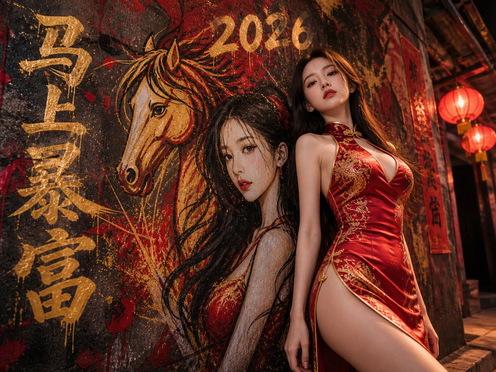

---

### Case 138: Japanese Tatami Manga Reading Portrait

**Source**: [@Ciri_ai](https://x.com/Ciri_ai/status/2052431172224094321)

**Prompt**:
```
A Japanese teenage girl wearing a white sailor school uniform with a navy blue collar, lying on a traditional Japanese tatami floor, staring directly at the camera while holding a manga book in front of her face, covering her mouth and chin so that only her eyes and part of her nose are visible. Overhead top-down camera angle directly above her. Long black hair naturally spread across the tatami mat. Surrounded by vintage analog cameras, a retro cassette tape recorder, disposable camera, Japanese soda can, and small aesthetic accessories. Warm afternoon sunlight streaming through a window, creating dramatic striped shadows. Cinematic lighting, nostalgic Japanese youth aesthetic, moody atmosphere, soft shadows, photorealistic, realistic skin texture, ultra detailed, editorial photography style, 35mm film look, cozy retro Japanese room, authentic tatami texture, shallow depth of field, high realism.

Negative prompt: blurry, low quality, extra fingers, bad anatomy, distorted hands, duplicate objects, deformed face, extra limbs, overexposed, watermark, text artifacts, anime, cartoon, CGI
```

**Output**:

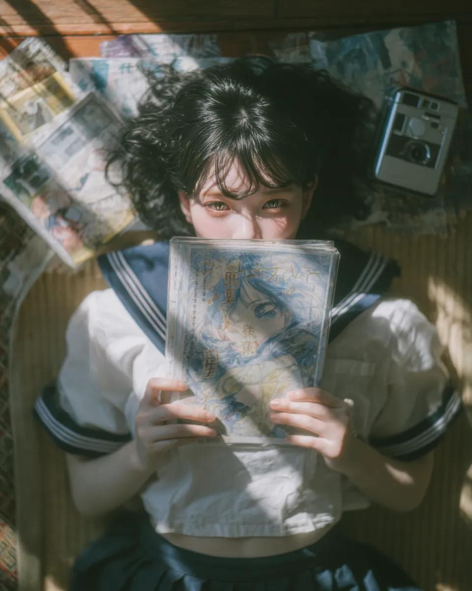

---

### Case 139: Ink Side Profile Mixed Media Portrait

**Source**: [@j_smeaton99](https://x.com/j_smeaton99/status/2052416775879561445)

**Prompt**:
```
;

{
  "reference_image": "uploaded_photo",
  "face_likeness": {
    "accuracy": "high",
    "preserve_features": [
      "exact facial structure",
      "natural skin tone",
      "eye shape",
      "nose form",
      "lip structure",
      "original expression"
    ],
    "usage": "primary face reference for proportions and likeness"
  },

  "portrait_style": {
    "composition": "dramatic female side-profile portrait",
    "mood": "intense, rebellious, emotionally charged",
    "art_direction": "expressive mixed-media ink illustration with conceptual editorial aesthetics"
  },

  "subject_details": {
    "gender": "female",
    "pose": "strong side profile facing right",
    "presence": "bold, mysterious, psychologically complex",
    "hair": {
      "style": "messy textured bun with loose strands",
      "treatment": "chaotic ink brush detailing and sharp sketch strokes"
    },
    "wardrobe": {
      "type": "dark abstract oversized jacket",
      "treatment": "heavy painterly textures, angular brushwork, layered ink strokes"
    }
  },

  "visual_elements": {
    "overlays": [
      "cryptic handwritten notes",
      "abstract mathematical sketches",
      "symbols and glyphs",
      "fragmented typography",
      "ink splatters",
      "diagram-like markings wrapping around the face"
    ],
    "meaning": "representing inner conflict, hidden emotions, intellectual chaos, and emotional depth"
  },

  "art_technique": {
    "linework": "sharp pen detailing mixed with aggressive brush strokes",
    "effects": [
      "ink splashes",
      "controlled chaos",
      "layered textures",
      "grunge imperfections",
      "rough mixed-media blending"
    ],
    "style_blend": "editorial illustration meets psychological concept art"
  },

  "background": {
    "texture": "aged parchment paper",
    "tone": "warm desaturated beige with grain",
    "details": [
      "faded manuscript texture",
      "subtle stains",
      "vintage paper imperfections",
      "delicate line artifacts",
      "hand-drawn sketch remnants"
    ]
  },

  "lighting": {
    "style": "high-contrast cinematic shading",
    "focus": "sharp highlights on facial contours with deep ink-heavy shadows"
  },

  "overall_aesthetic": {
    "contrast": "high",
    "finish": "raw yet precise, experimental and cinematic",
    "emotion": "powerful, intense, thought-provoking, rebellious"
  },

  "quality": {
    "detail_level": "extremely high",
    "render_style": "premium artstation-quality editorial illustration",
    "resolution": "ultra detailed"
  }
}
```

**Output**:

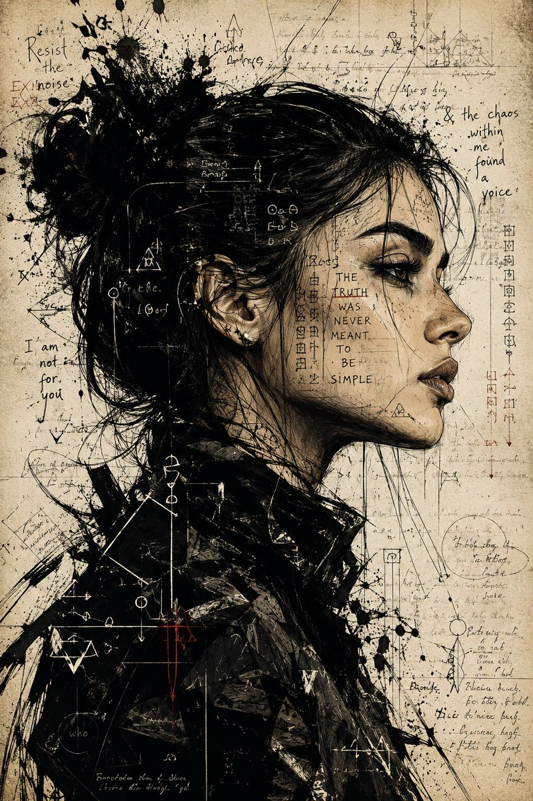

---

### Case 140: Latte Art Storyboard Sketch Sequence

**Source**: [@aimikoda](https://x.com/aimikoda/status/2052511767608066452)

**Prompt**:
```
Create a storyboard for a creative and artistic video about making latte art. The uploaded character should also appear in the storyboard. Use a basic sketch style. The overall tone should feel like fast slapstick mischief with instant hooks while still remaining artistic. The latte design should become the logo from the second image and be revealed at the very end. The character should also sing a musical song while making the latte art.

Pour the milk, let it spin
Tiny waves are dancing in
Foam goes round, the rhythm starts
Drawing magic, drawing hearts

One last swirl, one little glow
Watch the secret pattern show
In the cup, the dream comes through
Latte art made just for you!
```

**Output**:

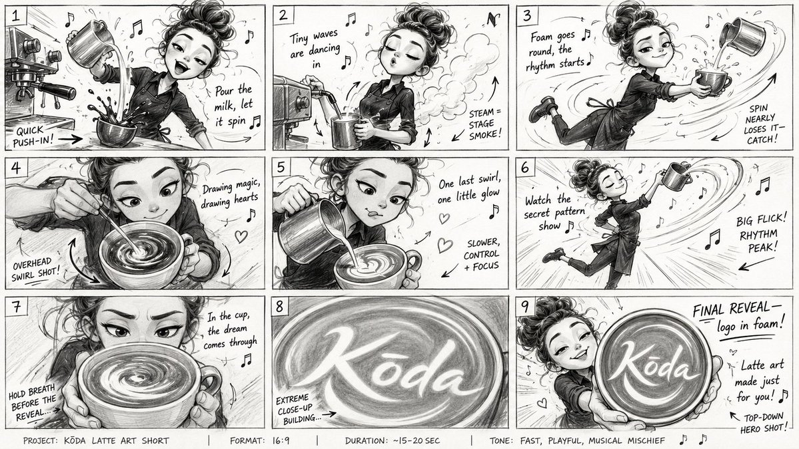

---

### Case 141: Desert Walking Citadel Cinematic Storyboard

**Source**: [@oggii_0](https://x.com/oggii_0/status/2052419818788438257)

**Prompt**:
```
Seedance 2.0 + GPT Image 2 on @SocialSight

Prompt: Desert Walking Citadel
 [FORMAT]
Duration: 15 seconds
Aspect Ratio: 16:9
Style: ultra realistic cinematic sci-fi, grounded physics, industrial dystopian realism, hyper detailed, dynamic action cinematography

[IMAGE BINDING — ABSOLUTE LOCK]

@ image1 = FEMALE REBEL + HOVERBIKE + SCRAP ARMOR
@ image2 = WALKING FACTORY + ENVIRONMENT + DRONES
@ image3 = STORYBOARD CONTINUITY 

RULE:
Maintain identical character design, bike engineering, machine structure, drone silhouettes, atmosphere, color palette, and armor behavior throughout all shots.

NO clean sci-fi.
NO glossy surfaces.
NO random redesigns.
[SUBJECT]

Female desert rebel riding an ultra-fast hoverbike across a wasteland toward a gigantic walking industrial fortress.

Appearance:
- athletic female scavenger
- short dark hair
- asymmetric scrap armor
- magnetic debris manipulation
- practical survival outfit

Movement:
- aggressive precision
- grounded stunt physics
- high-speed reactive combat
[SECOND SUBJECT]

Gigantic walking industrial city-machine.

Behavior:
- slow but unstoppable
- massive mechanical weight
- launches defense drones
- creates dust storms while walking
[ENVIRONMENT]
Endless desert wasteland during industrial sunset.
Atmosphere:
- sandstorms
- smoke plumes
- heat distortion
- debris clouds
- turbine dust trails
- collapsing metal wreckage
[VFX SYSTEM]

Color:
- deep red
- ember orange
- burnt steel
- furnace glow

Effects:
- realistic dust interaction
- sand displacement
- magnetic debris attraction
- sparks and turbine exhaust
- pressure distortion
- debris collisions
- heat haze
RULE:
Grounded industrial realism only.
NO fantasy magic effects.
[AUDIO]
- turbine roar
- metal rattling
- distant industrial groans
- drone propulsion screams
- heavy impact bass
- sand hitting metal
- wind shear during speed shots
- brief silence before major impacts
[CAMERA]
Lens:
- 24mm–50mm cinematic hybrid
Behavior:
- aggressive chase tracking
- aerial fly-bys
- low-angle scale shots
- near-pass debris
- reactive handheld impacts
- high-speed lateral tracking

RULE:
Camera always emphasizes speed and scale.
[PHYSICS]
- realistic momentum
- believable collisions
- visible weight on all machinery
- sand reacts dynamically to movement
- debris obeys gravity and velocity
[TIMELINE]
0.0–1.5s — DESERT HORIZON
Gigantic walking factory emerges through dust storms on the horizon.
Camera:
slow aerial reveal
Audio:
deep industrial groaning
1.5–3.5s — HIGH-SPEED CHASE
Female rebel races across dunes on hoverbike.
Camera:
side tracking beside bike
VFX:
sand displacement and turbine trails
3.5–5.0s — DRONE DEPLOYMENT
Massive drone bays open on the walking factory.
Defense drones launch aggressively.
Camera:
telephoto compression shot
5.0–6.5s — SCRAP ARMOR ACTIVATION
Metal debris magnetically forms armor around rebel while riding.
VFX:
rotating fragments, sparks, locking plates
Camera:
close orbit tracking
6.5–8.5s — DRONE PURSUIT
Drones attack from multiple angles.
Rebel narrowly dodges through wreckage.
Camera:
fast handheld chase motion
8.5–10.0s — MID-AIR JUMP
Rebel launches from hoverbike toward a drone.
Time slightly slows.
She smashes the drone mid-air.
VFX:
metal fragments, sparks, debris burst
Audio:
bass-heavy impact + short silence 10.0–12.0s — FACTORY LANDING
Rebel lands onto moving industrial structure.
Massive machinery moves beneath her feet.
Camera:
low-angle tracking shot
12.0–14.0s — ASCENT
She runs across moving mechanical surfaces toward upper levels.
Background:
gigantic legs crush dunes below
14.0–15.0s — FINAL FRAME
The colossal walking factory blocks the setting sun completely.

Tiny silhouette of rebel standing on machine edge.

Camera:
slow cinematic pull-back

CUT TO BLACK

[ENDING]

No resolution.
Maintain tension.
Seamless continuation into next sequence.
```

**Output**:


---

### Case 142: GTA VI Style Fashion Poster

**Source**: [@you1873118](https://x.com/you1873118/status/2052366066991714396)

**Prompt**:
```
创作一张高度详细的 8K 肖像海报，灵感来源于现代《Grand Theft Auto VI》宣传艺术作品的标志性视觉风格，呈现出电影般的都市氛围，采用大胆构图、鲜艳灯光、分层图形元素，以及时尚当代街头奢华时尚能量。整体设计必须强烈捕捉 GTA VI 海报的标志性氛围，包括动态霓虹色彩分级、热带现代城市氛围、戏剧性阴影、光泽高光、风格化纹理、装饰性饰品、图形叠加、都市符号、奢华生活点缀，以及沉浸式环境叙事。添加高级海报装饰元素，如抽象形状、涂鸦风格点缀、微妙复古现代纹理、奢华车辆轮廓、夜生活元素、棕榈树阴影、街牌细节、发光反射，以及分层视觉效果，这些元素能丰富构图而不让它显得拥挤。
在海报上突出放置大型电影式标题文本“Grand Theft Auto VI”，使用受官方 AAA 视频游戏宣传海报启发的字体设计，其中“GTA”的完整版本明确写成“Grand Theft Auto”。字体应感觉大胆、奢华、现代，并自然融入海报设计，由额外的较小装饰性文本、符号、标签和图形 UI 风格元素支持，以强化真实的游戏海报氛围。
主体不得复制参考照片中的确切姿势。创作一个完全新鲜且视觉上更具吸引力的姿势，带有更强烈的肢体语言、自然动作和富有表现力的情感。表情应感觉生动、魅力十足、自信且电影化，而不是僵硬、尴尬或平淡。姿势必须类似于国际时尚模特的优雅与态度，结合时尚自信与放松真实感。避免静态站姿。相反，使用动态姿态、微妙动作、时尚手势、不对称身体定位、与环境的真实互动，以及强烈的眼神表达，来营造高级编辑风格的外观。
服装应采用潮流现代休闲时尚，带有奢华街头服饰影响。服装必须感觉时尚、年轻且视觉丰富，避免平淡或单调的造型。结合多变颜色、分层服装件、现代面料纹理、独特图案、时尚配饰，以及当代时尚细节，这些元素应与 GTA VI 启发氛围相辅相成。造型应感觉高级、适合摄影且可信，类似于高端编辑时尚与现代开放世界视频游戏美学的混合。
使用电影式灯光，带有真实皮肤纹理、详细面料渲染、大气反射、深度丰富的环境构图、平衡对比，以及超清晰视觉细节。海报应感觉像官方下一代 AAA 游戏宣传艺术作品，具有高度精炼的渲染质量、沉浸式视觉叙事，以及专业图形设计执行。超详细、高度美学、电影构图、真实比例、高级海报布局、鲜艳现代色彩调色板、视觉强大，并以超高清 8K 质量渲染。比例 4:5
```

**Output**:


---

### Case 143: Ming Dynasty War Deity Streetwear

**Source**: [@you1873118](https://x.com/you1873118/status/2052247312026792030)

**Prompt**:
```
创作一张超高细节「新中式国潮 × 明代杀神」时尚人物海报，将东方龙元素、中式
街头文化、明代战神气质、书法美学与现代时尚摄影融合。

整体视觉方向：

“明代杀神 × 东方赛博街头 × 国际时尚大片”

画面兼具：

* 东方压迫感
* 冷峻肃杀气场
* 中式街头潮流感
* 高端时尚杂志视觉
* 电影级叙事氛围

整体构图极具视觉冲击力，但保持高级、克制、不杂乱。

⸻

主体人物（核心重点）

不要复制参考图姿势与表情。

重新设计人物：
像一位从古代战场穿越到未来东方都市的“明代杀神”。

人物气质：

* 冷感
* 极度压迫感
* 沉稳危险
* 不怒自威
* 东方帝王般肃杀气场
* 像经历无数战争后的安静疯感

表情：

* 眼神极具故事感
* 冷漠中带轻微蔑视
* 克制但危险
* 不要夸张怒吼
* 不要传统古风摆拍
* 有国际时尚大片中的“松弛感”

动态：

自然、真实、有重量感。
像准备缓慢走向镜头的瞬间。

⸻

服装设计（重点强化）

现代新中式战神穿搭：

融合：

* 明代飞鱼服结构
* 改良斗篷
* 解构汉服
* 中式立领
* 战损层叠布料
* 龙纹刺绣
* 暗黑水墨纹理
* 中式盘扣
* 功能性机能风
* 东方盔甲细节
* 金属束带
* 黑红战术长袍
* 宽松垂坠剪裁

整体风格：
“东方古代战神 × 高端街头时装 × 亚洲未来主义”

避免：

* cosplay感
* 廉价古风
* 游戏皮肤感
* 网红写真感

⸻

画面视觉元素

大量融入中式视觉文化：

* 中国龙图腾
* 巨型东方黑龙残影
* 毛笔狂草书法
* 水墨飞白
* 篆刻印章
* 霓虹汉字
* 国潮 graffiti
* 做旧海报拼贴
* 东方火焰纹
* 祥云解构纹样
* 红黑金配色
* 宣纸肌理
* 墨迹泼洒
* 古代军令符号
* 破损战旗元素
* 中文标语
* 中式街头海报层叠
* 龙鳞纹理
* 血色残墨质感

加入：

“古代战争余韵 + 未来都市霓虹”

⸻

背景

现代东方赛博都市街头：

* 雨夜霓虹巷道
* 中文霓虹灯牌
* 中国风广告牌
* 涂鸦墙
* 国潮贴纸
* 做旧街头海报
* 东方 cyberpunk 元素
* 潮湿地面反光
* 烟雾与雨气

背景有层次但不抢主体。

⸻

灯光（非常关键）

电影级灯光：

* 高对比硬光
* 红色边缘光
* 金色局部高光
* 冷黑阴影
* 霓虹轮廓光
* 真实皮肤纹理
* 潮湿空气中的体积光
* 高端时尚摄影布光

整体像：

“A24电影 + 亚洲奢侈品广告 + 国潮视觉实验”
```

**Output**:

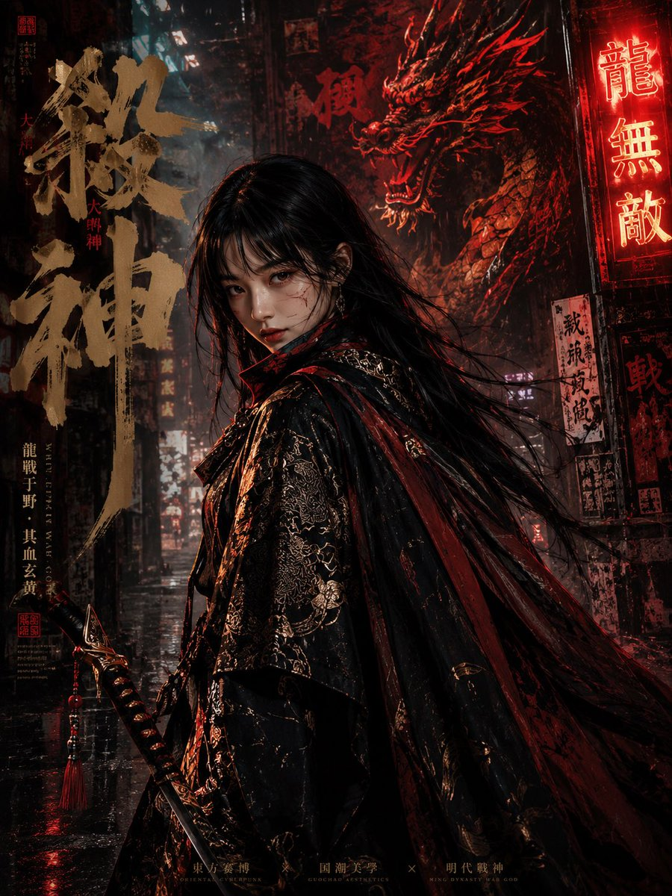

---

### Case 144: Recycled Shoes Streetwear Reel

**Source**: [@Goodmanprotocol](https://x.com/Goodmanprotocol/status/2052421717432353091)

**Prompt**:
```
type:image_generation_prompt

{
"style":"extreme hyper-realistic documentary fashion photography, authentic viral Instagram reel realism, raw street couture, handmade recycled fashion, zero CGI, real mobile-camera capture",

"subject":{
"identity_source":"strictly use uploaded reference image",
"identity_preservation":{
"priority":"maximum facial accuracy",
"preserve_exactly":[
"face shape","skin tone","eyes","nose","lips","jawline","haircut","expression","natural imperfections"
],
"goal":"identical to uploaded person, real Instagram reel frame realism"
},

"pose":"standing naturally on a small rusty steel skateboard platform, slightly leaning forward",

"body_language":"casual confident street attitude, realistic posture and weight balance",

"expression":"calm emotionless stare with viral reel confidence",

"outfit":{
"design":"fully handcrafted recycled outfit made from old shoes, rugged boots, damaged sneakers, denim scraps, hanging laces, stitched fabrics",

"rules":[
"physically wearable",
"real gravity-based materials",
"no fantasy look",
"true handmade realism"
],

"details":[
"dirty boot attached to chest",
"hanging shoelaces",
"worn sneaker-stitched denim",
"frayed seams",
"scratched rubber soles",
"used leather textures",
"dust accumulation",
"realistic folds"
],

"footwear":"worn rugged sandals and damaged shoes"
}
},

"environment":{
"location":"real outdoor alley workshop",

"background":{
"wall":"unfinished concrete wall covered with hanging old shoes and boots",

"details":[
"dust-covered shoes",
"dirty concrete textures",
"aged urban environment",
"real hanging shadows",
"weather damage",
"authentic underground workshop vibe",
"organic imperfections"
]
},

"ground":"dusty rough concrete floor with dirt and debris",

"platform":"small rusty homemade skateboard-like steel plate with tiny wheels"
},

"lighting":{
"type":"soft natural cloudy daylight",
"avoid":[
"studio lighting",
"cinematic glow",
"fake HDR"
]
},

"camera":{
"device":"high-end smartphone reel screenshot",
"lens":"35mm mobile lens",
"framing":"full-body vertical",
"angle":"slightly low handheld angle",
"focus":"sharp face and outfit realism",
"motion":"subtle reel motion blur"
},

"quality":{
"resolution":"16K ultra realism",
"textures":[
"skin pores",
"shoe cracks",
"dust particles",
"fabric stitching",
"metal rust",
"concrete texture"
],
"rendering":"indistinguishable from real life"
},

"mood":[
"raw authenticity",
"creative survival",
"viral underground fashion",
"street innovation"
],

"aspect_ratio":"9:16"
}
```

**Output**:

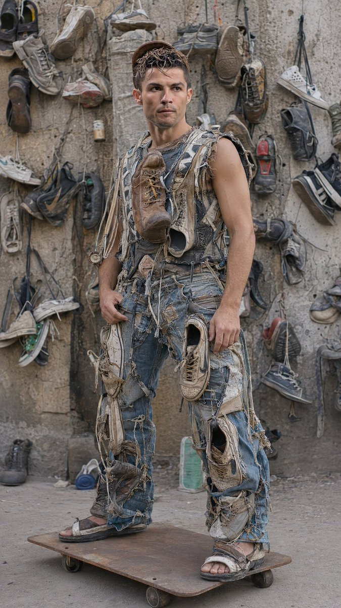

---

### Case 145: Barista 8-Shot Pixar Storyboard

**Source**: [@TechieBySA](https://x.com/TechieBySA/status/2052435507368394893)

**Prompt**:
```
“Create a crisp, clean infographic storyboard poster for THE BARISTA. Wide 16:9 layout, white background, black borders, bold black typography, premium Pixar 3D stylized rendering, bright warm colors — rich espresso browns, creamy whites, warm cafe golds, pops of green from plants.
Top header:

THE BARISTA
TOTAL VIDEO TIME: 15 SECONDS
8 SHOTS · FAST · WARM · SATISFYING
Legend icons: ACTION, HEAT, TIME HINT, INGREDIENT

Same Pixar-style barista throughout: young, energetic, green apron, warm independent coffee shop setting, bright morning light streaming through windows.
8 panels:

Coffee shop opens — barista flips sign to OPEN, warm morning light floods in, bright and inviting
Grinding beans — close-up of beans cascading into grinder, rich browns, aromatic steam rising
Tamping the portafilter — precise firm press, close-up on hands, confident and skilled
Espresso pull — golden crema flowing into white cup, beautiful close-up, warm amber tones
Milk steaming — silver pitcher, billowing white steam, barista watching carefully
The pour — milk swirling into espresso, latte art forming — a perfect leaf or heart
Sliding the cup across the counter — beautiful finished drink, soft focus background, warm light
Customer's face lights up — big smile, first sip, pure joy. Barista smiling proudly behind counter.

Footer:

VIDEO FLOW: 8 shots × ~1.5s = 15 seconds. Bean to smile.
CAMERA TIPS: close-ups on espresso pull and latte art, 45° angle on steaming, wide on shop opening, tight on customer reaction
LIGHT & STYLE: warm golden morning light, rich coffee browns, creamy whites, bright cafe greens, shallow depth of field, Pixar vivid colors
BARISTA NOTES: one barista, one perfect cup, one happy customer. Warm, skilled, satisfying.”
```

**Output**:

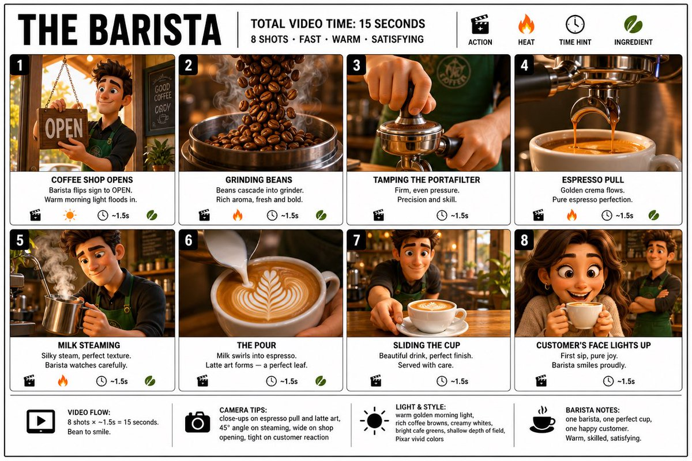

---

### Case 146: Manga Comic Strip Character Conversion

**Source**: [@MrDasOnX](https://x.com/MrDasOnX/status/2052426635992068556)

**Prompt**:
```
Turn your character into Anime Comic with GPT Image 2 on ChatGPT app

Prompt: Create a wholly original, simple black-and-white comic strip in a retro hand-inked manga style. Use 2-3 horizontal panels. Treat the uploaded image as the character reference; redraw the character entirely in manga form with consistent line work and shading across every panel. Interpret the person as the main character and, based on their appearance, generate an uplifting encounter with a clear “setup-reinforce-turnaround” structure: the first panel establishes context, the second develops the situation, and the third delivers a surprise twist. Keep the dialogue short, natural, and upbeat. No technology.
```

**Output**:

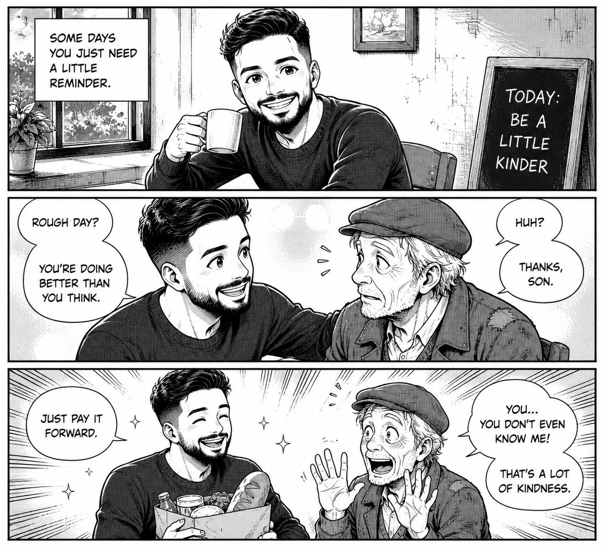

---

### Case 147: Rabbit Dentist Anime Illustration

**Source**: [@don56palmer](https://x.com/don56palmer/status/2052472382347231617)

**Prompt**:
```
In a highly detailed vibrant digital illustration style with smooth cel-shading, crisp linework, soft airbrush highlights, and anime-influenced expressive features, a young adult humanoid rabbit dentist with soft cream-colored fur, long floppy lavender-tipped rabbit ears adorned with small silver hoop earrings, large expressive amber eyes, delicate pink nose, long whiskers, and a small cotton-ball tail visible behind her stands in a modern dental clinic. She has a slender yet curvaceous build, short wavy pastel pink hair with bangs framing her face, and subtle blush marks on her cheeks. She wears a pristine white dentist lab coat with rolled-up sleeves over a pale mint-green scrubs top, white latex gloves, a light blue surgical mask pulled down below her chin, clear protective goggles resting on her forehead, and a name tag reading “Dr. Bunny” in elegant script.

Her expression is visibly nervous: wide amber eyes with dilated pupils and glistening sweat droplets rolling down her temples, eyebrows furrowed in anxious tension, mouth slightly open revealing small buck teeth, ears slightly drooped and trembling, body leaning forward cautiously with shoulders tense. Her left gloved hand carefully places two fingers inside the wide-open muzzle of her patient while her right hand holds a stainless-steel dental mirror and explorer tool, gently probing near the sharp carnivorous teeth.

The patient is a relaxed anthropomorphic fox male reclining in a sleek black dental chair, featuring rich orange-red fur with a white muzzle and chest, black-tipped pointed ears, a bushy orange tail draped lazily over the chair arm, piercing golden eyes half-lidded in calm amusement, and sharp white fangs and molars clearly visible with glistening saliva on the rabbit’s fingers inside his mouth, emphasizing the dangerous carnivore contrast.

Background elements include a clean contemporary dental operatory with white and soft teal walls, a large adjustable overhead LED dental lamp casting bright cool clinical light directly into the fox’s open mouth creating strong specular highlights on wet teeth and metal instruments, a stainless-steel instrument tray filled with polished dental tools beside her, an X-ray monitor displaying detailed tooth radiographs, colorful anatomical posters of animal dentition on the walls, a potted monstera plant in the corner, and large windows showing a bright daytime cityscape outside. 

Camera angle is a dynamic three-quarter close-up from a slightly low perspective to the rabbit dentist’s left side, sharply focusing on her nervous facial expression, the precise insertion of her fingers into the fox’s powerful jaws, and the dramatic size contrast between her delicate hands and his sharp teeth. Composition follows rule-of-thirds with the rabbit dentist occupying the left and central foreground, the fox’s head filling the right midground, creating visual tension and depth through overlapping elements. Color palette features saturated yet professional digital illustration tones: crisp whites and cool teals for the clinical environment, warm vibrant oranges and reds for the fox’s fur, soft creams, lavenders, and pinks for the rabbit dentist, glossy metallic silvers on tools, and realistic wet highlights on saliva and teeth. Overall aesthetic is polished, cinematic digital artwork with perfect anatomy, high detail, glossy textures, emotional expressiveness, and vibrant yet realistic lighting, 8K resolution quality.
```

**Output**:

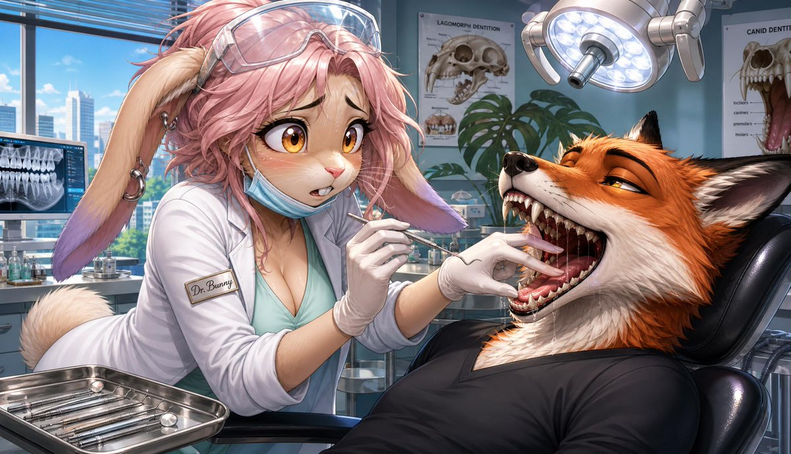

---

### Case 148: Businesswoman Luxury Car Arrival

**Source**: [@Fati_092](https://x.com/Fati_092/status/2052425727107268925)

**Prompt**:
```
4. Generate   

Amazing viral prompt

Vertical 3:4 cinematic overhead portrait. A young businessman women in a beige suit with sky-blue shirt steps from a luxury car, adjusting his jacket. Sky-blue Wayfarers, wristwatch, two security guards beside him—razor sharp. Blurred media crowd, city bokeh and soft golden light. Billionaire lifestyle vibe, maximum realism, ultra-detailed, mobile-optimized.
```

**Output**:

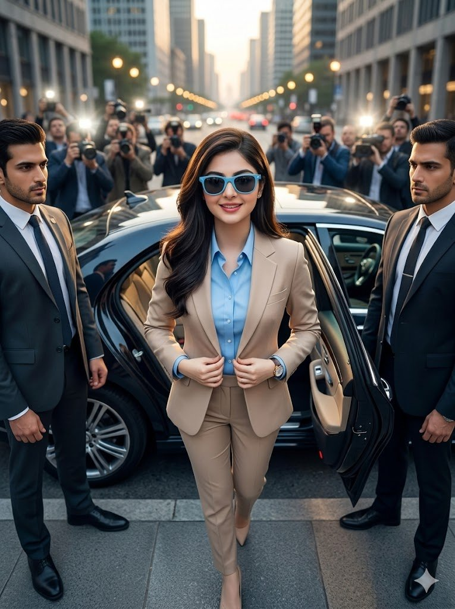

---

### Case 149: Cyclist Apparel Detail Macro Storyboard

**Source**: [@Just_sharon7](https://x.com/Just_sharon7/status/2052426396073685273)

**Prompt**:
```
Ultra-realistic cinematic close-up of a female cyclist tightening a baby pink performance glove around her wrist. Focus on fingers, tendons, and fabric stretch. Realistic tension and folds in the glove material. Cool foggy environment, soft diffused light, cinematic shallow depth of field, subtle breathing movement transferred into frame, ultra-realistic textures.

Panel 5 — Balaclava & Focused Eyes

Ultra-realistic cinematic close-up of a female cyclist wearing helmet and performance glasses while adjusting a baby pink balaclava over the lower half of her face. Tight symmetrical framing focused on eyes and hands. Slow controlled movement as the fabric stretches softly around her face. Slight condensation on glasses, calm determined eyes shifting subtly to the side. Foggy blurred background, cool cinematic lighting, photorealistic detail.

Panel 6 — Misty Mountain Establishing Shot

Ultra-realistic cinematic wide shot of foggy mountain valleys and dense forest under overcast skies. Heavy fog drifting through trees and across the road. Cold moody atmosphere, soft volumetric fog, subtle wind movement in branches and grass. Cool cinematic color grading, high dynamic range, deep atmospheric depth, almost static camera with very subtle cinematic push-in.

Panel 7 — Drone Tracking Cyclists

Ultra-realistic wide cinematic drone shot of three female road cyclists riding uphill together on a wet mountain road in foggy weather. The cyclists wear baby pink performance cycling apparel contrasting against the cold gray environment. Smooth lateral drone tracking movement parallel to the cyclists. Wet asphalt reflecting soft light, subtle tire spray, drifting fog crossing the road, synchronized pedaling rhythm, natural movement, documentary realism.

Panel 8 — Frontal Speed Shot

Ultra-realistic cinematic frontal drone shot of three female cyclists riding fast in single-file formation on a wet mountain road. Camera flies backward at the exact same speed, keeping constant framing and centered composition. Baby pink cycling jackets visible through rain and fog. Wet asphalt reflections, water spray from wheels, dynamic rain particles, cinematic stabilization with subtle natural drone float, cold atmospheric mountain background.

Panel 9 — Bicycle Drivetrain Finale

Ultra-realistic cinematic close-up from a camera mounted near the rear wheel and drivetrain of a road bicycle. Baby pink cycling shoe and lower apparel visible while pedaling intensely uphill in rain. Detailed chain, cassette, crankset, and wheel movement with realistic mechanical motion. Water droplets splashing onto the drivetrain, wet asphalt texture sharp and reflective. Natural vibrations from the bike, shallow depth of field, cinematic motion blur, foggy mountain atmosphere, premium high-end commercial realism.
```

**Output**:

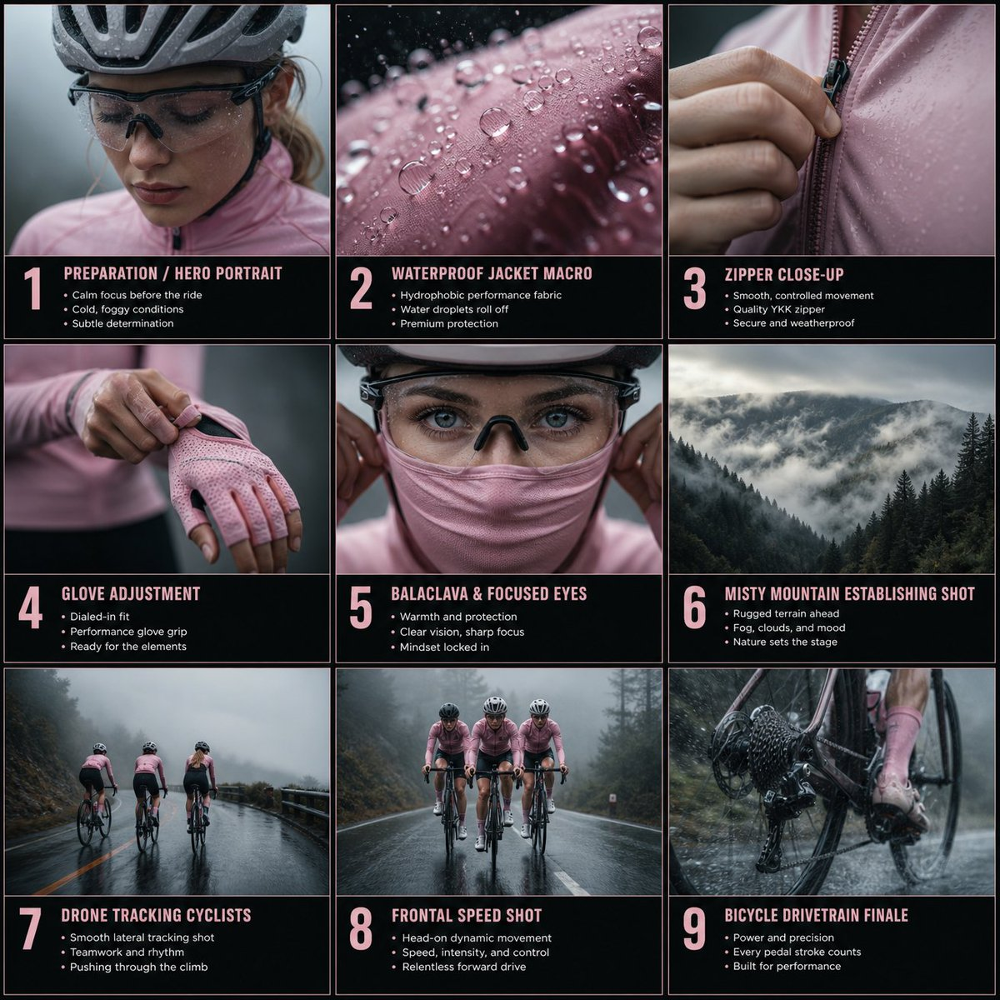

---

### Case 150: PSG 2026 Propaganda Poster Portrait

**Source**: [@EE_NOO_EE](https://x.com/EE_NOO_EE/status/2052483638160183780)

**Prompt**:
```
Içi c'est Paris !
GPT Image 2 sur ChatGPT  Prompt 👇

Create a propaganda poster themed around the character “[Prénom Nom] - PSG 2026” with a consistent and hierarchical main visual composition. Poster structure: Top (top half): Use the character’s head, facial features, mask, or half-body silhouette as the main large-sized visual element, forming an easily recognizable iconic image. Middle to bottom: Place the full-length character as the second subject, with a stable standing pose or light movement, serving as the center of the visual composition. Visual style: Use double exposure and narrative collage techniques in and around the character’s large silhouette. Combine various elements such as: layered scenes additional images small character interactions supporting elements environmental backgrounds all arranged in layers of clouds, ink, and white negative space. Additional composition: Place supporting elements on the left and right to create narrative tension and spatial variation. Add a vertical flowing visual line connecting: main character internal collage elements large silhouette at the top to reinforce visual continuity. Aesthetics: Maintain the use of large amounts of negative space. The edges are processed with the effects of: ink diffusion soft blur visual fragmentation to create a poetic and “survival ” Eastern aesthetic. Add more pop and striking colors Overall style: Consistent, premium, and refined. Focus on: visual layering narrative key visual impact visual language of serial posters Size: A4 Définir le format d’image sur 3:4
```

**Output**:

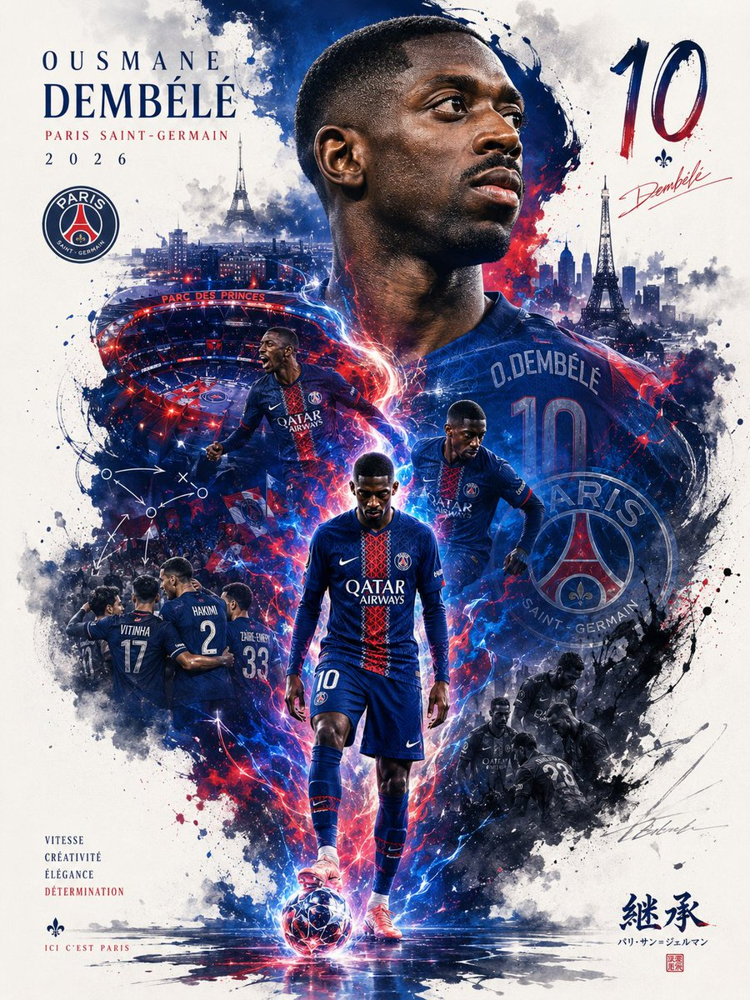

---

### Case 151: UGC Beach Golden Hour Selfie

**Source**: [@rafeluxe](https://x.com/rafeluxe/status/2052407184424833216)

**Prompt**:
```
(follow-up prompt on the reply)

A highly realistic UGC-style beach selfie of a young Indonesian woman in her early 20s with natural Southeast Asian facial features, warm sunkissed medium-tan skin, and an athletic feminine physique from consistent gym training. She has toned shoulders, softly defined arms, firm athletic thighs, a naturally shaped waist, and subtle healthy muscle definition visible under warm golden-hour beach lighting. Her body looks strong, fit, feminine, and realistic — not exaggerated or bodybuilder-like.

She is sitting casually on a dark brown beach towel on light textured sand during late afternoon golden hour at a tropical beach. The ocean and soft waves are visible behind her, with warm sunlight reflecting on the water. Slight breeze moving loose strands of hair. A woven beach tote bag sits naturally beside her. Environment feels candid and socially believable, like a real beach day.

Camera style is realistic smartphone front-camera selfie framing with slight handheld imperfection and subtle Instagram-story feel. Phone itself is not visible. Slightly wide-angle smartphone lens distortion on the extended selfie arm. Composition framed vertically from slightly above chest level, angled downward toward torso and legs. Natural imperfect cropping and mild grain/noise for authentic UGC realism.

She is seated with relaxed asymmetrical posture: torso angled slightly toward camera, one knee bent upward naturally while the other leg relaxes outward. One arm extended out of frame holding the phone. Other hand resting casually near upper thigh. Pose feels spontaneous and unposed, like a real vacation selfie.

Expression is soft and relaxed with a subtle confident smile. Looking naturally into the phone camera. No heavy makeup — mostly bare-faced with healthy post-beach glow, natural skin texture, slight warmth on cheeks and nose. Hair is dark brown-black, loosely tied back in a casual messy ponytail with soft flyaways and beach humidity texture.

OUTFIT MUST MATCH EXACTLY:
A ribbed brown knit halter bikini set / beach co-ord with no redesigns or modifications.

Top details:

* cropped halter-style top with thin spaghetti straps tying behind the neck
* high gathered neckline with soft fabric bunching across upper chest
* center-front ruched twist construction gathered tightly into a small circular cutout ring opening directly below the bust center
* adjustable dangling drawstrings hanging from the center opening
* fabric naturally tensioned and stretched across bust
* hemline cropped above waist
* warm chocolate-cinnamon brown color
* ribbed textured knit fabric with fine vertical ribbing clearly visible
* soft clingy stretch material with realistic fabric folds and compression

Bottom details:

* matching high-cut fitted mini shorts/bikini bottoms
* same ribbed stretch-knit brown fabric
* ruched gathering along both outer hips
* adjustable side drawstrings on both sides
* snug athletic fit contouring hips and upper thighs naturally
* subtle fabric tension and realistic stretch wrinkles
* slightly curved waistband sitting low-mid waist
* no logos, patterns, prints, or accessories

Lighting:
Strong warm golden-hour sunlight coming from side/back side angle near sunset. Natural sun highlights softly defining shoulders, collarbones, arms, thighs, and stomach contours. Slight lens flare and warm glow allowed. Shadows remain soft and natural. No studio lighting.

Photography feel:
ultra realistic, candid, authentic social-media selfie, Instagram story aesthetic, natural skin texture, realistic pores, slight smartphone sharpening, subtle sensor noise, imperfect framing, spontaneous beach-day atmosphere, believable human proportions, no AI artifacts, no over-retouching, no fashion editorial posing, no excessive polish.
```

**Output**:

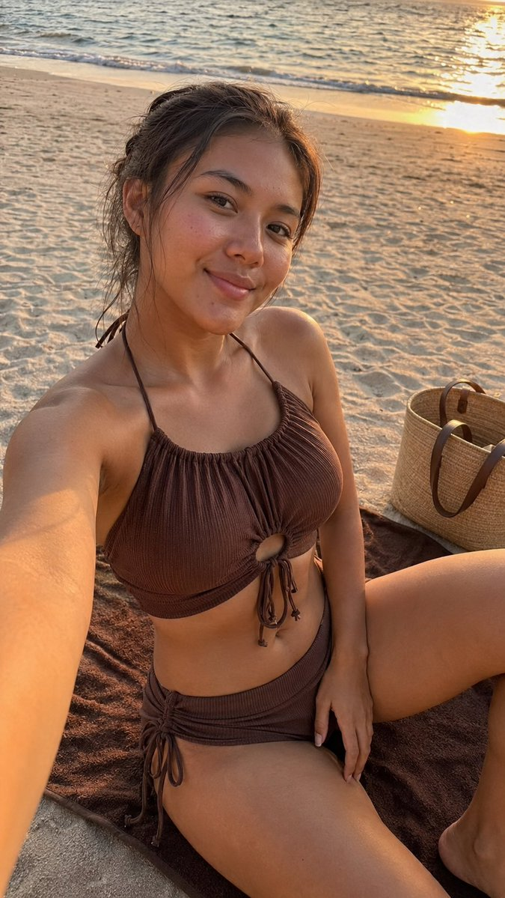

---

### Case 152: Y2K Bedroom Pink Hair Selfie

**Source**: [@DiamondZPetSpa](https://x.com/DiamondZPetSpa/status/2052397338703049122)

**Prompt**:
```
Create image: A hyper-photorealistic shot of the same subject in the attached image.

Main subject / quality details:
Rosy complexion with dewy skin and korean pinkish glow, authentic skin texture with visible pores, glossy jelly lips with reflective shine, softly highlighted cheekbones, realistic under-eye texture, subtle nose highlight, visible skin sheen from direct indoor lighting.

Expression or mood:
Flirty playful Y2K bedroom selfie energy, exaggerated pout lips, one eye half closed in teasing expression, relaxed sleepy gaze. Mood feels feminine, internet-girl aesthetic and spontaneous.

Camera settings:
A hyper-realistic, ultra-sharp photograph taken on an iPhone 15 Pro, characterized by digital clarity, focal point eye subject but rendere the background sharp with soft blur characterized by high end smartphone, shot at ISO 100. 4k rendered, normal white balance, natural lighting, no cinematic color grading. sharp facial details. Bright bedroom lighting with soft phone flash bounce, realistic indoor white balance, slight grain from low-light smartphone processing.

Hair:
Dark brown hair dyed vivid pink with darker brown undertones visible near roots, sleek straight texture with inward upward curl near shoulders, two thin braided face strands framing cheeks, glossy synthetic-dye shine.

Outfit:
White fluffy Bratz bucket hat, pastel pink spaghetti strap tank top, silver heart pendant necklace, light washed denim jeans visible in foreground, glossy nude nails.

Background:
Minimal dim bedroom with dark curtains and faint computer monitor glow in far background, soft neutral walls, intimate late-night room atmosphere.

Composition:
Close half-body selfie framing. Bent knee occupies lower left foreground creating casual depth. Subject positioned slightly right-of-center. Hat creates rounded silhouette framing face. Leading lines from braids and shoulder straps direct focus toward lips and eyes.

Negative prompt:
cartoonish, AI-looking, plastic skin, distorted anatomy, over-smoothed face, blurry face, heavy bokeh, stiff pose, center-facing ID-photo style, unrealistic pink hair texture, waxy lips
```

**Output**:

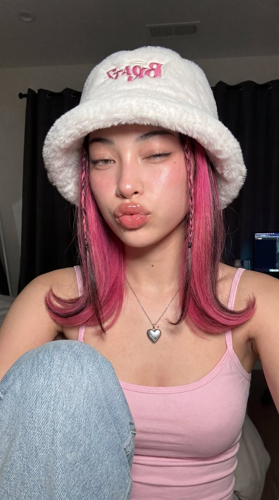

---

### Case 153: Mirror Selfie Diamond Glam Portrait

**Source**: [@XShreyaYadav](https://x.com/XShreyaYadav/status/2052691060573532367)

**Prompt**:
```
A hyper-realistic mirror selfie portrait of a beautiful young woman with long, straight dark hair parted down the middle. She has soft, glowing makeup with neutral mauve lipstick and manicured nails with a matching mauve polish. She is wearing a deeply plunging black sleeveless dress with side cutouts and a gathered twist detail at the waist. She is heavily accessorized with a sparkling thick rhinestone choker, a delicate diamond tennis bracelet on her right wrist, and a small, structured should
```

**Output**:

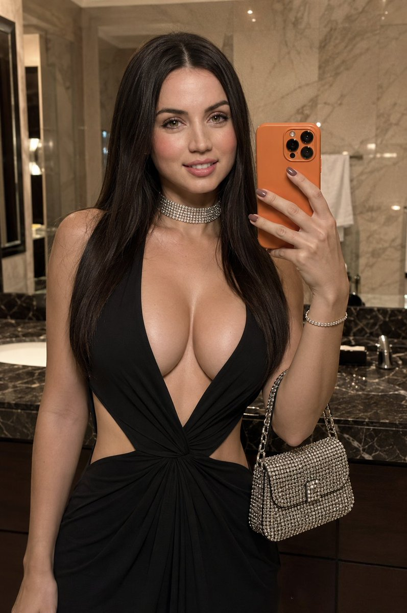

---

### Case 154: Couture Saree Cinematic Fashion Portrait

**Source**: [@XShreyaYadav](https://x.com/XShreyaYadav/status/2052581805736554657)

**Prompt**:
```
sing Uploaded image as face and body reference. A Ultra-realistic, vertical 2:3, Candid Cinematic event photorealistic fashion portrait photography image of a woman. Dress (Attire & Accessories) She is wearing a luxurious, modern interpretation of a saree in a shimmering, metallic champagne or light gold fabric. The most striking element is the top, which the text explicitly describes as a "jewellery-integratedcouture piece."
It acts as a bustier made entirely of clustered diamonds and large eme
```

**Output**:

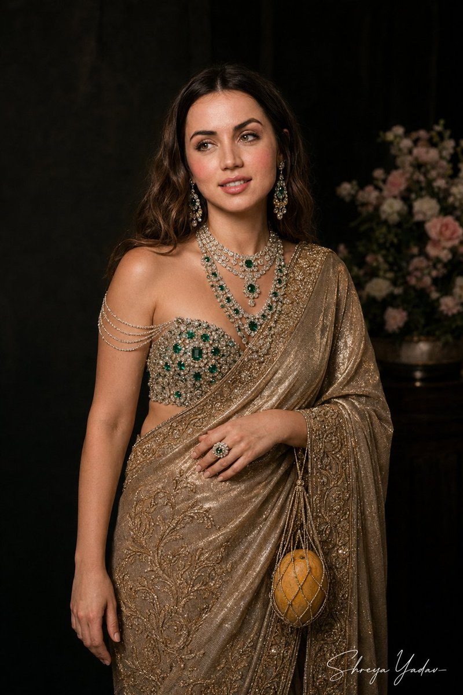

---

### Case 155: Graffiti Restroom Glam Portrait

**Source**: [@KeorUnreal](https://x.com/KeorUnreal/status/2052785320970572141)

**Prompt**:
```
A highly detailed cinematic photograph of a beautiful young woman with long wavy fiery blonde hair and fair skin with light freckles, standing in a uncleaned neglected public restroom with peeling light green tiles covered in colorful graffiti and stickers. She is wearing a sleek white glitter strapless mini dress and applying vibrant red lipstick with a lipstick tube in her right hand while her left hand rests on the edge of a sink. Her head is slightly turned to the side with a confident gaze.
```

**Output**:

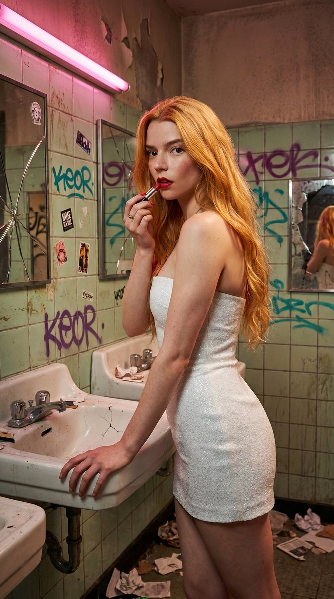

---

### Case 156: Silhouette Sun Horizon Minimalist Portrait

**Source**: [@harboriis](https://x.com/harboriis/status/2052775236278653032)

**Prompt**:
```
Create a cinematic minimalist portrait using my uploaded photo Place the subject in full-body
side profile, standing still and facing left, with a calm, introspective posture and hands in
pockets. The subject should appear as a dark silhouette with subtle soft lighting, preserving
natural proportions. In the background, add a large glowing sun (or orb) directly behind the
subject, low on the horizon, partially diffused through thick atmospheric fog. Use a warm
monochromatic color palette.
```

**Output**:

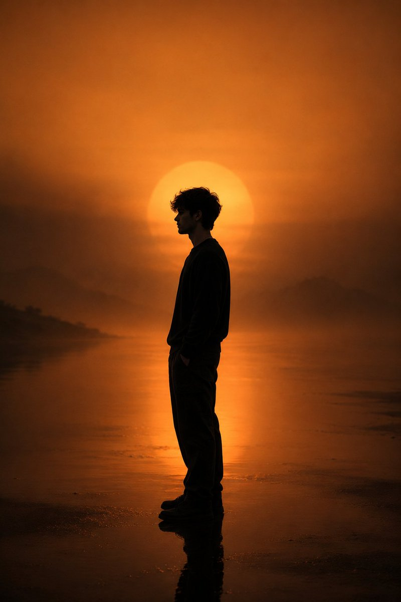

---

### Case 157: Selfie Look-Up Hand Pointing Portrait

**Source**: [@ozansihay](https://x.com/ozansihay/status/2052811738345615370)

**Prompt**:
```
A raw, highly authentic, and heavily unpolished amateur smartphone selfie, explicitly captured with an iPhone front-facing camera. The overall image features prominent camera shake and strong motion blur, giving it a frantic, imperfect, and slightly out-of-focus aesthetic. In the extreme foreground, a person looks directly into the lens with a slight, natural smile, hastily pointing one finger up towards the sky. Looming above in the dramatic, overcast sky is a massive, futuristic metallic UFO f
```

**Output**:


---

### Case 158: Desert Motel Pink Sunglasses Portrait

**Source**: [@Sairah_0](https://x.com/Sairah_0/status/2052704912312861005)

**Prompt**:
```
Ultra-realistic lifestyle portrait of a smiling young woman standing on a desert roadside near a vintage motel sign, holding oversized translucent pink sunglasses toward the camera, shallow depth of field, sunny California desert aesthetic, candid selfie composition, soft natural sunlight, warm pastel tones, retro Americana vibe, white ringer t-shirt with pink trim and bold “NO DRAMA CLUB” text with rose graphics, freckles and natural skin texture, dreamy summer mood, cinematic photography, high
```

**Output**:

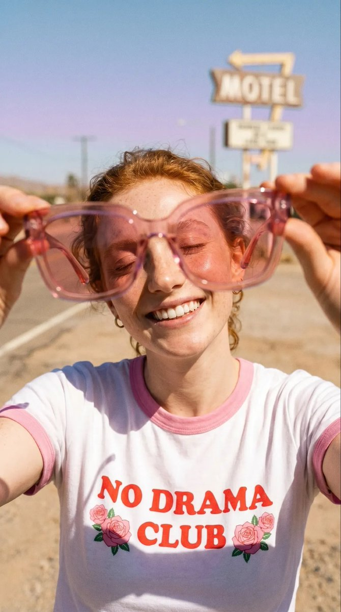

---
